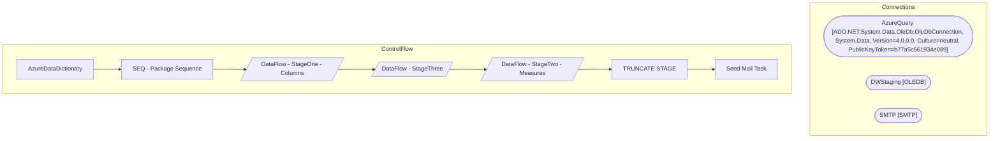

# SSIS Package: AzureDataDictionary

**Project:** AzureDataDictionary  
**Folder:** Azure  

## Architecture Diagram

## Connection Managers

| Connection Name | Type |
|---|---|
| AzureQuery | ADO.NET:System.Data.OleDb.OleDbConnection, System.Data, Version=4.0.0.0, Culture=neutral, PublicKeyToken=b77a5c561934e089 |
| DWStaging | OLEDB |
| SMTP | SMTP |

## Control Flow Tasks

| Task Name | Type |
|---|---|
| AzureDataDictionary | Microsoft.Package |
| SEQ - Package Sequence | STOCK:SEQUENCE |
| DataFlow - StageOne - Columns | Microsoft.Pipeline |
| DataFlow - StageThree | Microsoft.Pipeline |
| DataFlow - StageTwo - Measures | Microsoft.Pipeline |
| TRUNCATE STAGE | Microsoft.ExecuteSQLTask |
| Send Mail Task | Microsoft.SendMailTask |

## Data Flow: Sources

| Component | Tables Referenced | SQL Preview |
|---|---|---|
|  |  | with  Base as  	( 		select  			TableName, 			substring(QueryDefinition,(charindex('Item="', QueryDefinition)),1000) Base 		from azuretablemeta 		group by  			TableName, 			substring(QueryDefinition,(charindex('Item="', QueryDefinition)),1000) 	), Base2 as 	( 		select  			TableName, 			substring(Base,charindex('"',Base)+1, 1000) Base 		from Base 		group by  			TableName, 			substring(Base,charindex |
|  |  | select  	--replace(replace(substring(Table_ID, charindex('(', Table_ID), 100),'(',''),')','') as TableID, 	Dimension_Name as TableName, 	cast(Dimension_Name as nvarchar(100)) as DisplayFolder, 	'Column' as ColumnOrMeasure, 	Attribute_Name as ColumnName, 	Concat(Dimension_Name, '.', Attribute_Name) as Expression, 	SourceView from AzureDataDictionaryStageOne where table_id not like ('R$%') and table |
|  |  | with  AzureViews as 	( 		select 			o.name ViewName, 			m.definition ViewDefinition 		from dw.sys.objects o 		join dw.sys.schemas s on s.schema_id = o.schema_id 		join dw.sys.sql_modules m on o.object_id = m.object_id 		where o.type_desc='view' 		and s.name <>'domo' 		--and o.name='vwNameMeTransactionFact' 		group by o.name,m.definition 	) select  	--cast(replace(replace(substring(s1.Table_ID, char |
|  |  | select  	cast(replace(replace(substring(Table_ID, charindex('(', Table_ID), 100),'(',''),')','') as int) as TableID, 	Dimension_Name as TableName, SourceView from AzureDataDictionaryStageOne where table_id not like ('R$%') and table_id not like ('H$%') and Attribute_Name not like 'RowNumber-%' group by  	replace(replace(substring(Table_ID, charindex('(', Table_ID), 100),'(',''),')',''), 	Dimension |

## Data Flow: Destinations

| Component | Destination Table |
|---|---|
|  | [AzureDataDictionaryStageOne] |
|  | [AzureDataDictionaryStageThree] |
|  | [dbo].[AzureDataDictionaryStageTwo] |
|  | [AzureDataDictionaryStageTwo] |

