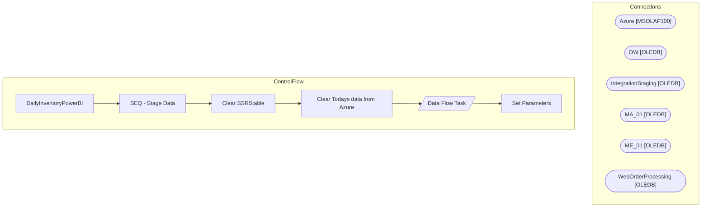

# SSIS Package: DailyInventoryPowerBI

**Project:** DailyInventoryPowerBI  
**Folder:** Azure  

## Architecture Diagram

## Connection Managers

| Connection Name | Type |
|---|---|
| Azure | MSOLAP100 |
| DW | OLEDB |
| IntegrationStaging | OLEDB |
| MA_01 | OLEDB |
| ME_01 | OLEDB |
| WebOrderProcessing | OLEDB |

## Control Flow Tasks

| Task Name | Type |
|---|---|
| DailyInventoryPowerBI | Microsoft.Package |
| SEQ - Stage Data | STOCK:SEQUENCE |
| Clear SSRStable | Microsoft.ExecuteSQLTask |
| Clear Todays data from Azure | Microsoft.ExecuteSQLTask |
| Data Flow Task | Microsoft.Pipeline |
| Set Parameters | Microsoft.ExecuteSQLTask |

## Data Flow: Sources

| Component | Tables Referenced | SQL Preview |
|---|---|---|
|  |  | SELECT         	isd.inventory_status_desc,  	CASE  		WHEN l.location_code = '0013'  			THEN 'US'  		ELSE 'UK'  	END AS location_code,  	s.style_code,  	SUM(m.total_on_hand_units) AS Total_Intransit,  	s.order_multiple FROM view_ib_inv_total_metadata AS m  INNER JOIN inventory_status_data AS isd ON isd.inventory_status_id = m.inventory_status_id  INNER JOIN sku AS sk ON sk.sku_id = m.sku_id  INNER  |
|  |  | SELECT        WM.OrderItems.sku, SUM(WM.OrderItems.qty) AS LastWeeksSales, RIGHT(WM.Orders.SourceSite, 2) AS LocationCode, sum(Case isnull(cast(EnterpriseSellingID as bigint),0) when 0 then 0 else OrderItems.QTY end) as LWEnterpriseSales FROM            WM.Orders INNER JOIN                          WM.OrderItems ON WM.Orders.OrderId = WM.OrderItems.OrderId INNER JOIN                          WM.It |
|  |  | SELECT        WM.OrderItems.sku, SUM(WM.OrderItems.qty) AS MTDSales, RIGHT(WM.Orders.SourceSite, 2) AS LocationCode, sum(Case isnull(cast(EnterpriseSellingID as bigint),0) when 0 then 0 else OrderItems.QTY end) as MTDEnterpriseSales FROM            WM.Orders INNER JOIN                          WM.OrderItems ON WM.Orders.OrderId = WM.OrderItems.OrderId INNER JOIN                          WM.ItemSta |
|  |  | With D as( select  'US' as LocationCode, s.style_code, 0 as available, isnull(sum(ia.allocated_units),0) as allocated from sku sk with (nolock) join ib_allocation ia with (nolock) on ia.sku_id = sk.sku_id join style s with (nolock) on sk.style_id = s.style_id  join style_group sg with (nolock) on s.style_id = sg.style_id join hierarchy_group hg with (nolock) on sg.hierarchy_group_id = hg.hierarchy |
|  |  | select Style_Code,DisplayName,HierarchyGroupCode,keyStory,mstat,MerchInDate, UnbufferedQty as Inventory, UnbufferedQTY - QTY as InventoryBuffer, ProductSellingGeography,ClassName from WEB.ProductCatalogMasterAttributes M left join web.InventoryFact F 	on m.style_code = f.StyleCode and m.ProductSellingGeography = f.SellingGeography where ISNULL(locationCode,'0013') in ('0013','2013') and Storefront |
|  |  | With D as( select  'UK' as LocationCode, s.style_code, 0 as available, isnull(sum(ia.allocated_units),0) as allocated from sku sk with (nolock) join ib_allocation ia with (nolock) on ia.sku_id = sk.sku_id join style s with (nolock) on sk.style_id = s.style_id  join style_group sg with (nolock) on s.style_id = sg.style_id join hierarchy_group hg with (nolock) on sg.hierarchy_group_id = hg.hierarchy |
|  |  | SELECT        WM.OrderItems.sku, SUM(WM.OrderItems.qty) AS AllocatedSales, right(sourcesite,2) as LOcationCode FROM            WM.Orders INNER JOIN                          WM.OrderItems ON WM.Orders.OrderId = WM.OrderItems.OrderId INNER JOIN                          WM.ItemStatus ON WM.Orders.OrderId = WM.ItemStatus.OrderID AND WM.OrderItems.OrderItemID = WM.ItemStatus.OrderItemID and currentstat |
|  |  | --NEW select  	case l.location_code  		when '0013'  			then 'US'  		else 'UK'  	end as location_code,  	s.style_code,  	sum(case when cast(expected_receipt_date as date) <= cast(getdate()+7 as date) then a.allocated_units else 0 end) as Allocated_Units  from view_ib_allocation a join sku sk on sk.sku_id=a.sku_id join style s on s.style_id=sk.style_id join location l on l.location_id=a.location_id  |
|  |  | SELECT        WM.OrderItems.sku, SUM(WM.OrderItems.qty) AS WTDSales, RIGHT(WM.Orders.SourceSite, 2) AS LOcationCode, sum(Case isnull(cast(EnterpriseSellingID as bigint),0) when 0 then 0 else OrderItems.QTY end) as WTDEnterpriseSales FROM            WM.Orders INNER JOIN                          WM.OrderItems ON WM.Orders.OrderId = WM.OrderItems.OrderId INNER JOIN                          WM.ItemSta |
|  |  | SELECT        WM.OrderItems.sku, SUM(WM.OrderItems.qty) AS YesterdaysSales, RIGHT(WM.Orders.SourceSite, 2) AS LocationCode, sum(Case isnull(cast(EnterpriseSellingID as bigint),0) when 0 then 0 else OrderItems.QTY end) as YesterdaysEnterpriseSales FROM            WM.Orders INNER JOIN                          WM.OrderItems ON WM.Orders.OrderId = WM.OrderItems.OrderId INNER JOIN                       |

## Data Flow: Destinations

| Component | Destination Table |
|---|---|
|  | [Azure].[DailyInventory] |
|  | [Azure].[WebActiveDate] |
|  | [dbo].[DailyInventoryReport] |

