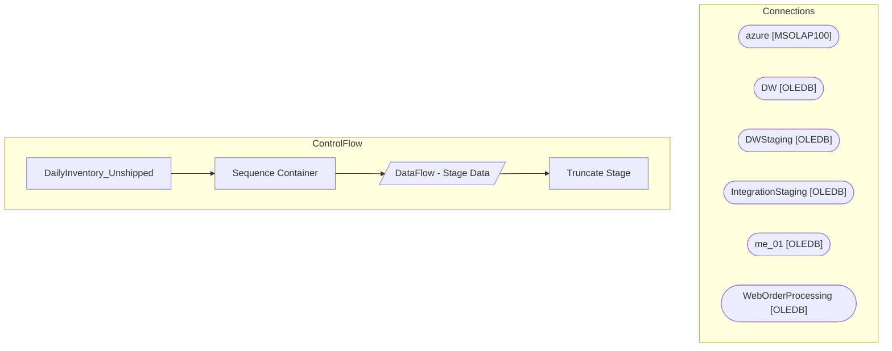

# SSIS Package: DailyInventory_Unshipped

**Project:** DailyInventory_Unshipped  
**Folder:** Azure  

## Architecture Diagram

## Connection Managers

| Connection Name | Type |
|---|---|
| azure | MSOLAP100 |
| DW | OLEDB |
| DWStaging | OLEDB |
| IntegrationStaging | OLEDB |
| me_01 | OLEDB |
| WebOrderProcessing | OLEDB |

## Control Flow Tasks

| Task Name | Type |
|---|---|
| DailyInventory_Unshipped | Microsoft.Package |
| Sequence Container | STOCK:SEQUENCE |
| DataFlow - Stage Data | Microsoft.Pipeline |
| Truncate Stage | Microsoft.ExecuteSQLTask |

## Data Flow: Sources

| Component | Tables Referenced | SQL Preview |
|---|---|---|
|  |  | select  	cast(l.location_code as varchar(4)) as LocationCode, 	cast(s.style_code as varchar(6)) as StyleCode, 	sum(a.allocated_units) as storeAllocated  from  	view_ib_allocation a with (nolock) join sku sk with (nolock) on sk.sku_id=a.sku_id join style s with (nolock) on s.style_id=sk.style_id join location l with (nolock) on l.location_id=a.location_id group by  	cast(l.location_code as varchar( |
|  |  | select  	i.DateKey,  	cast(d.Fiscal_Week as nvarchar) as 'PreviousFiscalWeek',  	i.StyleCode,  	i.OnHand,  	i.Allocated,  	i.InTransit  from Azure.DailyInventory i join Azure.NewDateDim d on d.Date_Key = cast(getdate()-7 as date) where i.DateKey = cast(getdate() as date) |
|  |  | SELECT         	cast(l.location_code as varchar(4)) as LocationCode, 	cast(s.style_code as varchar(6)) as StyleCode, 	SUM(m.total_on_hand_units) AS  storeInTransit FROM view_ib_inv_total_metadata AS m with (nolock) --join inventory_status_data AS isd with (nolock) ON isd.inventory_status_id = m.inventory_status_id  join sku AS sk with (nolock) ON sk.sku_id = m.sku_id  join style AS s with (nolock) |
|  |  | select  	cast(WarehouseCode as varchar(4)) as LocationCode, 	cast(CustomerSKU as varchar(6)) as StyleCode, 	UnbufferedQty,  	StoreInventoryBuffer,  	TotalQuantity from WEB.vwStoreInventoryBuffer  where WarehouseCode not in ('0013', '2013') |
|  |  | select  	tdf.StoreKey, 	tdf.ProductKey, 	cast(dd.Fiscal_Week as nvarchar) as fiscal_week, 	isnull(sum(tdf.units),0)  as PreviousWeekSold from [Azure].[vwTDF] tdf with (nolock) join Azure.NewDateDim dd with (nolock) on tdf.TransactionDate=dd.Date_Key where tdf.TransactionDate between cast(getdate()-14 as date) and cast(getdate() as date) group by  	tdf.StoreKey, 	tdf.ProductKey, 	cast(dd.Fiscal_Wee |
|  |  | select  	p.ProductKey,	 	p.StyleDescription,  	p.Chain as 'consumer group',  	p.department,  	p.class,  	p.deptcode,  	p.subclasscode, 	p.keyStory, 	cast(p.mstat as nvarchar) as mstat from Azure.vwProducts p  where 1=1 and p.subclasscode not in ('W-C-K-12-01-07','W-D-K-12-01-07','W-E-K-12-01-07', 'W-F-K-12-01-07', 'R-B-D-80-02-00','R-B-U-80-02-00') and p.deptcode not in  ('R-B-D-46','R-B-U-46','R- |
|  |  | select min(product_key) as product_key, cast(right(concat('000000', sku),6) as varchar(6))  as StyleCode from product_dim with (nolock) --where jurisdiction_code in ('US', 'UK') group by cast(right(concat('000000', sku),6) as varchar(6)) |
|  |  | select product_key, cast(right(concat('000000', sku),6) as varchar(6))  as StyleCode, jurisdiction_code from product_dim with (nolock) where jurisdiction_code in ('US', 'UK') |
|  |  | select  	s.StoreKey,  	s.StoreNumber, 	cast(s.StoreNameFull as nvarchar) as StoreNameFull, 	s.StoreConcept,  	s.DistroDay,  	s.DCsource from Azure.vwStores s where 1=1 and s.StoreNumber not in ('2013','0013') |
|  |  | with  MaxOrder as 	( 		select  			o.TransactionID, max(o.OrderNum) OrderNum 		from wm.Orders o with (nolock)  		join WM.OrderStatus os with (nolock)  			on o.OrderID=os.OrderID  			and os.CurrentStatus=1  			and os.[Status] not in ('Cancelled', 'Complete', 'Shipped') 		where isnull(PickupStore,'') <> '' 		group by o.TransactionID 	) select  	right(o.SourceSite,'2') as Country, 	o.PickUpStore,  	oi |

## Data Flow: Destinations

| Component | Destination Table |
|---|---|
|  | [dbo].[tmpUnshippedItemsWithLWunitsSales] |

