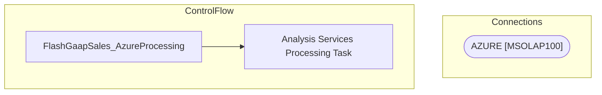

# SSIS Package: FlashGaapSales_AzureProcessing

**Project:** FlashGaapSales_AzureProcessing  
**Folder:** Azure  

## Architecture Diagram

## Connection Managers

| Connection Name | Type |
|---|---|
| AZURE | MSOLAP100 |

## Control Flow Tasks

| Task Name | Type |
|---|---|
| FlashGaapSales_AzureProcessing | Microsoft.Package |
| Analysis Services Processing Task | Microsoft.DTSProcessingTask |

## Data Flow: Sources

_No OLE DB data flow sources detected._

## Data Flow: Destinations

_No OLE DB data flow destinations detected._

