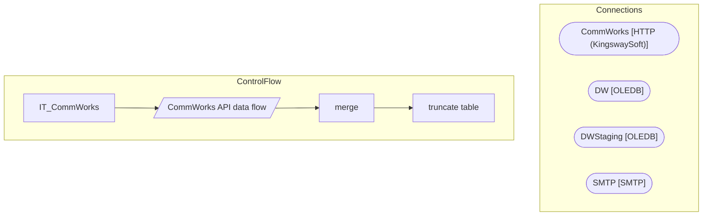

# SSIS Package: IT_CommWorks

**Project:** IT_commworks  
**Folder:** Azure  

## Architecture Diagram

## Connection Managers

| Connection Name | Type |
|---|---|
| CommWorks | HTTP (KingswaySoft) |
| DW | OLEDB |
| DWStaging | OLEDB |
| SMTP | SMTP |

## Control Flow Tasks

| Task Name | Type |
|---|---|
| IT_CommWorks | Microsoft.Package |
| CommWorks API data flow | Microsoft.Pipeline |
| merge | Microsoft.ExecuteSQLTask |
| truncate table | Microsoft.ExecuteSQLTask |

## Data Flow: Sources

_No OLE DB data flow sources detected._

## Data Flow: Destinations

| Component | Destination Table |
|---|---|
|  | [dbo].[IT_commworks_stage] |

