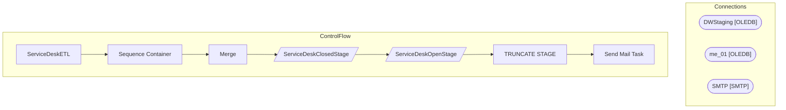

# SSIS Package: ServiceDeskETL

**Project:** ServiceDeskETL  
**Folder:** Azure  

## Architecture Diagram

## Connection Managers

| Connection Name | Type |
|---|---|
| DWStaging | OLEDB |
| me_01 | OLEDB |
| SMTP | SMTP |

## Control Flow Tasks

| Task Name | Type |
|---|---|
| ServiceDeskETL | Microsoft.Package |
| Sequence Container | STOCK:SEQUENCE |
| Merge | Microsoft.ExecuteSQLTask |
| ServiceDeskClosedStage | Microsoft.Pipeline |
| ServiceDeskOpenStage | Microsoft.Pipeline |
| TRUNCATE STAGE | Microsoft.ExecuteSQLTask |
| Send Mail Task | Microsoft.SendMailTask |

## Data Flow: Sources

| Component | Tables Referenced | SQL Preview |
|---|---|---|
|  |  | select  	Incident,	 	Summary,	 	Status,	 	Priority,	 	Customer,	 	case  		when isnumeric(right(Customer,4))=1  			then right(concat('0000',cast(cast(right(Customer,4) as int) as varchar)),4) 			else 'BQ'  	end as CustomerLocation, 	Owner,	 	[Created On],	 	[Source],	 	Team,	 	Area,	 	Category,	 	Subcategory,	 	ResolvedDateTime,	 	Address1Country,	 	[Problem ID],	 	[Avg Days Open], 	OpenWk,	 	Close |
|  |  | select  	Incident,	 	Summary,	 	Status,	 	Priority,	 	Customer,	 	case  		when isnumeric(right(Customer,4))=1  			then right(concat('0000',cast(cast(right(Customer,4) as int) as varchar)),4) 			else 'BQ'  	end as CustomerLocation, 	Owner,	 	[Created On],	 	[Source],	 	Team,	 	Area,	 	Category,	 	Subcategory,	 	ResolvedDateTime,	 	Description,	 	Country,	 	[Owner Email],	 	Problem,	 	OpenWK,	 	Open |

## Data Flow: Destinations

| Component | Destination Table |
|---|---|
|  | [ServiceDeskClosedStage] |
|  | [ServiceDeskOpenStage] |

