# SSIS Package: Web_OrderIntegrationDataMonitor

**Project:** Web_OrderIntegrationDataMonitor  
**Folder:** Azure  

## Architecture Diagram

```mermaid
flowchart TD
    subgraph Connections
        ApplicationResources_conn(["ApplicationResources [OLEDB]"])
        auditworks_conn(["auditworks [OLEDB]"])
        Azure_conn(["Azure [MSOLAP100]"])
        BABWPartyPlanner_conn(["BABWPartyPlanner [OLEDB]"])
        DW_conn(["DW [OLEDB]"])
        DWStaging_conn(["DWStaging [OLEDB]"])
        Dynamics_AX_Connection_Manager_conn(["Dynamics AX Connection Manager [DynamicsAX]"])
        Dynamics_Sales_Order_Cache_conn(["Dynamics Sales Order Cache [CACHE]"])
        DynamicsAPILog_Cache_conn(["DynamicsAPILog Cache [CACHE]"])
        IntegrationStaging_conn(["IntegrationStaging [OLEDB]"])
        RecordYourVoice_conn(["RecordYourVoice [OLEDB]"])
        RecordYourVoice_Cache_conn(["RecordYourVoice Cache [CACHE]"])
        SMTP_conn(["SMTP [SMTP]"])
        UK_Created_Cache_conn(["UK Created Cache [CACHE]"])
        UK_FTP_Cache_conn(["UK FTP Cache [CACHE]"])
        WebOrderProcessing_conn(["WebOrderProcessing [OLEDB]"])
    end
    subgraph ControlFlow
        Web_OrderIntegrationDataMonitor_task["Web_OrderIntegrationDataMonitor"]
        DataFlow___Stage_Outbound_task[/"DataFlow - Stage Outbound"/]
        Web_OrderIntegrationDataMonitor_task --> DataFlow___Stage_Outbound_task
        Sequence_Container_task["Sequence Container"]
        DataFlow___Stage_Outbound_task --> Sequence_Container_task
        SEQ___Extract_Order_Outbound_task["SEQ - Extract Order Outbound"]
        Sequence_Container_task --> SEQ___Extract_Order_Outbound_task
        DataFlow___Load_Outbound_task[/"DataFlow - Load Outbound"/]
        SEQ___Extract_Order_Outbound_task --> DataFlow___Load_Outbound_task
        DataFlow___Stage_Outbound_task[/"DataFlow - Stage Outbound"/]
        DataFlow___Load_Outbound_task --> DataFlow___Stage_Outbound_task
        Process_Azure_Outbound_Table_task["Process Azure Outbound Table"]
        DataFlow___Stage_Outbound_task --> Process_Azure_Outbound_Table_task
        Truncate_Outbound_Stage_task["Truncate Outbound Stage"]
        Process_Azure_Outbound_Table_task --> Truncate_Outbound_Stage_task
        Truncate_Outbound_Stage_Two_task["Truncate Outbound Stage Two"]
        Truncate_Outbound_Stage_task --> Truncate_Outbound_Stage_Two_task
        SEQ___Inbound_Data_Load_task["SEQ - Inbound Data Load"]
        Truncate_Outbound_Stage_Two_task --> SEQ___Inbound_Data_Load_task
        DataFlow___Load_Inbound_task[/"DataFlow - Load Inbound"/]
        SEQ___Inbound_Data_Load_task --> DataFlow___Load_Inbound_task
        DataFlow___RecordYourVoice_Cache_task[/"DataFlow - RecordYourVoice Cache"/]
        DataFlow___Load_Inbound_task --> DataFlow___RecordYourVoice_Cache_task
        DataFlow___Stage_Inbound_task[/"DataFlow - Stage Inbound"/]
        DataFlow___RecordYourVoice_Cache_task --> DataFlow___Stage_Inbound_task
        Process_Azure_FcastDays_task["Process Azure FcastDays"]
        DataFlow___Stage_Inbound_task --> Process_Azure_FcastDays_task
        Process_Azure_Inbound_Table_task["Process Azure Inbound Table"]
        Process_Azure_FcastDays_task --> Process_Azure_Inbound_Table_task
        Truncate_Inbound_Stage_One_task["Truncate Inbound Stage One"]
        Process_Azure_Inbound_Table_task --> Truncate_Inbound_Stage_One_task
        Truncate_Inbound_Stage_Two_task["Truncate Inbound Stage Two"]
        Truncate_Inbound_Stage_One_task --> Truncate_Inbound_Stage_Two_task
        Send_Mail_Task_task["Send Mail Task"]
        Truncate_Inbound_Stage_Two_task --> Send_Mail_Task_task
    end
```

## Connection Managers

| Connection Name | Type |
|---|---|
| ApplicationResources | OLEDB |
| auditworks | OLEDB |
| Azure | MSOLAP100 |
| BABWPartyPlanner | OLEDB |
| DW | OLEDB |
| DWStaging | OLEDB |
| Dynamics AX Connection Manager | DynamicsAX |
| Dynamics Sales Order Cache | CACHE |
| DynamicsAPILog Cache | CACHE |
| IntegrationStaging | OLEDB |
| RecordYourVoice | OLEDB |
| RecordYourVoice Cache | CACHE |
| SMTP | SMTP |
| UK Created Cache | CACHE |
| UK FTP Cache | CACHE |
| WebOrderProcessing | OLEDB |

## Control Flow Tasks

| Task Name | Type |
|---|---|
| Web_OrderIntegrationDataMonitor | Microsoft.Package |
| DataFlow - Stage Outbound | Microsoft.Pipeline |
| Sequence Container | STOCK:SEQUENCE |
| SEQ - Extract Order Outbound | STOCK:SEQUENCE |
| DataFlow - Load Outbound | Microsoft.Pipeline |
| DataFlow - Stage Outbound | Microsoft.Pipeline |
| Process Azure Outbound Table | Microsoft.DTSProcessingTask |
| Truncate Outbound Stage | Microsoft.ExecuteSQLTask |
| Truncate Outbound Stage Two | Microsoft.ExecuteSQLTask |
| SEQ - Inbound Data Load | STOCK:SEQUENCE |
| DataFlow - Load Inbound | Microsoft.Pipeline |
| DataFlow - RecordYourVoice Cache | Microsoft.Pipeline |
| DataFlow - Stage Inbound | Microsoft.Pipeline |
| Process Azure FcastDays | Microsoft.DTSProcessingTask |
| Process Azure Inbound Table | Microsoft.DTSProcessingTask |
| Truncate Inbound Stage One | Microsoft.ExecuteSQLTask |
| Truncate Inbound Stage Two | Microsoft.ExecuteSQLTask |
| Send Mail Task | Microsoft.SendMailTask |

## Data Flow: Sources

| Component | Tables Referenced | SQL Preview |
|---|---|---|
|  |  | with  StatusPivot as 	( 		select  			OrderNumber as DeckOrderNumber, 			CurrentOrderStatus, 			CurrentItemStatus, 			New as DeckNewDate, 			isnull(PendingWave,StorePendingShip) as DeckPendingWaveDate, 			isnull(Waved,PickingForShipping) as DeckWaveDate, 			isnull(isnull(shipped,StoreShipped),GiftCardProcessed) as DeckShipDate, 			Cancelled as DeckCancelDate 		from wm.vwDeckOrderItemStatusPivot 		g |
|  |  | select  	DeckSalesOrderReferenceNumber as IntegrationWebOrderNumber,  	cast(dateadd(hh,-6,ShipConfirmDateTime) as date) as IntegrationShippedDate, 	OrderNum as IntegrationSalesOrderNumber from [WMS].[SalesOrderStatusUpdateShipped] with (nolock) where Warehouse = '1013' and cast(dateadd(hh,-6,ShipConfirmDateTime) as date) >= dateadd(dd, -60, ?) group by  DeckSalesOrderReferenceNumber, cast(dateadd( |
|  |  | select  	O.OrderNum, cast(left(o.EnterpriseSellingID, 19) as varchar(19)) ESReferenceNo from WM.Orders o with (nolock) join WM.Transactions t on o.TransactionID = t.TransactionID |
|  |  | select left(EnterpriseSellingID,19) as EnterpriseSellingID from PartyEnterpriseSellingXRef with (nolock) |
|  |  | select  	cast (WebOrderNumber as varchar) as WebOrderNumber,  	cast(SUBSTRING(api.ResponseBody, charindex('Sales order ',api.ResponseBody,1)+12,12) as nvarchar(20)) as SalesOrderNumber from wms.DynamicsAPILog  api with (nolock) where IntegrationName = 'WM Import OMS' and ResponseBody like '%hasErrors":false%' --and cast(api.InsertDate as date) >= ?  group by  	cast (WebOrderNumber as varchar),  	c |
|  |  | select   	cast(substring (ln.line_note, 12,30) as varchar(10)) as SalesAuditWebOrderNumber, 	cast(substring (ln.line_note, 12,30) as varchar(8)) as SalesAuditOrderNumber, 	cast(th.transaction_date as date) as SalesAuditTransactionDate from transaction_header th (nolock) join line_note ln (nolock) on th.transaction_id = ln.transaction_id and th.store_no in ('13', '2013') and ln.line_note like 'Web  |
|  |  | select  	cast(left(tl.reference_no,19) as varchar) as ESinSAReferenceNo, 	cast(th.transaction_date as date) as ESinSATransactionDate from transaction_line tl with (nolock) join transaction_header th with (nolock) on tl.transaction_id=th.transaction_id where tl.line_object = 106 and tl.line_action = 90 and cast(th.transaction_date as date) >= dateadd(dd, -60, ?) group by  	cast(left(tl.reference_no |
|  |  | select  	v.OrderNumber as UKShippedOrder, 	cast(v.LogDateTime as date) as UKShippedDate from vwUpdateShippedOMS_ErrorLog v join WebOrderProcessing.wm.Orders o with (nolock) on v.OrderNumber=o.OrderNum where cast(v.LogDateTime as date) >= ? and o.SourceSite='BABW-UK'  group by  	v.OrderNumber, cast(v.LogDateTime as date) |
|  |  | select  	o.OrderNum WebOrderProcessingShippedWebOrderNumber, 	cast(os.StatusDate as date) as WebOrderProcessingShippedStatusDate from wm.Orders o with (nolock) join wm.OrderStatus os with (nolock) 	on o.OrderID=os.OrderID 	and os.CurrentStatus=1 join wm.OrderStatus osS with (nolock)  	on osS.Status in ('Shipped','Complete') 	and o.OrderID=osS.OrderID where 1=1 and ( 		( 			sourcesite = 'BABW-US' 	 |
|  |  | select  	ExposedShippedDate,	 	ShippedFromCountry,	 	ExposedShippedOrder,	 	DynamicsShippedInvoiceDate,	 	DynamicsShippedSalesOrderNumber,	 	DynamicsShippedWebOrderNumber,	 	IntegrationShippedDate,	 	IntegrationSalesOrderNumber,	 	IntegrationWebOrderNumber,	 	UKShippedDate,	 	UKShippedOrder,	 	WebOrderProcessingShippedStatusDate,	 	WebOrderProcessingShippedWebOrderNumber,	 	DeckShipDate,	 	DeckWeb |
|  |  | with  StatusPivot as 	( 		select  			OrderNumber as DeckOrderNumber, 			CurrentOrderStatus, 			CurrentItemStatus, 			New as DeckNewDate, 			isnull(PendingWave,StorePendingShip) as DeckPendingWaveDate, 			isnull(Waved,PickingForShipping) as DeckWaveDate, 			isnull(isnull(shipped,StoreShipped),GiftCardProcessed) as DeckShipDate, 			Cancelled as DeckCancelDate 		from wm.vwDeckOrderItemStatusPivot 		g |
|  |  | select  	DeckSalesOrderReferenceNumber as IntegrationWebOrderNumber,  	cast(dateadd(hh,-6,ShipConfirmDateTime) as date) as IntegrationShippedDate, 	OrderNum as IntegrationSalesOrderNumber from [WMS].[SalesOrderStatusUpdateShipped] with (nolock) where Warehouse = '1013' and cast(dateadd(hh,-6,ShipConfirmDateTime) as date) >= dateadd(dd, -60, ?) group by  DeckSalesOrderReferenceNumber, cast(dateadd( |
|  |  | select  	O.OrderNum, cast(left(o.EnterpriseSellingID, 19) as varchar(19)) ESReferenceNo from WM.Orders o with (nolock) join WM.Transactions t on o.TransactionID = t.TransactionID |
|  |  | select left(EnterpriseSellingID,19) as EnterpriseSellingID from PartyEnterpriseSellingXRef with (nolock) |
|  |  | select  	cast (WebOrderNumber as varchar) as WebOrderNumber,  	cast(SUBSTRING(api.ResponseBody, charindex('Sales order ',api.ResponseBody,1)+12,12) as nvarchar(20)) as SalesOrderNumber from wms.DynamicsAPILog  api with (nolock) where IntegrationName = 'WM Import OMS' and ResponseBody like '%hasErrors":false%' --and cast(api.InsertDate as date) >= ?  group by  	cast (WebOrderNumber as varchar),  	c |
|  |  | select   	cast(substring (ln.line_note, 12,30) as varchar(10)) as SalesAuditWebOrderNumber, 	cast(substring (ln.line_note, 12,30) as varchar(8)) as SalesAuditOrderNumber, 	cast(th.transaction_date as date) as SalesAuditTransactionDate from transaction_header th (nolock) join line_note ln (nolock) on th.transaction_id = ln.transaction_id and th.store_no in ('13', '2013') and ln.line_note like 'Web  |
|  |  | select  	cast(left(tl.reference_no,19) as varchar) as ESinSAReferenceNo, 	cast(th.transaction_date as date) as ESinSATransactionDate from transaction_line tl with (nolock) join transaction_header th with (nolock) on tl.transaction_id=th.transaction_id where tl.line_object = 106 and tl.line_action = 90 and cast(th.transaction_date as date) >= dateadd(dd, -60, ?) group by  	cast(left(tl.reference_no |
|  |  | select  	v.OrderNumber as UKShippedOrder, 	cast(v.LogDateTime as date) as UKShippedDate from vwUpdateShippedOMS_ErrorLog v join WebOrderProcessing.wm.Orders o with (nolock) on v.OrderNumber=o.OrderNum where cast(v.LogDateTime as date) >= ? and o.SourceSite='BABW-UK'  group by  	v.OrderNumber, cast(v.LogDateTime as date) |
|  |  | select  	o.OrderNum WebOrderProcessingShippedWebOrderNumber, 	cast(os.StatusDate as date) as WebOrderProcessingShippedStatusDate from wm.Orders o with (nolock) join wm.OrderStatus os with (nolock) 	on o.OrderID=os.OrderID 	and os.CurrentStatus=1 join wm.OrderStatus osS with (nolock)  	on osS.Status in ('Shipped','Complete') 	and o.OrderID=osS.OrderID where 1=1 and ( 		( 			sourcesite = 'BABW-US' 	 |
|  |  | select  	r.OrderNumber RecordYourVoiceOrder, 	--cast(r.OrderDate as date) as OrderDate, 	case  		when sum(case when r.AudioRecordedDate is not null then 1 else 0 end) >= 1  		then 1 		else 0 	end as isAudioRecorded from Orders r with (nolock) group by  	r.OrderNumber, 	cast(r.OrderDate as date) |
|  |  | select  		o.OrderNumber as OrderNumber, 		i.RecordYourVoiceOrder from wm.OrderItems i with (nolock)  join wm.Orders o with (nolock) on i.OrderId=o.OrderId where 1=1 and cast(o.OrderDate as date) >= ? group by  	o.OrderNumber, 	i.RecordYourVoiceOrder |
|  |  | select  	e.OrderNumber as DeckOrderNumber, 	max(cast(e.OrderItemStatusChangeDateUTC as date)) as DeckOrderDate,  	max(e.OrderNetTotal) as DeckOrderNetTotal, 	e.SiteCode as DeckCountry from wm.OMSCustomOrderExport e with (nolock) where 1=1 and e.ItemStatus in ('Pending Wave','Store Pending Ship','Pending Sound')  and isnull(e.OrderItemTypeName,'x') <> 'eGift'  and isnull(e.OrderItemCustom1,'x') <>  |
|  |  | with MaxWebOrder as 	( 		select  			cast(left(WebOrderNumber,8) as varchar(8)) as DynamicsAPIOrderNumber, 			cast (max(WebOrderNumber) as varchar(10)) as DynamicsAPIWebOrderNumber, 			min(cast(api.InsertDate as date)) as DynamicsAPIDate 		from wms.DynamicsAPILog  api with (nolock) 		where IntegrationName = 'WM Import OMS' 		and ResponseBody like '%hasErrors":false%' 		and cast(api.InsertDate as da |
|  |  | select  	max(cast(l.LogCreatedDate as date)) ImportedDate, 	cast(l.OrderNumber as varchar(8)) as ImportedOrderNumber, 	max(l.OrderNumber) as ImportedWebOrderNumber from ApplicationResources.dbo.vwImportOMSOrderFileLog l with (nolock) where 1=1 and cast(l.LogCreatedDate as date) >= dateadd(dd, -60, ?) and l.OrderNumber like '%[_]%' group by  	cast(l.OrderNumber as varchar(8)) |
|  |  | with preStage as 	( 		select  			o.OrderNumber as WOPOrderNumber, 			max(o.OrderNum) as WOPWebOrderNumber, 			right(o.SourceSite,2) as WOPCountry 		from wm.Orders o with (nolock) 		join wm.vwOrderStatusPivot p on o.OrderNum=p.OrderNum 		where 1=1 		and o.OrderNum like '%[_]%'  		and cast(isnull(isnull(p.PendingStatusDate,p.WavedStatusDate),p.ShippedCompletedStatusDate) as date) >= ? 		group by  		 |
|  |  | select  	left(OrderNumber,8) as UKCreatedOrderNumber, 	min(OrderNumber) as UKCreatedWebOrderNumber, 	min(LogDateTime) as UKCreatedLogDate from vwUpdateWavedOMS_ErrorLog  where cast(LogDateTime as date) >= ? group by  	left(OrderNumber,8) |
|  |  | select  	substring(ftpLog,64,8) as UKFTPOrderNumber, 	max(substring(ftpLog,64,10)) as UKFTPWebOrderNumber, 	max(cast(LogDateTime as date)) as UKFTPLogDate from WEB.UKFTPTransmissionLogDump  where ftplog like '%OMSInBoundOrder%' and right(ftpLog,4) = '100%' and cast(LogDateTime as date) >= ? group by substring(ftpLog,64,8) |

## Data Flow: Destinations

| Component | Destination Table |
|---|---|
|  | [dbo].[WebOrderIntegrationOutboundTrackingStage] |
|  | [dbo].[WebOrderIntegrationOutboundTracking] |
|  | [dbo].[WebOrderIntegrationOutboundTrackingStage] |
|  | [dbo].[WebOrderIntegrationOutboundTrackingStage] |
|  | [WebOrderIntegrationInboundTracking] |
|  | [dbo].[WebOrderIntegrationInboundTrackingStage] |
|  | [dbo].[WebOrderIntegrationInboundTrackingStage] |

