# SSIS Package: CRMCustomerTransactionMetrics___

**Project:** CRMCustomerTransactionMetrics___  
**Folder:** CRM  

## Architecture Diagram

```mermaid
flowchart TD
    subgraph Connections
        cDim_conn(["cDim [CACHE]"])
        CRM_conn(["CRM [OLEDB]"])
        DW_conn(["DW [OLEDB]"])
        DWStaging_conn(["DWStaging [OLEDB]"])
        loyaltyAttrCache_conn(["loyaltyAttrCache [CACHE]"])
        SMTP_conn(["SMTP [SMTP]"])
        transRollupCache_conn(["transRollupCache [CACHE]"])
    end
    subgraph ControlFlow
        CRMCustomerTransactionMetrics____task["CRMCustomerTransactionMetrics___"]
        SEQ___Customer_Measures_task["SEQ - Customer Measures"]
        CRMCustomerTransactionMetrics____task --> SEQ___Customer_Measures_task
        CRMCustomerFrequencyRecencyMonetaryStage_task[/"CRMCustomerFrequencyRecencyMonetaryStage"/]
        SEQ___Customer_Measures_task --> CRMCustomerFrequencyRecencyMonetaryStage_task
        CRMTranFactPreRoll_task["CRMTranFactPreRoll"]
        CRMCustomerFrequencyRecencyMonetaryStage_task --> CRMTranFactPreRoll_task
        CRMTransaction_Data_12M_task[/"CRMTransaction Data 12M"/]
        CRMTranFactPreRoll_task --> CRMTransaction_Data_12M_task
        CRMTransaction_Data_18M_task[/"CRMTransaction Data 18M"/]
        CRMTransaction_Data_12M_task --> CRMTransaction_Data_18M_task
        CRMTransaction_Data_1M_task[/"CRMTransaction Data 1M"/]
        CRMTransaction_Data_18M_task --> CRMTransaction_Data_1M_task
        CRMTransaction_Data_24M_task[/"CRMTransaction Data 24M"/]
        CRMTransaction_Data_1M_task --> CRMTransaction_Data_24M_task
        CRMTransaction_Data_36M_task[/"CRMTransaction Data 36M"/]
        CRMTransaction_Data_24M_task --> CRMTransaction_Data_36M_task
        CRMTransaction_Data_3M_task[/"CRMTransaction Data 3M"/]
        CRMTransaction_Data_36M_task --> CRMTransaction_Data_3M_task
        CRMTransaction_Data_6M_task[/"CRMTransaction Data 6M"/]
        CRMTransaction_Data_3M_task --> CRMTransaction_Data_6M_task
        Customers3Days_task[/"Customers3Days"/]
        CRMTransaction_Data_6M_task --> Customers3Days_task
        Merge_CRMCustomerFrequencyRecencyMonetary_task["Merge CRMCustomerFrequencyRecencyMonetary"]
        Customers3Days_task --> Merge_CRMCustomerFrequencyRecencyMonetary_task
        Truncate_Stage_task["Truncate Stage"]
        Merge_CRMCustomerFrequencyRecencyMonetary_task --> Truncate_Stage_task
        SEQ___Transaction_Data_task["SEQ - Transaction Data"]
        Truncate_Stage_task --> SEQ___Transaction_Data_task
        DataFlow___CRMTransactionFactRollupStage_task[/"DataFlow - CRMTransactionFactRollupStage"/]
        SEQ___Transaction_Data_task --> DataFlow___CRMTransactionFactRollupStage_task
        Merge_CRMTransactionFactRollups_task["Merge CRMTransactionFactRollups"]
        DataFlow___CRMTransactionFactRollupStage_task --> Merge_CRMTransactionFactRollups_task
        Truncate_Stage_task["Truncate Stage"]
        Merge_CRMTransactionFactRollups_task --> Truncate_Stage_task
        Sequence_Container___FULL_Load_task["Sequence Container - FULL Load"]
        Truncate_Stage_task --> Sequence_Container___FULL_Load_task
        CRMTrans_task[/"CRMTrans"/]
        Sequence_Container___FULL_Load_task --> CRMTrans_task
        Insert_CRMTransactionFactRollups_task[/"Insert CRMTransactionFactRollups"/]
        CRMTrans_task --> Insert_CRMTransactionFactRollups_task
        TDF_task[/"TDF"/]
        Insert_CRMTransactionFactRollups_task --> TDF_task
        tmpCRMTransactions_task[/"tmpCRMTransactions"/]
        TDF_task --> tmpCRMTransactions_task
        TransFacts_task[/"TransFacts"/]
        tmpCRMTransactions_task --> TransFacts_task
        Truncate_Stage_task["Truncate Stage"]
        TransFacts_task --> Truncate_Stage_task
        Send_Mail_Task_task["Send Mail Task"]
        Truncate_Stage_task --> Send_Mail_Task_task
    end
```

## Connection Managers

| Connection Name | Type |
|---|---|
| cDim | CACHE |
| CRM | OLEDB |
| DW | OLEDB |
| DWStaging | OLEDB |
| loyaltyAttrCache | CACHE |
| SMTP | SMTP |
| transRollupCache | CACHE |

## Control Flow Tasks

| Task Name | Type |
|---|---|
| CRMCustomerTransactionMetrics___ | Microsoft.Package |
| SEQ - Customer Measures | STOCK:SEQUENCE |
| CRMCustomerFrequencyRecencyMonetaryStage | Microsoft.Pipeline |
| CRMTranFactPreRoll | Microsoft.ExecuteSQLTask |
| CRMTransaction Data 12M | Microsoft.Pipeline |
| CRMTransaction Data 18M | Microsoft.Pipeline |
| CRMTransaction Data 1M | Microsoft.Pipeline |
| CRMTransaction Data 24M | Microsoft.Pipeline |
| CRMTransaction Data 36M | Microsoft.Pipeline |
| CRMTransaction Data 3M | Microsoft.Pipeline |
| CRMTransaction Data 6M | Microsoft.Pipeline |
| Customers3Days | Microsoft.Pipeline |
| Merge CRMCustomerFrequencyRecencyMonetary | Microsoft.ExecuteSQLTask |
| Truncate Stage | Microsoft.ExecuteSQLTask |
| SEQ - Transaction Data | STOCK:SEQUENCE |
| DataFlow - CRMTransactionFactRollupStage | Microsoft.Pipeline |
| Merge CRMTransactionFactRollups | Microsoft.ExecuteSQLTask |
| Truncate Stage | Microsoft.ExecuteSQLTask |
| Sequence Container - FULL Load | STOCK:SEQUENCE |
| CRMTrans | Microsoft.Pipeline |
| Insert CRMTransactionFactRollups | Microsoft.Pipeline |
| TDF | Microsoft.Pipeline |
| tmpCRMTransactions | Microsoft.Pipeline |
| TransFacts | Microsoft.Pipeline |
| Truncate Stage | Microsoft.ExecuteSQLTask |
| Send Mail Task | Microsoft.SendMailTask |

## Data Flow: Sources

| Component | Tables Referenced | SQL Preview |
|---|---|---|
|  |  | select  	pr.CustomerNumber,	 	pr.LifetimeTransactionCount,	 	pr.LifetimeRecencyCount,	 	pr.LifetimeSalesTotal,	 	pr.FirstTransactionDate,	 	pr.FirstStoreConcept,	 	pr.LastTransDate, 	cast(pr.LastTransStore as nvarchar(4)) as LastTransStore, 	isnull(m1.TransactionCount,0) Frequency1M,	 	isnull(m1.RecencyCount,0) Recency1M,	 	isnull(m1.SalesTotal,0) Sales1M,	 	isnull(m1.minDaysBetween,0) minDaysBetw |
|  |  | select     x.CustomerNumber,     case         --when datediff(mm, dd.actual_date, getdate()) <= 12 --and datediff(mm, dd.actual_date, getdate()) >= 12           when cast(dd.actual_date as date) >= cast(dateadd(d,-365,getdate()) as date)                   then 'TwelveMonth'         end as MonthRange,     count(*) TransactionCount,     datediff(dd, max(t.TransactionDate), getdate()) RecencyCount,   |
|  |  | select     x.CustomerNumber,     case         --when datediff(mm, dd.actual_date, getdate()) <= 18 --and datediff(mm, dd.actual_date, getdate()) >= 12        when cast(dd.actual_date as date) >= cast(dateadd(d,-547,getdate()) as date)             then 'EighteenMonth'         end as MonthRange,     count(*) TransactionCount,     datediff(dd, max(t.TransactionDate), getdate()) RecencyCount,     sum( |
|  |  | select     x.CustomerNumber,     case         --when datediff(mm, dd.actual_date, getdate()) <= 1 --and datediff(mm, dd.actual_date, getdate()) >= 12            when cast(dd.actual_date as date) >= cast(dateadd(d,-30,getdate()) as date)             then 'OneMonth'         end as MonthRange,     count(*) TransactionCount,     datediff(dd, max(t.TransactionDate), getdate()) RecencyCount,     sum(t.G |
|  |  | select     x.CustomerNumber,     case         --when datediff(mm, dd.actual_date, getdate()) <= 24 --and datediff(mm, dd.actual_date, getdate()) >= 12            when cast(dd.actual_date as date) >= cast(dateadd(d,-729,getdate()) as date)             then 'TwentyFourMonth'         end as MonthRange,     count(*) TransactionCount,     datediff(dd, max(t.TransactionDate), getdate()) RecencyCount,    |
|  |  | select     x.CustomerNumber,     case         --when datediff(mm, dd.actual_date, getdate()) <= 36 --and datediff(mm, dd.actual_date, getdate()) >= 12          when cast(dd.actual_date as date) >= cast(dateadd(d,-1094,getdate()) as date)                     then 'ThirtySixMonth'         end as MonthRange,     count(*) TransactionCount,     datediff(dd, max(t.TransactionDate), getdate()) RecencyCou |
|  |  | select    x.CustomerNumber,     case         --when datediff(mm, dd.actual_date, getdate()) <= 3          when cast(dd.actual_date as date) >= cast(dateadd(d,-90,getdate()) as date)             then 'ThreeMonth'         end as MonthRange,     count(*) TransactionCount,     datediff(dd, max(t.TransactionDate), getdate()) RecencyCount,     sum(t.GaapSales) SalesTotal,     min(t.daysSinceLastVisit) m |
|  |  | select     x.CustomerNumber,     case         --when datediff(mm, dd.actual_date, getdate()) <= 6 --and datediff(mm, dd.actual_date, getdate()) >= 12            when cast(dd.actual_date as date) >= cast(dateadd(d,-180,getdate()) as date)             then 'SixMonth'         end as MonthRange,     count(*) TransactionCount,     datediff(dd, max(t.TransactionDate), getdate()) RecencyCount,     sum(t. |
|  |  | with  Cust3Days as 	( 		select CustomerNumber  		from CRMTransactionFact with (nolock)  		where TransactionDate >= getdate()-1094 		group by CustomerNumber 	) select 	x.CustomerNumber, 	min(t1.TransactionID) firstTransaction, 	max(t1.TransactionID) lastTransaction from Cust3Days x join CRMTransactionFact t1 with (nolock)  	on x.CustomerNumber=t1.CustomerNumber group by x.CustomerNumber |
|  |  | with Stores as 	( 		SELECT	  			right(('0000' + CAST(sd.STR_NUM AS VARCHAR)), 4) AS StoreNumber, 			CAST(dsd.Store_Key AS VARCHAR) AS StoreKey, 			cd.NM_FULL AS CountryNameFull, 			sa.StoreConcept 		  		FROM KODIAK.BABWMstrData.dbo.STR_DIM sd 		INNER JOIN Store_Dim dsd ON dsd.store_id=sd.STR_NUM 		left join KODIAK.BABWMstrData.dbo.CNTRY_DIM cd ON cd.CNTRY_ID=sd.CNTRY_ID 		left join [Azure].[vwStor |
|  |  | with Stores as 	( 		SELECT	  			right(('0000' + CAST(sd.STR_NUM AS VARCHAR)), 4) AS StoreNumber, 			CAST(dsd.Store_Key AS VARCHAR) AS StoreKey, 			cd.NM_FULL AS CountryNameFull, 			sa.StoreConcept 		  		FROM KODIAK.BABWMstrData.dbo.STR_DIM sd 		INNER JOIN Store_Dim dsd ON dsd.store_id=sd.STR_NUM 		left join KODIAK.BABWMstrData.dbo.CNTRY_DIM cd ON cd.CNTRY_ID=sd.CNTRY_ID 		left join [Azure].[vwStor |
|  |  | select  	cast(tdf.transaction_id as int) as transaction_id, 	tdf.product_key, 	sum(tdf.Units) Units, 	sum(tdf.unit_gross_amount) Sales from TransactionDetailFact tdf with (nolock)  join date_dim dd with (nolock) on tdf.date_key=dd.date_key --where datediff(yy, dd.actual_date, getdate()) <= 3 where datepart(yyyy, dd.actual_date) >= datepart(yyyy, dateadd(yyyy, -3, getdate())) group by  	tdf.transac |
|  |  | select * from tmpCRMTrans order by TransactionID |
|  |  | select  	pd.ProductKey, 	pd.KeyStory, 	pd.Chain as ConsumerGroup,	 	pd.Department, 	case when len(LicenseCode) > 1  then 1 else 0 end as LicensedOrNot, pd.Style from azure.vwProducts pd with (nolock) |
|  |  | select * from tmpTDFstage  order by transaction_id |
|  |  | select * from tmpTransFacts order by transaction_id |
|  |  | select	 	tf.transaction_id, 	sum(gaap_sales_amount) as GaapSales, 	sum(gaap_units) as GaapUnits from TransactionFact tf with (nolock) join date_dim dd with (nolock) on tf.date_key=dd.date_key where datediff(yy, dd.actual_date, getdate()) <=3 group by tf.transaction_id |

## Data Flow: Destinations

| Component | Destination Table |
|---|---|
|  | [dbo].[CRMCustomerFrequencyRecencyMonetaryStage] |
|  | [CRMTranFact12MStage] |
|  | [CRMTranFact18MStage] |
|  | [CRMTranFact1MStage] |
|  | [CRMTranFact24MStage] |
|  | [CRMTranFact36MStage] |
|  | [CRMTranFact3MStage] |
|  | [CRMTranFact6MStage] |
|  | [dbo].[CRMCustomers3DaysStage] |
|  | [tmpCRMTransactions] |
|  | [tmpCRMTrans] |
|  | [dbo].[CRMTransactionFactRollups] |
|  | [dbo].[tmpCRMTransactions] |
|  | [tmpTDFStage] |
|  | [dbo].[tmpCRMTrans] |
|  | [tmpCRMTransactions] |
|  | [dbo].[tmpTDFStage] |
|  | [dbo].[tmpTransFacts] |
|  | [tmpTransFacts] |

