# SSIS Package: CRMSalesForceDataExtensionFileCreate

**Project:** CRMSalesForceDataExtensionFileCreate  
**Folder:** CRM  

## Architecture Diagram

```mermaid
flowchart TD
    subgraph Connections
        12M_conn(["12M [CACHE]"])
        18M_conn(["18M [CACHE]"])
        1M_conn(["1M [CACHE]"])
        24M_conn(["24M [CACHE]"])
        3M_conn(["3M [CACHE]"])
        6M_conn(["6M [CACHE]"])
        archive_conn(["archive [FILE]"])
        birthday_export_csv_conn(["birthday_export.csv [FILE]"])
        cDim_conn(["cDim [CACHE]"])
        CRM_conn(["CRM [OLEDB]"])
        delta_conn(["delta [EXCEL]"])
        DW_conn(["DW [OLEDB]"])
        DWStaging_conn(["DWStaging [OLEDB]"])
        Flat_File_Connection_Manager_conn(["Flat File Connection Manager [FLATFILE]"])
        SMTP_conn(["SMTP [SMTP]"])
        STL_SSIS_P_01_IntegrationStaging_conn(["STL-SSIS-P-01.IntegrationStaging [OLEDB]"])
    end
    subgraph ControlFlow
        CRMSalesForceDataExtensionFileCreate_task["CRMSalesForceDataExtensionFileCreate"]
        file_output__Service_Cloud_task["file output- Service Cloud"]
        CRMSalesForceDataExtensionFileCreate_task --> file_output__Service_Cloud_task
        SEQ___data_extension_1_task["SEQ - data extension 1"]
        file_output__Service_Cloud_task --> SEQ___data_extension_1_task
        check_for_dupes_task["check for dupes"]
        SEQ___data_extension_1_task --> check_for_dupes_task
        check_for_dupes_2_task["check for dupes 2"]
        check_for_dupes_task --> check_for_dupes_2_task
        file_output__Marketing_Cloud_task["file output- Marketing Cloud"]
        check_for_dupes_2_task --> file_output__Marketing_Cloud_task
        final_customer_flow_task[/"final customer flow"/]
        file_output__Marketing_Cloud_task --> final_customer_flow_task
        spMergeCRMde1_V3_task["spMergeCRMde1_V3"]
        final_customer_flow_task --> spMergeCRMde1_V3_task
        truncate_tmpCrmDe1_task["truncate tmpCrmDe1"]
        spMergeCRMde1_V3_task --> truncate_tmpCrmDe1_task
        SEQ___data_extension_2_task["SEQ - data extension 2"]
        truncate_tmpCrmDe1_task --> SEQ___data_extension_2_task
        file_output_task["file output"]
        SEQ___data_extension_2_task --> file_output_task
        final_bday_flow_task[/"final bday flow"/]
        file_output_task --> final_bday_flow_task
        spMergeCRMde2_V2_task["spMergeCRMde2_V2"]
        final_bday_flow_task --> spMergeCRMde2_V2_task
        truncate_tmpCrmDe2_task["truncate tmpCrmDe2"]
        spMergeCRMde2_V2_task --> truncate_tmpCrmDe2_task
        SEQ___data_extension_3_task["SEQ - data extension 3"]
        truncate_tmpCrmDe2_task --> SEQ___data_extension_3_task
        DataFlow___CRMDE3_task[/"DataFlow - CRMDE3"/]
        SEQ___data_extension_3_task --> DataFlow___CRMDE3_task
        file_output_task["file output"]
        DataFlow___CRMDE3_task --> file_output_task
        spMergeCRMde3_task["spMergeCRMde3"]
        file_output_task --> spMergeCRMde3_task
        truncate_tmpCrmDe3_task["truncate tmpCrmDe3"]
        spMergeCRMde3_task --> truncate_tmpCrmDe3_task
        SEQ___data_extension_prep_task["SEQ - data extension prep"]
        truncate_tmpCrmDe3_task --> SEQ___data_extension_prep_task
        bdayFacts_task[/"bdayFacts"/]
        SEQ___data_extension_prep_task --> bdayFacts_task
        load_cDim_status____DE1_status_to_cFRM_task[/"load cDim status <> DE1 status to cFRM"/]
        bdayFacts_task --> load_cDim_status____DE1_status_to_cFRM_task
        load_GDPR_opt_out_from_Salesforce_file_to_cFRM_task[/"load GDPR opt-out from Salesforce file to cFRM"/]
        load_cDim_status____DE1_status_to_cFRM_task --> load_GDPR_opt_out_from_Salesforce_file_to_cFRM_task
        Non_trans__recenlty_updated_in_CRMcustomerDim_task[/"Non-trans, recenlty updated in CRMcustomerDim"/]
        load_GDPR_opt_out_from_Salesforce_file_to_cFRM_task --> Non_trans__recenlty_updated_in_CRMcustomerDim_task
        Non_trans__recenlty_updated_in_CRMcustomerDim_test_task[/"Non-trans, recenlty updated in CRMcustomerDim test"/]
        Non_trans__recenlty_updated_in_CRMcustomerDim_task --> Non_trans__recenlty_updated_in_CRMcustomerDim_test_task
        Non_Transactional_Bday_task[/"Non-Transactional Bday"/]
        Non_trans__recenlty_updated_in_CRMcustomerDim_test_task --> Non_Transactional_Bday_task
        Non_Transactional_cell_task[/"Non-Transactional cell"/]
        Non_Transactional_Bday_task --> Non_Transactional_cell_task
        truncate_tmpCRMbdayFacts_task["truncate tmpCRMbdayFacts"]
        Non_Transactional_cell_task --> truncate_tmpCRMbdayFacts_task
        SEQ___data_extesnion_4_task["SEQ - data extesnion 4"]
        truncate_tmpCRMbdayFacts_task --> SEQ___data_extesnion_4_task
        file_output_task["file output"]
        SEQ___data_extesnion_4_task --> file_output_task
        final_coupon_flow_task[/"final coupon flow"/]
        file_output_task --> final_coupon_flow_task
        final_coupon_flow_BK_task[/"final coupon flow BK"/]
        final_coupon_flow_task --> final_coupon_flow_BK_task
        spMergeCRMde4_V2_task["spMergeCRMde4_V2"]
        final_coupon_flow_BK_task --> spMergeCRMde4_V2_task
        truncate_tmpCrmDe4_task["truncate tmpCrmDe4"]
        spMergeCRMde4_V2_task --> truncate_tmpCrmDe4_task
        Sequence_Container_task["Sequence Container"]
        truncate_tmpCrmDe4_task --> Sequence_Container_task
        archive_task["archive"]
        Sequence_Container_task --> archive_task
        bday_stage_task[/"bday_stage"/]
        archive_task --> bday_stage_task
        delete_task["delete"]
        bday_stage_task --> delete_task
        truncate_tmpCrmDe2_SC_task["truncate tmpCrmDe2_SC"]
        delete_task --> truncate_tmpCrmDe2_SC_task
        upload_files_task["upload files"]
        truncate_tmpCrmDe2_SC_task --> upload_files_task
        Foreach_Loop___Move_to_Archive_task["Foreach Loop - Move to Archive"]
        upload_files_task --> Foreach_Loop___Move_to_Archive_task
        Archive_File_task["Archive File"]
        Foreach_Loop___Move_to_Archive_task --> Archive_File_task
        FTP_script_task["FTP script"]
        Archive_File_task --> FTP_script_task
        Send_Mail_Task_task["Send Mail Task"]
        FTP_script_task --> Send_Mail_Task_task
    end
```

## Connection Managers

| Connection Name | Type |
|---|---|
| 12M | CACHE |
| 18M | CACHE |
| 1M | CACHE |
| 24M | CACHE |
| 3M | CACHE |
| 6M | CACHE |
| archive | FILE |
| birthday_export.csv | FILE |
| cDim | CACHE |
| CRM | OLEDB |
| delta | EXCEL |
| DW | OLEDB |
| DWStaging | OLEDB |
| Flat File Connection Manager | FLATFILE |
| SMTP | SMTP |
| STL-SSIS-P-01.IntegrationStaging | OLEDB |

## Control Flow Tasks

| Task Name | Type |
|---|---|
| CRMSalesForceDataExtensionFileCreate | Microsoft.Package |
| file output- Service Cloud | Microsoft.ExecuteSQLTask |
| SEQ - data extension 1 | STOCK:SEQUENCE |
| check for dupes | Microsoft.ExecuteSQLTask |
| check for dupes 2 | Microsoft.ExecuteSQLTask |
| file output- Marketing Cloud | Microsoft.ExecuteSQLTask |
| final customer flow | Microsoft.Pipeline |
| spMergeCRMde1_V3 | Microsoft.ExecuteSQLTask |
| truncate tmpCrmDe1 | Microsoft.ExecuteSQLTask |
| SEQ - data extension 2 | STOCK:SEQUENCE |
| file output | Microsoft.ExecuteSQLTask |
| final bday flow | Microsoft.Pipeline |
| spMergeCRMde2_V2 | Microsoft.ExecuteSQLTask |
| truncate tmpCrmDe2 | Microsoft.ExecuteSQLTask |
| SEQ - data extension 3 | STOCK:SEQUENCE |
| DataFlow - CRMDE3 | Microsoft.Pipeline |
| file output | Microsoft.ExecuteSQLTask |
| spMergeCRMde3 | Microsoft.ExecuteSQLTask |
| truncate tmpCrmDe3 | Microsoft.ExecuteSQLTask |
| SEQ - data extension prep | STOCK:SEQUENCE |
| bdayFacts | Microsoft.Pipeline |
| load cDim status <> DE1 status to cFRM | Microsoft.Pipeline |
| load GDPR opt-out from Salesforce file to cFRM | Microsoft.Pipeline |
| Non-trans, recenlty updated in CRMcustomerDim | Microsoft.Pipeline |
| Non-trans, recenlty updated in CRMcustomerDim test | Microsoft.Pipeline |
| Non-Transactional Bday | Microsoft.Pipeline |
| Non-Transactional cell | Microsoft.Pipeline |
| truncate tmpCRMbdayFacts | Microsoft.ExecuteSQLTask |
| SEQ - data extesnion 4 | STOCK:SEQUENCE |
| file output | Microsoft.ExecuteSQLTask |
| final coupon flow | Microsoft.Pipeline |
| final coupon flow BK | Microsoft.Pipeline |
| spMergeCRMde4_V2 | Microsoft.ExecuteSQLTask |
| truncate tmpCrmDe4 | Microsoft.ExecuteSQLTask |
| Sequence Container | STOCK:SEQUENCE |
| archive | Microsoft.FileSystemTask |
| bday_stage | Microsoft.Pipeline |
| delete | Microsoft.FileSystemTask |
| truncate tmpCrmDe2_SC | Microsoft.ExecuteSQLTask |
| upload files | STOCK:SEQUENCE |
| Foreach Loop - Move to Archive | STOCK:FOREACHLOOP |
| Archive File | Microsoft.FileSystemTask |
| FTP script | Microsoft.ExecuteSQLTask |
| Send Mail Task | Microsoft.SendMailTask |

## Data Flow: Sources

| Component | Tables Referenced | SQL Preview |
|---|---|---|
|  |  | select  	cDim.CustomerNumber as 'custNum', 	cFRM.LifetimeTransactionCount, 	cFRM.LifetimeRecencyCount, 	cFRM.LifetimeSalesTotal, 	cFRM.FirstStoreConcept, 	cFRM.FirstTransactionDate, 	cFRM.Frequency1M, 	cFRM.Recency1M, 	cFRM.Sales1M, 	cFRM.minDaysBetween1M, 	cFRM.maxDaysBetween1M, 	cFRM.DaysBetween1M, 	cFRM.Frequency3M, 	cFRM.Recency3M, 	cFRM.Sales3M, 	cFRM.minDaysBetween3M, 	cFRM.maxDaysBetween3M, |
|  |  | ; with  LastTrans as 	( 		select  			t.CustomerNumber, 			max(t.TransactionDate) lastTransactionDate 		from CRMTransactionFact t with (nolock) 		join TransactionFact tf with (nolock) on t.TransactionID=tf.transaction_id 		group by CustomerNumber 	), PriorTrans as 	( 		select  			t.CustomerNumber, 			max(t.TransactionDate) PriorTransactionDate 		from CRMTransactionFact t with (nolock) 		join Transa |
|  |  | select cast(cFRM.CustomerNumber as nvarchar) as CustomerNumber from CRMCustomerFrequencyRecencyMonetary cFRM  join CRMCustomerDim cDim  	on cFRM.CustomerNumber = cDim.CustomerNumber  	and cDim.Emailable = 1 |
|  |  | select  	tCBF.CustomerNumber,  	tCBF.attribute_code,  	tCBF.attribute_comment,  	tCBF.attribute_value from tmpCRMbdayFacts tCBF join dw.dbo.CRMCustomerDim cDim on tCBF.CustomerNumber = cDim.CustomerNumber |
|  |  | SELECT  	cTFR.[CustomerNumber], 	isnull(cTFR.[TransactionID],'') as TransactionID,     isnull(cTFR.[TransactionDate],'') as TransactionDate,     isnull(cTFR.[StoreConcept],'') as StoreConcept, 	cast(isnull(cTFR.[StoreNumber],'') as nvarchar(4)) as StoreNumber, 	isnull(cTFR.[Sales],0) as Sales, 	isnull(cTFR.[Units],0) as Units, 	'stuffed' = case when  cTFR.Department = 'Stuffed' then 1 else 0 end,  |
|  |  | select * from [dbo].[vwDW_CustomerBDAYattributes] |
|  |  | select c.customerNumber as CustomerNumber,            0 as LifetimeTransactionCount,            0 as LifetimeRecencyCount,            0 as LifetimeSalesTotal,            null as FirstStoreConcept,            null as FirstTransactionDate,             0 as Frequency1M,            0 as Recency1M,            0 as Sales1M,            0 as minDaysBetween1M,            0 as maxDaysBetween1M,            0 |
|  |  | select CustomerNumber  from CRMCustomerFrequencyRecencyMonetary |
|  |  | select c.customerNumber as CustomerNumber,            0 as LifetimeTransactionCount,            0 as LifetimeRecencyCount,            0 as LifetimeSalesTotal,            null as FirstStoreConcept,            null as FirstTransactionDate,             0 as Frequency1M,            0 as Recency1M,            0 as Sales1M,            0 as minDaysBetween1M,            0 as maxDaysBetween1M,            0 |
|  |  | select CustomerNumber  from CRMCustomerFrequencyRecencyMonetary |
|  |  | select c.customerNumber as CustomerNumber,            0 as LifetimeTransactionCount,            0 as LifetimeRecencyCount,            0 as LifetimeSalesTotal,            null as FirstStoreConcept,            null as FirstTransactionDate,             0 as Frequency1M,            0 as Recency1M,            0 as Sales1M,            0 as minDaysBetween1M,            0 as maxDaysBetween1M,            0 |
|  |  | select CustomerNumber  from CRMCustomerFrequencyRecencyMonetary |
|  |  | select c.customerNumber as CustomerNumber,            0 as LifetimeTransactionCount,            0 as LifetimeRecencyCount,            0 as LifetimeSalesTotal,            null as FirstStoreConcept,            null as FirstTransactionDate,             0 as Frequency1M,            0 as Recency1M,            0 as Sales1M,            0 as minDaysBetween1M,            0 as maxDaysBetween1M,            0 |
|  |  | select CustomerNumber  from CRMCustomerFrequencyRecencyMonetary |
|  |  | select CustomerNumber  from CRMCustomerFrequencyRecencyMonetary |
|  |  | select distinct 	cast(CustomerNumber as varchar) as CustomerNumber,     0 as LifetimeTransactionCount,     0 as LifetimeRecencyCount,     0 as LifetimeSalesTotal,     null as FirstStoreConcept,     null as FirstTransactionDate,      0 as Frequency1M,     0 as Recency1M,     0 as Sales1M,     0 as minDaysBetween1M,     0 as maxDaysBetween1M,     0 as Frequency3M,     0 as Recency3M,     0 as Sales3 |
|  |  | with  LastCell as 	( 		select  			customer_id,  			max(phone_id) as 'maxPhoneId'  			from phone 		where phone_type_code = 'MOBI' 		group by customer_id 	) select c.customer_no as CustomerNumber,            0 as LifetimeTransactionCount,            0 as LifetimeRecencyCount,            0 as LifetimeSalesTotal,            null as FirstStoreConcept,            null as FirstTransactionDate,            |
|  |  | select CustomerNumber  from CRMCustomerFrequencyRecencyMonetary |
|  |  | select distinct cDE3.transactionID,  cd.coupon_desc, cd.event_name, cd.category, df.unit_gross_amount, df.units ,cast(cd.Retail_Pro as varchar) as 'couponNumber', df.reference_no as 'certificateNumber' --from dw.[dbo].[CRMde3] cDE3 from tmpCrmDe3 cDE3 join dw.dbo.discount_facts df on cDE3.transactionID = df.transaction_id join dw.dbo.coupon_dim cd on df.coupon_key = cd.coupon_key where df.coupon_k |
|  |  | select distinct cDE3.transactionID,  cd.coupon_desc, cd.event_name, cd.category, df.unit_gross_amount, df.units ,cd.Retail_Pro as 'couponNumber', df.reference_no as 'certificateNumber' from tmpCrmDe3 cDE3 join dw.dbo.discount_facts df on cDE3.transactionID = df.transaction_id join dw.dbo.coupon_dim cd on df.coupon_key = cd.coupon_key where df.coupon_key <> 0 and df.coupon_key  is not null |

## Data Flow: Destinations

| Component | Destination Table |
|---|---|
|  | [dbo].[tmpCrmDe1] |
|  | [dbo].[tmpCrmDe2] |
|  | [dbo].[tmpCrmDe3] |
|  | [dbo].[tmpCRMbdayFacts] |
|  | [dbo].[CRMCustomerFrequencyRecencyMonetary] |
|  | [dbo].[CRMCustomerFrequencyRecencyMonetary] |
|  | [dbo].[CRMCustomerFrequencyRecencyMonetary] |
|  | Sheet1$ |
|  | [dbo].[CRMCustomerFrequencyRecencyMonetary] |
|  | [dbo].[CRMCustomerFrequencyRecencyMonetary] |
|  | [dbo].[tmpCrmDe4] |
|  | [dbo].[tmpCrmDe4] |
|  | [dbo].[tmpCrmDe2_SC] |

