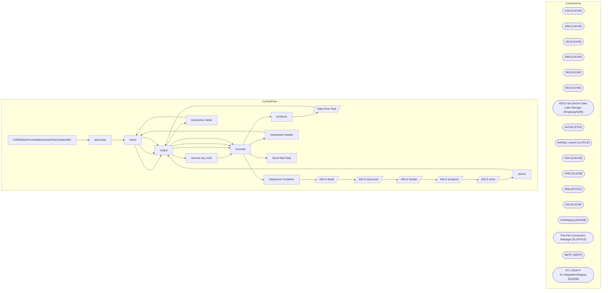

# SSIS Package: CRMSalesForceDataExtensionFileCreateA360

**Project:** CRMSalesForceDataExtensionFileCreateA360  
**Folder:** CRM  

## Architecture Diagram

## Connection Managers

| Connection Name | Type |
|---|---|
| 12M | CACHE |
| 18M | CACHE |
| 1M | CACHE |
| 24M | CACHE |
| 3M | CACHE |
| 6M | CACHE |
| ADLS raw | Azure Data Lake Storage (KingswaySoft) |
| archive | FILE |
| birthday_export.csv | FILE |
| cDim | CACHE |
| CRM | OLEDB |
| delta | EXCEL |
| DW | OLEDB |
| DWStaging | OLEDB |
| Flat File Connection Manager | FLATFILE |
| SMTP | SMTP |
| STL-SSIS-P-01.IntegrationStaging | OLEDB |

## Control Flow Tasks

| Task Name | Type |
|---|---|
| CRMSalesForceDataExtensionFileCreateA360 | Microsoft.Package |
| discounts | STOCK:SEQUENCE |
| insert | Microsoft.ExecuteSQLTask |
| output | Microsoft.ExecuteSQLTask |
| remove any nulls | Microsoft.ExecuteSQLTask |
| truncate | Microsoft.ExecuteSQLTask |
| products | STOCK:SEQUENCE |
| Data Flow Task | Microsoft.Pipeline |
| output | Microsoft.ExecuteSQLTask |
| truncate | Microsoft.ExecuteSQLTask |
| Sequence Container | STOCK:SEQUENCE |
| ADLS detail | Microsoft.Pipeline |
| ADLS discounts | Microsoft.Pipeline |
| ADLS header | Microsoft.Pipeline |
| ADLS products | Microsoft.Pipeline |
| ADLS store | Microsoft.Pipeline |
| stores | STOCK:SEQUENCE |
| output | Microsoft.ExecuteSQLTask |
| transaction detail | STOCK:SEQUENCE |
| insert | Microsoft.ExecuteSQLTask |
| output | Microsoft.ExecuteSQLTask |
| truncate | Microsoft.ExecuteSQLTask |
| transaction header | STOCK:SEQUENCE |
| insert | Microsoft.ExecuteSQLTask |
| output | Microsoft.ExecuteSQLTask |
| truncate | Microsoft.ExecuteSQLTask |
| Send Mail Task | Microsoft.SendMailTask |

## Data Flow: Sources

| Component | Tables Referenced | SQL Preview |
|---|---|---|
|  |  | with  products as ( select p.* from [Azure].[vwPOSOutbound_Products] p ), chain as ( select style, max(Chain) as consumerGroup from  [Azure].[vwProducts]  group by style  ) select products.*, chain.consumerGroup from products join chain on products.ProductNumber = chain.style |

## Data Flow: Destinations

| Component | Destination Table |
|---|---|
|  | [dbo].[A360_product_dim] |

