# SSIS Package: Package

**Project:** CRM_1439_file_create  
**Folder:** CRM  

## Architecture Diagram

```mermaid
flowchart TD
    subgraph Connections
        clb_crmdb_t_01_crm_conn(["clb-crmdb-t-01.crm [OLEDB]"])
        Flat_File_Connection_Manager_conn(["Flat File Connection Manager [FLATFILE]"])
        IntegrationStaging_conn(["IntegrationStaging [OLEDB]"])
        papamart_dw_conn(["papamart.dw [OLEDB]"])
        stl_crmdb_p_01_crm_conn(["stl-crmdb-p-01.crm [OLEDB]"])
    end
    subgraph ControlFlow
        Package_task["Package"]
        day_task["day"]
        Package_task --> day_task
        export_file_task[/"export file"/]
        day_task --> export_file_task
        move_file_task["move file"]
        export_file_task --> move_file_task
        Sequence_Container_task["Sequence Container"]
        move_file_task --> Sequence_Container_task
        move_1439b_task[/"move 1439b"/]
        Sequence_Container_task --> move_1439b_task
        stage_1439a_task[/"stage 1439a"/]
        move_1439b_task --> stage_1439a_task
        stage_1439b_task[/"stage 1439b"/]
        stage_1439a_task --> stage_1439b_task
        stage_1439c_task[/"stage 1439c"/]
        stage_1439b_task --> stage_1439c_task
        stage_1439d_task[/"stage 1439d"/]
        stage_1439c_task --> stage_1439d_task
        stage_1439e_task[/"stage 1439e"/]
        stage_1439d_task --> stage_1439e_task
        stage_1439f_task[/"stage 1439f"/]
        stage_1439e_task --> stage_1439f_task
        Sequence_Container_1_task["Sequence Container 1"]
        stage_1439f_task --> Sequence_Container_1_task
        assign_date_keys_task["assign date keys"]
        Sequence_Container_1_task --> assign_date_keys_task
        set_endDate_task["set endDate"]
        assign_date_keys_task --> set_endDate_task
        set_startDate_task["set startDate"]
        set_endDate_task --> set_startDate_task
        truncate_task["truncate"]
        set_startDate_task --> truncate_task
        truncate_2_task["truncate 2"]
        truncate_task --> truncate_2_task
    end
```

## Connection Managers

| Connection Name | Type |
|---|---|
| clb-crmdb-t-01.crm | OLEDB |
| Flat File Connection Manager | FLATFILE |
| IntegrationStaging | OLEDB |
| papamart.dw | OLEDB |
| stl-crmdb-p-01.crm | OLEDB |

## Control Flow Tasks

| Task Name | Type |
|---|---|
| Package | Microsoft.Package |
| day | Microsoft.ExecuteSQLTask |
| export file | Microsoft.Pipeline |
| move file | Microsoft.FileSystemTask |
| Sequence Container | STOCK:SEQUENCE |
| move 1439b | Microsoft.Pipeline |
| stage 1439a | Microsoft.Pipeline |
| stage 1439b | Microsoft.Pipeline |
| stage 1439c | Microsoft.Pipeline |
| stage 1439d | Microsoft.Pipeline |
| stage 1439e | Microsoft.Pipeline |
| stage 1439f | Microsoft.Pipeline |
| Sequence Container 1 | STOCK:SEQUENCE |
| assign date keys | Microsoft.ExecuteSQLTask |
| set endDate | Microsoft.ExecuteSQLTask |
| set startDate | Microsoft.ExecuteSQLTask |
| truncate | Microsoft.ExecuteSQLTask |
| truncate 2 | Microsoft.ExecuteSQLTask |

## Data Flow: Sources

| Component | Tables Referenced | SQL Preview |
|---|---|---|
|  |  | select 	ctf.customernumber, 	ctf.crmtransactionid, 	dd.actual_date as transaction_date, 	--tdf.transaction_id, 	--sd.store_id, 	--tdf.transaction_no, 	--sd.country, 	--right(sku,2)*1 as age, 	(year(dd.actual_date)-(right(sku,2)*1))*100+month(dd.actual_date) as bdayYYYYMM	 from transaction_detail_facts tdf with(nolock) 	JOIN CRMTransactionFact ctf with (nolock) on tdf.transaction_id=ctf.transaction |
|  |  | select 	c.customer_no, 	s.bdayYYYYMM, 	min(s.transactionDate) as transactionDate from customer c with (nolock) 	join bab_1439 s on c.customer_no=s.CustomerNumber group by  	c.customer_no,  	s.bdayYYYYMM |
|  |  | select distinct 	c.customer_no,  	s.bdayYYYYMM, 	min(s.transactionDate) as transactionDate from customer c with (nolock) 	join transaction_header th with (nolock) on c.customer_id=th.customer_id 	join bab_1439 s on th.transaction_id=s.CRMTransactionID  and cast(th.transaction_date as date)=s.transactionDate group by  	c.customer_no,  	s.bdayYYYYMM |
|  |  | select 	c.customer_no, 	ca.attribute_code, 	case when ca.attribute_code like 'CYC%' then right(ca.attribute_code,1)*1 else -1 end as cyc_max, 	ca.attribute_value as bdayYYYYMM from customer c with (nolock) 	join customer_attribute ca with (nolock) on c.customer_id=ca.customer_id and ca.attribute_grouping_code='BDAY' 	join (select distinct customerNumber from bab_1439b) s on c.customer_no=s.custome |
|  |  | select b.* from CRM_stage_1439b b 	full outer join CRM_stage_1439c  c on b.customerNumber=c.customerNumber and b.bdayYYYYMM=c.bdayYYYYMM where c.customerNumber is null |
|  |  | select 	customerNumber, 	max(isnull(cyc_max,-1)) as cyc_max  from CRM_stage_1439c group by customerNumber |
|  |  | select distinct 	cast(customerNumber as varchar) as customerNumber, 	cast(bdayYYYYMM as varchar) as bdayYYYYMM, 	'BDAY' as attribute_grouping_code, 	attribute_code, 	cast(cast(transactionDate as date)as varchar) as attribute_date, 	'I' as action_code from  (select s5.customerNumber, s5.bdayYYYYMM, s5.transactionDate, rank() over (partition by s5.customerNumber order by bdayYYYYMM) as rank_order, c |

## Data Flow: Destinations

| Component | Destination Table |
|---|---|
|  | [dbo].[CRM_stage_1439f] |
|  | [dbo].[CRM_stage_1439b] |
|  | [dbo].[bab_1439b] |
|  | [dbo].[bab_1439] |
|  | [dbo].[bab_1439b] |
|  | [dbo].[CRM_stage_1439c] |
|  | [dbo].[CRM_stage_1439d] |
|  | [dbo].[CRM_stage_1439e] |
|  | [dbo].[CRM_stage_1439f] |

