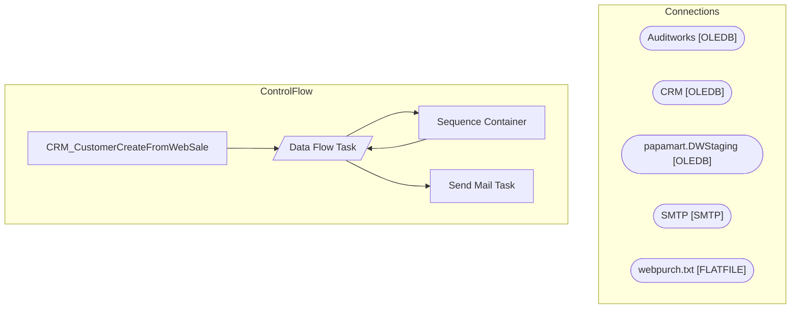

# SSIS Package: CRM_CustomerCreateFromWebSale

**Project:** CRM_CustomerCreateFromWebSale  
**Folder:** CRM  

## Architecture Diagram

## Connection Managers

| Connection Name | Type |
|---|---|
| Auditworks | OLEDB |
| CRM | OLEDB |
| papamart.DWStaging | OLEDB |
| SMTP | SMTP |
| webpurch.txt | FLATFILE |

## Control Flow Tasks

| Task Name | Type |
|---|---|
| CRM_CustomerCreateFromWebSale | Microsoft.Package |
| Data Flow Task | Microsoft.Pipeline |
| Sequence Container | STOCK:SEQUENCE |
| Data Flow Task | Microsoft.Pipeline |
| Send Mail Task | Microsoft.SendMailTask |

## Data Flow: Sources

| Component | Tables Referenced | SQL Preview |
|---|---|---|
|  |  | select  	cast(m.email as nvarchar) as email_address, 	cast(m.[first-name] as nvarchar) First_name, 	cast(m.[last-name] as nvarchar) last_name, 	cast(m.address1 as nvarchar) address_1, 	cast(m.address2 as nvarchar) address_2, 	cast(m.city as nvarchar) as city, 	cast(case when len(m.[state-code]) > 2 then NULL else m.[state-code] end as nvarchar) as state, 	cast(m.[postal-code] as nvarchar) post_cod |
|  |  | with EmailMaxTransactionID as ---get email's most recent transaction from store 13 	( 		select  			max(th.transaction_id) MaxTransactionID, 			c.email_address 		from customer c with (nolock)  		join transaction_header th with (nolock) on c.transaction_id=th.transaction_id 		where th.store_no = 13 		and c.customer_role=1 --purchasing customer?? 		and c.email_address not like '%buildabear.com' 		gro |

## Data Flow: Destinations

| Component | Destination Table |
|---|---|
|  | [dbo].[vwWebSaleCustomerEmailForCRM] |
|  | [dbo].[vwWebSaleCustomerEmailForCRM] |

