# SSIS Package: CRM_CustomerDimDelete

**Project:** CRM_CustomerDimDelete  
**Folder:** CRM  

## Architecture Diagram

```mermaid
flowchart TD
    subgraph Connections
        Archive_conn(["Archive [FILE]"])
        CRM_conn(["CRM [OLEDB]"])
        CRM_1_conn(["CRM 1 [OLEDB]"])
        CRMCustomerDimDelete_xlsx_conn(["CRMCustomerDimDelete.xlsx [Excel (KingswaySoft)]"])
        DW_conn(["DW [OLEDB]"])
        DW_1_conn(["DW 1 [OLEDB]"])
        DWStaging_conn(["DWStaging [OLEDB]"])
        IntegrationStaging_conn(["IntegrationStaging [OLEDB]"])
        SMTP_conn(["SMTP [SMTP]"])
    end
    subgraph ControlFlow
        CRM_CustomerDimDelete_task["CRM_CustomerDimDelete"]
        Sequence_Container_task["Sequence Container"]
        CRM_CustomerDimDelete_task --> Sequence_Container_task
        prepare_data_for_compare_and_updates_task["prepare data for compare and updates"]
        Sequence_Container_task --> prepare_data_for_compare_and_updates_task
        CRM_results_task[/"CRM results"/]
        prepare_data_for_compare_and_updates_task --> CRM_results_task
        truncate_table_task["truncate table"]
        CRM_results_task --> truncate_table_task
        Sequence_Container_2_task["Sequence Container 2"]
        truncate_table_task --> Sequence_Container_2_task
        Data_Flow_Task_task[/"Data Flow Task"/]
        Sequence_Container_2_task --> Data_Flow_Task_task
        Sequence_Container_3_task["Sequence Container 3"]
        Data_Flow_Task_task --> Sequence_Container_3_task
        Data_Flow_Task_task[/"Data Flow Task"/]
        Sequence_Container_3_task --> Data_Flow_Task_task
        truncate_stage_task["truncate stage"]
        Data_Flow_Task_task --> truncate_stage_task
        Sequence_Container_1_task["Sequence Container 1"]
        truncate_stage_task --> Sequence_Container_1_task
        delete_customers_no_longer_in_CRM_from_DE_table_task["delete customers no longer in CRM from DE table"]
        Sequence_Container_1_task --> delete_customers_no_longer_in_CRM_from_DE_table_task
        Sequence_Container_4_task["Sequence Container 4"]
        delete_customers_no_longer_in_CRM_from_DE_table_task --> Sequence_Container_4_task
        Sequence_Container_5_task["Sequence Container 5"]
        Sequence_Container_4_task --> Sequence_Container_5_task
        delete_from_CRMCustomerDim_task["delete from CRMCustomerDim"]
        Sequence_Container_5_task --> delete_from_CRMCustomerDim_task
        set_status_in_CRMDE1_task["set status in CRMDE1"]
        delete_from_CRMCustomerDim_task --> set_status_in_CRMDE1_task
        Sequence_Container_6_task["Sequence Container 6"]
        set_status_in_CRMDE1_task --> Sequence_Container_6_task
        archive_file_task["archive file"]
        Sequence_Container_6_task --> archive_file_task
        Send_Mail_Task_task["Send Mail Task"]
        archive_file_task --> Send_Mail_Task_task
        Send_Mail_Task_task["Send Mail Task"]
        Send_Mail_Task_task --> Send_Mail_Task_task
    end
```

## Connection Managers

| Connection Name | Type |
|---|---|
| Archive | FILE |
| CRM | OLEDB |
| CRM 1 | OLEDB |
| CRMCustomerDimDelete.xlsx | Excel (KingswaySoft) |
| DW | OLEDB |
| DW 1 | OLEDB |
| DWStaging | OLEDB |
| IntegrationStaging | OLEDB |
| SMTP | SMTP |

## Control Flow Tasks

| Task Name | Type |
|---|---|
| CRM_CustomerDimDelete | Microsoft.Package |
| Sequence Container | STOCK:SEQUENCE |
| prepare data for compare and updates | STOCK:SEQUENCE |
| CRM results | Microsoft.Pipeline |
| truncate table | Microsoft.ExecuteSQLTask |
| Sequence Container 2 | STOCK:SEQUENCE |
| Data Flow Task | Microsoft.Pipeline |
| Sequence Container 3 | STOCK:SEQUENCE |
| Data Flow Task | Microsoft.Pipeline |
| truncate stage | Microsoft.ExecuteSQLTask |
| Sequence Container 1 | STOCK:SEQUENCE |
| delete customers no longer in CRM from DE table | Microsoft.ExecuteSQLTask |
| Sequence Container 4 | STOCK:SEQUENCE |
| Sequence Container 5 | STOCK:SEQUENCE |
| delete from CRMCustomerDim | Microsoft.ExecuteSQLTask |
| set status in CRMDE1 | Microsoft.ExecuteSQLTask |
| Sequence Container 6 | STOCK:SEQUENCE |
| archive file | Microsoft.FileSystemTask |
| Send Mail Task | Microsoft.SendMailTask |
| Send Mail Task | Microsoft.SendMailTask |

## Data Flow: Sources

| Component | Tables Referenced | SQL Preview |
|---|---|---|
|  |  | select CustomerID, CustomerNumber  from papamart.dw.[dbo].[CRMCustomerDim] cD --where CustomerNumber = '926943103'  where not exists (select c.customer_id from customer c where cD.CustomerID = c.customer_id) |
|  |  | SELECT [customerNumber] FROM [dbo].[tmpCRM_CustomerDimDelete] |

## Data Flow: Destinations

| Component | Destination Table |
|---|---|
|  | [dbo].[tmpCRM_UKcompareValidation] |
|  | [dbo].[tmpCRM_CustomerDimDelete] |
|  | [dbo].[tmpCRM_CustomerDimDelete] |
|  | [dbo].[tmpCRM_CustomerDimDelete] |

