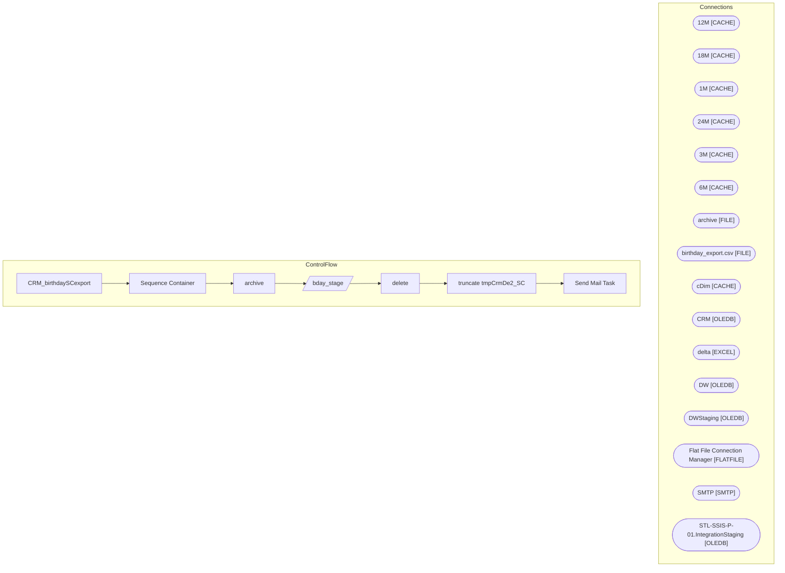

# SSIS Package: CRM_birthdaySCexport

**Project:** CRM_birthdaySCexport  
**Folder:** CRM  

## Architecture Diagram

## Connection Managers

| Connection Name | Type |
|---|---|
| 12M | CACHE |
| 18M | CACHE |
| 1M | CACHE |
| 24M | CACHE |
| 3M | CACHE |
| 6M | CACHE |
| archive | FILE |
| birthday_export.csv | FILE |
| cDim | CACHE |
| CRM | OLEDB |
| delta | EXCEL |
| DW | OLEDB |
| DWStaging | OLEDB |
| Flat File Connection Manager | FLATFILE |
| SMTP | SMTP |
| STL-SSIS-P-01.IntegrationStaging | OLEDB |

## Control Flow Tasks

| Task Name | Type |
|---|---|
| CRM_birthdaySCexport | Microsoft.Package |
| Sequence Container | STOCK:SEQUENCE |
| archive | Microsoft.FileSystemTask |
| bday_stage | Microsoft.Pipeline |
| delete | Microsoft.FileSystemTask |
| truncate tmpCrmDe2_SC | Microsoft.ExecuteSQLTask |
| Send Mail Task | Microsoft.SendMailTask |

## Data Flow: Sources

_No OLE DB data flow sources detected._

## Data Flow: Destinations

| Component | Destination Table |
|---|---|
|  | [dbo].[tmpCrmDe2_SC] |

