# SSIS Package: ConversantFiles

**Project:** ConversantFilesUpload  
**Folder:** CRM  

## Architecture Diagram

```mermaid
flowchart TD
    subgraph Connections
        Archive_conn(["Archive [FILE]"])
        CLB_CRMDB_T_01_crm_conn(["CLB-CRMDB-T-01.crm [OLEDB]"])
        conversant_Customer_File_txt_conn(["conversant Customer File txt [FLATFILE]"])
        Conversant_Product_File_txt_conn(["Conversant Product File txt [FLATFILE]"])
        Conversant_Transaction_File_txt_conn(["Conversant Transaction File txt [FLATFILE]"])
        conversant_web_order_fil_txt_conn(["conversant web order fil txt [FLATFILE]"])
        CRMDB02_crm_conn(["CRMDB02.crm [OLEDB]"])
        STL_CRMDB_P_01_crm_conn(["STL-CRMDB-P-01.crm [OLEDB]"])
    end
    subgraph ControlFlow
        ConversantFiles_task["ConversantFiles"]
        Conversant_Customer_Data_task["Conversant Customer Data"]
        ConversantFiles_task --> Conversant_Customer_Data_task
        Data_Flow_Task_task[/"Data Flow Task"/]
        Conversant_Customer_Data_task --> Data_Flow_Task_task
        Export_Customer_Data_to_File_task[/"Export Customer Data to File"/]
        Data_Flow_Task_task --> Export_Customer_Data_to_File_task
        Truncate_Customer_Table_task["Truncate Customer Table"]
        Export_Customer_Data_to_File_task --> Truncate_Customer_Table_task
        Zip_Customer_File_task["Zip Customer File"]
        Truncate_Customer_Table_task --> Zip_Customer_File_task
        Execute_Process_Task_task["Execute Process Task"]
        Zip_Customer_File_task --> Execute_Process_Task_task
        Conversant_Product_Data_task["Conversant Product Data"]
        Execute_Process_Task_task --> Conversant_Product_Data_task
        Export_Product_Data_to_File_task[/"Export Product Data to File"/]
        Conversant_Product_Data_task --> Export_Product_Data_to_File_task
        Zip_Product_File_task["Zip Product File"]
        Export_Product_Data_to_File_task --> Zip_Product_File_task
        Execute_Process_Task_task["Execute Process Task"]
        Zip_Product_File_task --> Execute_Process_Task_task
        Conversant_Transaction_Data_task["Conversant Transaction Data"]
        Execute_Process_Task_task --> Conversant_Transaction_Data_task
        Export_Transaction_Data_to_File_task[/"Export Transaction Data to File"/]
        Conversant_Transaction_Data_task --> Export_Transaction_Data_to_File_task
        Insert_into_Transaction_Table__past_7_days__task["Insert into Transaction Table (past 7 days)"]
        Export_Transaction_Data_to_File_task --> Insert_into_Transaction_Table__past_7_days__task
        Truncate_Transaction_Table_task["Truncate Transaction Table"]
        Insert_into_Transaction_Table__past_7_days__task --> Truncate_Transaction_Table_task
        Zip_Transaction_File_task["Zip Transaction File"]
        Truncate_Transaction_Table_task --> Zip_Transaction_File_task
        Execute_Process_Task_task["Execute Process Task"]
        Zip_Transaction_File_task --> Execute_Process_Task_task
        Conversant_Web_Data_task["Conversant Web Data"]
        Execute_Process_Task_task --> Conversant_Web_Data_task
        Data_Flow_Task_task[/"Data Flow Task"/]
        Conversant_Web_Data_task --> Data_Flow_Task_task
        Insert_Web_Order_Data__past_7_days__task["Insert Web Order Data (past 7 days)"]
        Data_Flow_Task_task --> Insert_Web_Order_Data__past_7_days__task
        Truncate_Web_Order_Table_task["Truncate Web Order Table"]
        Insert_Web_Order_Data__past_7_days__task --> Truncate_Web_Order_Table_task
        Zip_Transaction_File_task["Zip Transaction File"]
        Truncate_Web_Order_Table_task --> Zip_Transaction_File_task
        Execute_Process_Task_task["Execute Process Task"]
        Zip_Transaction_File_task --> Execute_Process_Task_task
        Execute_sp_to_upload_files_to_sftp_task["Execute sp to upload files to sftp"]
        Execute_Process_Task_task --> Execute_sp_to_upload_files_to_sftp_task
        Insert_into_Customer_Table__past_7_days__task["Insert into Customer Table (past 7 days)"]
        Execute_sp_to_upload_files_to_sftp_task --> Insert_into_Customer_Table__past_7_days__task
        Upload_and_Move_Zip_Files_task["Upload and Move Zip Files"]
        Insert_into_Customer_Table__past_7_days__task --> Upload_and_Move_Zip_Files_task
        File_System_Task_task["File System Task"]
        Upload_and_Move_Zip_Files_task --> File_System_Task_task
    end
```

## Connection Managers

| Connection Name | Type |
|---|---|
| Archive | FILE |
| CLB-CRMDB-T-01.crm | OLEDB |
| conversant Customer File txt | FLATFILE |
| Conversant Product File txt | FLATFILE |
| Conversant Transaction File txt | FLATFILE |
| conversant web order fil txt | FLATFILE |
| CRMDB02.crm | OLEDB |
| STL-CRMDB-P-01.crm | OLEDB |

## Control Flow Tasks

| Task Name | Type |
|---|---|
| ConversantFiles | Microsoft.Package |
| Conversant Customer Data | STOCK:SEQUENCE |
| Data Flow Task | Microsoft.Pipeline |
| Export Customer Data to File | Microsoft.Pipeline |
| Truncate Customer Table | Microsoft.ExecuteSQLTask |
| Zip Customer File | STOCK:FOREACHLOOP |
| Execute Process Task | Microsoft.ExecuteProcess |
| Conversant Product Data | STOCK:SEQUENCE |
| Export Product Data to File | Microsoft.Pipeline |
| Zip Product File | STOCK:FOREACHLOOP |
| Execute Process Task | Microsoft.ExecuteProcess |
| Conversant Transaction Data | STOCK:SEQUENCE |
| Export Transaction Data to File | Microsoft.Pipeline |
| Insert into Transaction Table (past 7 days) | Microsoft.ExecuteSQLTask |
| Truncate Transaction Table | Microsoft.ExecuteSQLTask |
| Zip Transaction File | STOCK:FOREACHLOOP |
| Execute Process Task | Microsoft.ExecuteProcess |
| Conversant Web Data | STOCK:SEQUENCE |
| Data Flow Task | Microsoft.Pipeline |
| Insert Web Order Data (past 7 days) | Microsoft.ExecuteSQLTask |
| Truncate Web Order Table | Microsoft.ExecuteSQLTask |
| Zip Transaction File | STOCK:FOREACHLOOP |
| Execute Process Task | Microsoft.ExecuteProcess |
| Execute sp to upload files to sftp | Microsoft.ExecuteSQLTask |
| Insert into Customer Table (past 7 days) | Microsoft.ExecuteSQLTask |
| Upload and Move Zip Files | STOCK:FOREACHLOOP |
| File System Task | Microsoft.FileSystemTask |

## Data Flow: Sources

| Component | Tables Referenced | SQL Preview |
|---|---|---|
|  |  | select  c.customer_no, c.customer_id,  c.first_name,  c.last_name,  a.address_1, a.address_2, a.address_3, a.address_4, a.post_code, a.country_code,  c.gender,  e.email_address,  c.landmark_date_a,  p.telephone_no, cd.store_no,  ed.email_opt_in_flag as opt_in_flag,  clp.current_membership_type_code as membership_type_code,  clt.last_purchase_date AS last_tran_date FROM customer AS c with (nolock)  |
|  |  | select  c.customer_no, c.customer_id,  c.first_name,  c.last_name,  a.address_1, a.address_2, a.address_3, a.address_4, a.post_code, a.country_code,  c.gender,  e.email_address,  c.landmark_date_a,  p.telephone_no, cd.store_no,  ed.email_opt_in_flag as opt_in_flag,  clp.current_membership_type_code as membership_type_code,  clt.last_purchase_date AS last_tran_date FROM customer AS c with (nolock)  |
|  |  | Select c.* from ConversantCustomer c where not exists  	(--	subquery excludes funky characters in first or last name 		Select fc.customer_id 		from ConversantCustomer fc 		where  			( 				fc.first_name <> cast(fc.first_name as varchar) 				or fc.last_name <> cast(fc.last_name as varchar) 			) 		and fc.customer_id = c.customer_id 	) |
|  |  | select   s.style_aka, s.style_description, s.vendor_code, s.style_id, p.Class, p.Department, p.Chain,  p.KeyStory  from style s Left Join papamart.dw.Azure.vwProducts p 	On s.style_aka =  p.Style  COLLATE SQL_Latin1_General_CP1_CI_AS |
|  |  | select * from ConversantTrans |
|  |  | select * from ConversantWebOrders |

## Data Flow: Destinations

| Component | Destination Table |
|---|---|
|  | [dbo].[ConversantCustomer] |

