# SSIS Package: DatoRamaETL

**Project:** DatoRamaETL  
**Folder:** CRM  

## Architecture Diagram

```mermaid
flowchart TD
    subgraph Connections
        Azure_conn(["Azure [ADO.NET:System.Data.OleDb.OleDbConnection, System.Data, Version=4.0.0.0, Culture=neutral, PublicKeyToken=b77a5c561934e089]"])
        DatoRamaMergedCSV_conn(["DatoRamaMergedCSV [FLATFILE]"])
        DW_conn(["DW [OLEDB]"])
        EmailFacts_conn(["EmailFacts [FLATFILE]"])
        IntegrationStaging_conn(["IntegrationStaging [OLEDB]"])
        SMTP_conn(["SMTP [SMTP]"])
        StoreSalesCSV_conn(["StoreSalesCSV [FLATFILE]"])
        TrafficCSV_conn(["TrafficCSV [FLATFILE]"])
        WebSalesCSV_conn(["WebSalesCSV [FLATFILE]"])
    end
    subgraph ControlFlow
        DatoRamaETL_task["DatoRamaETL"]
        Execution_Path_Selection_task["Execution Path Selection"]
        DatoRamaETL_task --> Execution_Path_Selection_task
        SEQ___Generate_DatoramaOfflineData_File_task["SEQ - Generate DatoramaOfflineData File"]
        Execution_Path_Selection_task --> SEQ___Generate_DatoramaOfflineData_File_task
        Traffic_plus_Web_and_Store_Sales_task[/"Traffic plus Web and Store Sales"/]
        SEQ___Generate_DatoramaOfflineData_File_task --> Traffic_plus_Web_and_Store_Sales_task
        Truncate_DatoRamaTesting_Table_task["Truncate DatoRamaTesting Table"]
        Traffic_plus_Web_and_Store_Sales_task --> Truncate_DatoRamaTesting_Table_task
        SEQ___Generate_EmailFacts_File_task["SEQ - Generate EmailFacts File"]
        Truncate_DatoRamaTesting_Table_task --> SEQ___Generate_EmailFacts_File_task
        EmailFacts_task[/"EmailFacts"/]
        SEQ___Generate_EmailFacts_File_task --> EmailFacts_task
        SEQ___Generate_Files___Replaced_Sep_3_2021_task["SEQ - Generate Files - Replaced Sep 3 2021"]
        EmailFacts_task --> SEQ___Generate_Files___Replaced_Sep_3_2021_task
        EmailFacts_task[/"EmailFacts"/]
        SEQ___Generate_Files___Replaced_Sep_3_2021_task --> EmailFacts_task
        Store_Sales_task[/"Store Sales"/]
        EmailFacts_task --> Store_Sales_task
        Traffic_task[/"Traffic"/]
        Store_Sales_task --> Traffic_task
        Web_Sales_task[/"Web Sales"/]
        Traffic_task --> Web_Sales_task
        SEQ___Upload_DatoramaOfflineData_File_to_FTP_task["SEQ - Upload DatoramaOfflineData File to FTP"]
        Web_Sales_task --> SEQ___Upload_DatoramaOfflineData_File_to_FTP_task
        FTP_task["FTP"]
        SEQ___Upload_DatoramaOfflineData_File_to_FTP_task --> FTP_task
        SEQ___Upload_EmailFacts_File_to_FTP_task["SEQ - Upload EmailFacts File to FTP"]
        FTP_task --> SEQ___Upload_EmailFacts_File_to_FTP_task
        FTP_task["FTP"]
        SEQ___Upload_EmailFacts_File_to_FTP_task --> FTP_task
        Send_Mail_Task_task["Send Mail Task"]
        FTP_task --> Send_Mail_Task_task
    end
```

## Connection Managers

| Connection Name | Type |
|---|---|
| Azure | ADO.NET:System.Data.OleDb.OleDbConnection, System.Data, Version=4.0.0.0, Culture=neutral, PublicKeyToken=b77a5c561934e089 |
| DatoRamaMergedCSV | FLATFILE |
| DW | OLEDB |
| EmailFacts | FLATFILE |
| IntegrationStaging | OLEDB |
| SMTP | SMTP |
| StoreSalesCSV | FLATFILE |
| TrafficCSV | FLATFILE |
| WebSalesCSV | FLATFILE |

## Control Flow Tasks

| Task Name | Type |
|---|---|
| DatoRamaETL | Microsoft.Package |
| Execution Path Selection | Microsoft.ExecuteSQLTask |
| SEQ - Generate DatoramaOfflineData File | STOCK:SEQUENCE |
| Traffic plus Web and Store Sales | Microsoft.Pipeline |
| Truncate DatoRamaTesting Table | Microsoft.ExecuteSQLTask |
| SEQ - Generate EmailFacts File | STOCK:SEQUENCE |
| EmailFacts | Microsoft.Pipeline |
| SEQ - Generate Files - Replaced Sep 3 2021 | STOCK:SEQUENCE |
| EmailFacts | Microsoft.Pipeline |
| Store Sales | Microsoft.Pipeline |
| Traffic | Microsoft.Pipeline |
| Web Sales | Microsoft.Pipeline |
| SEQ - Upload DatoramaOfflineData File to FTP | STOCK:SEQUENCE |
| FTP | Microsoft.ExecuteSQLTask |
| SEQ - Upload EmailFacts File to FTP | STOCK:SEQUENCE |
| FTP | Microsoft.ExecuteSQLTask |
| Send Mail Task | Microsoft.SendMailTask |

## Data Flow: Sources

| Component | Tables Referenced | SQL Preview |
|---|---|---|
|  |  | select  	cast(SendDate as date) as SendDate, 	AudienceSeg,		 	LastPurchaseChan, 	sum(case when ClickDate is null then 0 else 1 end) as ClickCount, 	sum(case when OpenDate is null then 0 else 1 end) as OpenCount, 	sum(case when BounceDate is null then 0 else 1 end) as BounceCount, 	sum(case when UnSubDate is null then 0 else 1 end) as UnSubCount, 	PreferredStory, 	sum(retRev1) RetailSalesDayOne, 	s |
|  |  | select  	cast(SendDate as date) as SendDate, 	AudienceSeg,		 	LastPurchaseChan, 	sum(case when ClickDate is null then 0 else 1 end) as ClickCount, 	sum(case when OpenDate is null then 0 else 1 end) as OpenCount, 	sum(case when BounceDate is null then 0 else 1 end) as BounceCount, 	sum(case when UnSubDate is null then 0 else 1 end) as UnSubCount, 	PreferredStory, 	sum(retRev1) RetailSalesDayOne, 	s |

## Data Flow: Destinations

| Component | Destination Table |
|---|---|
|  | [dbo].[DatoRamaTesting] |

