# SSIS Package: EmailFactRevCalc

**Project:** EmailFactRevCalc  
**Folder:** CRM  

## Architecture Diagram

```mermaid
flowchart TD
    subgraph Connections
        DW_conn(["DW [OLEDB]"])
        Dynamics_AX_Connection_Manager_conn(["Dynamics AX Connection Manager [DynamicsAX]"])
        papamart_DWStaging_conn(["papamart.DWStaging [OLEDB]"])
        SMTP_conn(["SMTP [SMTP]"])
    end
    subgraph ControlFlow
        EmailFactRevCalc_task["EmailFactRevCalc"]
        EmailFact_update__using_email_address__task["EmailFact update (using email address)"]
        EmailFactRevCalc_task --> EmailFact_update__using_email_address__task
        main_task["main"]
        EmailFact_update__using_email_address__task --> main_task
        retail_updates_task["retail updates"]
        main_task --> retail_updates_task
        subcontainer_1_task["subcontainer 1"]
        retail_updates_task --> subcontainer_1_task
        update_EmailFact_retRev1_task["update EmailFact retRev1"]
        subcontainer_1_task --> update_EmailFact_retRev1_task
        subcontainer_2_task["subcontainer 2"]
        update_EmailFact_retRev1_task --> subcontainer_2_task
        update_EmailFact_retRev2_task["update EmailFact retRev2"]
        subcontainer_2_task --> update_EmailFact_retRev2_task
        subcontainer_3_task["subcontainer 3"]
        update_EmailFact_retRev2_task --> subcontainer_3_task
        update_EmailFact_retRev3_task["update EmailFact retRev3"]
        subcontainer_3_task --> update_EmailFact_retRev3_task
        subcontainer_4_task["subcontainer 4"]
        update_EmailFact_retRev3_task --> subcontainer_4_task
        update_EmailFact_retRev1_task["update EmailFact retRev1"]
        subcontainer_4_task --> update_EmailFact_retRev1_task
        subcontainer_5_task["subcontainer 5"]
        update_EmailFact_retRev1_task --> subcontainer_5_task
        update_EmailFact_retRev2_task["update EmailFact retRev2"]
        subcontainer_5_task --> update_EmailFact_retRev2_task
        subcontainer_6_task["subcontainer 6"]
        update_EmailFact_retRev2_task --> subcontainer_6_task
        update_EmailFact_retRev1_task["update EmailFact retRev1"]
        subcontainer_6_task --> update_EmailFact_retRev1_task
        web_updates_task["web updates"]
        update_EmailFact_retRev1_task --> web_updates_task
        subcontainer_10_task["subcontainer 10"]
        web_updates_task --> subcontainer_10_task
        update_EmailFact_webRev1_task["update EmailFact webRev1"]
        subcontainer_10_task --> update_EmailFact_webRev1_task
        subcontainer_11_task["subcontainer 11"]
        update_EmailFact_webRev1_task --> subcontainer_11_task
        update_EmailFact_webRev1_task["update EmailFact webRev1"]
        subcontainer_11_task --> update_EmailFact_webRev1_task
        subcontainer_12_task["subcontainer 12"]
        update_EmailFact_webRev1_task --> subcontainer_12_task
        update_EmailFact_webRev1_task["update EmailFact webRev1"]
        subcontainer_12_task --> update_EmailFact_webRev1_task
        subcontainer_7_task["subcontainer 7"]
        update_EmailFact_webRev1_task --> subcontainer_7_task
        update_EmailFact_webRev1_task["update EmailFact webRev1"]
        subcontainer_7_task --> update_EmailFact_webRev1_task
        subcontainer_8_task["subcontainer 8"]
        update_EmailFact_webRev1_task --> subcontainer_8_task
        update_EmailFact_webRev2_task["update EmailFact webRev2"]
        subcontainer_8_task --> update_EmailFact_webRev2_task
        subcontainer_9_task["subcontainer 9"]
        update_EmailFact_webRev2_task --> subcontainer_9_task
        update_EmailFact_webRev2_task["update EmailFact webRev2"]
        subcontainer_9_task --> update_EmailFact_webRev2_task
        EmailFactYYYY_update__using_email_address__task["EmailFactYYYY update (using email address)"]
        update_EmailFact_webRev2_task --> EmailFactYYYY_update__using_email_address__task
        main_task["main"]
        EmailFactYYYY_update__using_email_address__task --> main_task
        retail_updates_task["retail updates"]
        main_task --> retail_updates_task
        subcontainer_1_task["subcontainer 1"]
        retail_updates_task --> subcontainer_1_task
        StartDate3_StartDate3_task[/"StartDate3_StartDate3"/]
        subcontainer_1_task --> StartDate3_StartDate3_task
        update_EmailFact_retRev1_task["update EmailFact retRev1"]
        StartDate3_StartDate3_task --> update_EmailFact_retRev1_task
        subcontainer_2_task["subcontainer 2"]
        update_EmailFact_retRev1_task --> subcontainer_2_task
        StartDate3_StartDate2_task[/"StartDate3_StartDate2"/]
        subcontainer_2_task --> StartDate3_StartDate2_task
        update_EmailFact_retRev2_task["update EmailFact retRev2"]
        StartDate3_StartDate2_task --> update_EmailFact_retRev2_task
        subcontainer_3_task["subcontainer 3"]
        update_EmailFact_retRev2_task --> subcontainer_3_task
        StartDate3_StartDate1_task[/"StartDate3_StartDate1"/]
        subcontainer_3_task --> StartDate3_StartDate1_task
        update_EmailFact_retRev3_task["update EmailFact retRev3"]
        StartDate3_StartDate1_task --> update_EmailFact_retRev3_task
        subcontainer_4_task["subcontainer 4"]
        update_EmailFact_retRev3_task --> subcontainer_4_task
        StartDate2_StartDate2_task[/"StartDate2_StartDate2"/]
        subcontainer_4_task --> StartDate2_StartDate2_task
        update_EmailFact_retRev1_task["update EmailFact retRev1"]
        StartDate2_StartDate2_task --> update_EmailFact_retRev1_task
        subcontainer_5_task["subcontainer 5"]
        update_EmailFact_retRev1_task --> subcontainer_5_task
        StartDate2_StartDate1_task[/"StartDate2_StartDate1"/]
        subcontainer_5_task --> StartDate2_StartDate1_task
        update_EmailFact_retRev2_task["update EmailFact retRev2"]
        StartDate2_StartDate1_task --> update_EmailFact_retRev2_task
        subcontainer_6_task["subcontainer 6"]
        update_EmailFact_retRev2_task --> subcontainer_6_task
        StartDate1_StartDate1_task[/"StartDate1_StartDate1"/]
        subcontainer_6_task --> StartDate1_StartDate1_task
        update_EmailFact_retRev1_task["update EmailFact retRev1"]
        StartDate1_StartDate1_task --> update_EmailFact_retRev1_task
        web_updates_task["web updates"]
        update_EmailFact_retRev1_task --> web_updates_task
        subcontainer_10_task["subcontainer 10"]
        web_updates_task --> subcontainer_10_task
        StartDate2_StartDate2_task[/"StartDate2_StartDate2"/]
        subcontainer_10_task --> StartDate2_StartDate2_task
        update_EmailFact_webRev1_task["update EmailFact webRev1"]
        StartDate2_StartDate2_task --> update_EmailFact_webRev1_task
        subcontainer_11_task["subcontainer 11"]
        update_EmailFact_webRev1_task --> subcontainer_11_task
        StartDate2_StartDate1_task[/"StartDate2_StartDate1"/]
        subcontainer_11_task --> StartDate2_StartDate1_task
        update_EmailFact_webRev2_task["update EmailFact webRev2"]
        StartDate2_StartDate1_task --> update_EmailFact_webRev2_task
        subcontainer_12_task["subcontainer 12"]
        update_EmailFact_webRev2_task --> subcontainer_12_task
        StartDate1_StartDate1_task[/"StartDate1_StartDate1"/]
        subcontainer_12_task --> StartDate1_StartDate1_task
        update_EmailFact_webRev1_task["update EmailFact webRev1"]
        StartDate1_StartDate1_task --> update_EmailFact_webRev1_task
        subcontainer_7_task["subcontainer 7"]
        update_EmailFact_webRev1_task --> subcontainer_7_task
        StartDate3_StartDate3_task[/"StartDate3_StartDate3"/]
        subcontainer_7_task --> StartDate3_StartDate3_task
        update_EmailFact_webRev1_task["update EmailFact webRev1"]
        StartDate3_StartDate3_task --> update_EmailFact_webRev1_task
        subcontainer_8_task["subcontainer 8"]
        update_EmailFact_webRev1_task --> subcontainer_8_task
        StartDate3_StartDate2_task[/"StartDate3_StartDate2"/]
        subcontainer_8_task --> StartDate3_StartDate2_task
        update_EmailFact_webRev2_task["update EmailFact webRev2"]
        StartDate3_StartDate2_task --> update_EmailFact_webRev2_task
        subcontainer_9_task["subcontainer 9"]
        update_EmailFact_webRev2_task --> subcontainer_9_task
        StartDate3_StartDate1_task[/"StartDate3_StartDate1"/]
        subcontainer_9_task --> StartDate3_StartDate1_task
        update_EmailFact_webRev3_task["update EmailFact webRev3"]
        StartDate3_StartDate1_task --> update_EmailFact_webRev3_task
        truncate_stage_task["truncate stage"]
        update_EmailFact_webRev3_task --> truncate_stage_task
        Send_Mail_Task_task["Send Mail Task"]
        truncate_stage_task --> Send_Mail_Task_task
    end
```

## Connection Managers

| Connection Name | Type |
|---|---|
| DW | OLEDB |
| Dynamics AX Connection Manager | DynamicsAX |
| papamart.DWStaging | OLEDB |
| SMTP | SMTP |

## Control Flow Tasks

| Task Name | Type |
|---|---|
| EmailFactRevCalc | Microsoft.Package |
| EmailFact update (using email address) | STOCK:SEQUENCE |
| main | STOCK:SEQUENCE |
| retail updates | STOCK:SEQUENCE |
| subcontainer 1 | STOCK:SEQUENCE |
| update EmailFact retRev1 | Microsoft.ExecuteSQLTask |
| subcontainer 2 | STOCK:SEQUENCE |
| update EmailFact retRev2 | Microsoft.ExecuteSQLTask |
| subcontainer 3 | STOCK:SEQUENCE |
| update EmailFact retRev3 | Microsoft.ExecuteSQLTask |
| subcontainer 4 | STOCK:SEQUENCE |
| update EmailFact retRev1 | Microsoft.ExecuteSQLTask |
| subcontainer 5 | STOCK:SEQUENCE |
| update EmailFact retRev2 | Microsoft.ExecuteSQLTask |
| subcontainer 6 | STOCK:SEQUENCE |
| update EmailFact retRev1 | Microsoft.ExecuteSQLTask |
| web updates | STOCK:SEQUENCE |
| subcontainer 10 | STOCK:SEQUENCE |
| update EmailFact webRev1 | Microsoft.ExecuteSQLTask |
| subcontainer 11 | STOCK:SEQUENCE |
| update EmailFact webRev1 | Microsoft.ExecuteSQLTask |
| subcontainer 12 | STOCK:SEQUENCE |
| update EmailFact webRev1 | Microsoft.ExecuteSQLTask |
| subcontainer 7 | STOCK:SEQUENCE |
| update EmailFact webRev1 | Microsoft.ExecuteSQLTask |
| subcontainer 8 | STOCK:SEQUENCE |
| update EmailFact webRev2 | Microsoft.ExecuteSQLTask |
| subcontainer 9 | STOCK:SEQUENCE |
| update EmailFact webRev2 | Microsoft.ExecuteSQLTask |
| EmailFactYYYY update (using email address) | STOCK:SEQUENCE |
| main | STOCK:SEQUENCE |
| retail updates | STOCK:SEQUENCE |
| subcontainer 1 | STOCK:SEQUENCE |
| StartDate3_StartDate3 | Microsoft.Pipeline |
| update EmailFact retRev1 | Microsoft.ExecuteSQLTask |
| subcontainer 2 | STOCK:SEQUENCE |
| StartDate3_StartDate2 | Microsoft.Pipeline |
| update EmailFact retRev2 | Microsoft.ExecuteSQLTask |
| subcontainer 3 | STOCK:SEQUENCE |
| StartDate3_StartDate1 | Microsoft.Pipeline |
| update EmailFact retRev3 | Microsoft.ExecuteSQLTask |
| subcontainer 4 | STOCK:SEQUENCE |
| StartDate2_StartDate2 | Microsoft.Pipeline |
| update EmailFact retRev1 | Microsoft.ExecuteSQLTask |
| subcontainer 5 | STOCK:SEQUENCE |
| StartDate2_StartDate1 | Microsoft.Pipeline |
| update EmailFact retRev2 | Microsoft.ExecuteSQLTask |
| subcontainer 6 | STOCK:SEQUENCE |
| StartDate1_StartDate1 | Microsoft.Pipeline |
| update EmailFact retRev1 | Microsoft.ExecuteSQLTask |
| web updates | STOCK:SEQUENCE |
| subcontainer 10 | STOCK:SEQUENCE |
| StartDate2_StartDate2 | Microsoft.Pipeline |
| update EmailFact webRev1 | Microsoft.ExecuteSQLTask |
| subcontainer 11 | STOCK:SEQUENCE |
| StartDate2_StartDate1 | Microsoft.Pipeline |
| update EmailFact webRev2 | Microsoft.ExecuteSQLTask |
| subcontainer 12 | STOCK:SEQUENCE |
| StartDate1_StartDate1 | Microsoft.Pipeline |
| update EmailFact webRev1 | Microsoft.ExecuteSQLTask |
| subcontainer 7 | STOCK:SEQUENCE |
| StartDate3_StartDate3 | Microsoft.Pipeline |
| update EmailFact webRev1 | Microsoft.ExecuteSQLTask |
| subcontainer 8 | STOCK:SEQUENCE |
| StartDate3_StartDate2 | Microsoft.Pipeline |
| update EmailFact webRev2 | Microsoft.ExecuteSQLTask |
| subcontainer 9 | STOCK:SEQUENCE |
| StartDate3_StartDate1 | Microsoft.Pipeline |
| update EmailFact webRev3 | Microsoft.ExecuteSQLTask |
| truncate stage | Microsoft.ExecuteSQLTask |
| Send Mail Task | Microsoft.SendMailTask |

## Data Flow: Sources

| Component | Tables Referenced | SQL Preview |
|---|---|---|
|  |  | with emailOpen as ( select eF.OpenDate,   eF.EmailAddress  from [DW].[dbo].[EmailFact2020] eF where convert(varchar, eF.OpenDate, 101) = ?  ), transDay as ( select t.CustomerNumber, m.EmailAddress, sum(t.purchaseRevenue) as 'retRev' from [dw].[dbo].[CRMde3] t join [dw].[dbo].[CRMde1] m on t.customerNumber = m.customerNumber where t.purchaseDate = ? and t.purchaseStoreNumber not in  ('0013','2013') |
|  |  | with emailOpen as ( select eF.OpenDate,   eF.EmailAddress  from [DW].[dbo].[EmailFact2020] eF where convert(varchar, eF.OpenDate, 101) = ?  ), transDay as ( select t.CustomerNumber, m.EmailAddress, sum(t.purchaseRevenue) as 'retRev' from [dw].[dbo].[CRMde3] t join [dw].[dbo].[CRMde1] m on t.customerNumber = m.customerNumber where t.purchaseDate = ? and t.purchaseStoreNumber not in  ('0013','2013') |
|  |  | with emailOpen as ( select eF.OpenDate,   eF.EmailAddress  from [DW].[dbo].[EmailFact2024] eF where convert(varchar, eF.OpenDate, 101) = ?  ), transDay as ( select t.CustomerNumber, m.EmailAddress, sum(t.purchaseRevenue) as 'retRev' from [dw].[dbo].[CRMde3] t join [dw].[dbo].[CRMde1] m on t.customerNumber = m.customerNumber where t.purchaseDate = ? and t.purchaseStoreNumber not in  ('0013','2013') |
|  |  | with emailOpen as ( select eF.OpenDate,   eF.EmailAddress  from [DW].[dbo].[EmailFact2020] eF where convert(varchar, eF.OpenDate, 101) = ?  ), transDay as ( select t.CustomerNumber, m.EmailAddress, sum(t.purchaseRevenue) as 'retRev' from [dw].[dbo].[CRMde3] t join [dw].[dbo].[CRMde1] m on t.customerNumber = m.customerNumber where t.purchaseDate = ? and t.purchaseStoreNumber not in  ('0013','2013') |
|  |  | with emailOpen as ( select eF.OpenDate,   eF.EmailAddress  from [DW].[dbo].[EmailFact2024] eF where convert(varchar, eF.OpenDate, 101) = ?  ), transDay as ( select t.CustomerNumber, m.EmailAddress, sum(t.purchaseRevenue) as 'retRev' from [dw].[dbo].[CRMde3] t join [dw].[dbo].[CRMde1] m on t.customerNumber = m.customerNumber where t.purchaseDate = ? and t.purchaseStoreNumber not in  ('0013','2013') |
|  |  | with emailOpen as ( select eF.OpenDate,   eF.EmailAddress  from [DW].[dbo].[EmailFact2024] eF where convert(varchar, eF.OpenDate, 101) = ?  ), transDay as ( select t.CustomerNumber, m.EmailAddress, sum(t.purchaseRevenue) as 'retRev' from [dw].[dbo].[CRMde3] t join [dw].[dbo].[CRMde1] m on t.customerNumber = m.customerNumber where t.purchaseDate = ? and t.purchaseStoreNumber not in  ('0013','2013') |
|  |  | with emailOpen as ( select eF.OpenDate,   eF.EmailAddress  from [DW].[dbo].[EmailFact2020] eF where convert(varchar, eF.OpenDate, 101) = ?  ), transDay as ( select t.CustomerNumber, m.EmailAddress, sum(t.purchaseRevenue) as 'webRev' from [dw].[dbo].[CRMde3] t join [dw].[dbo].[CRMde1] m on t.customerNumber = m.customerNumber where t.purchaseDate = ? and t.purchaseStoreNumber in  ('0013','2013') gro |
|  |  | with emailOpen as ( select eF.OpenDate,   eF.EmailAddress  from [DW].[dbo].[EmailFact2024] eF where convert(varchar, eF.OpenDate, 101) = ?  ), transDay as ( select t.CustomerNumber, m.EmailAddress, sum(t.purchaseRevenue) as 'webRev' from [dw].[dbo].[CRMde3] t join [dw].[dbo].[CRMde1] m on t.customerNumber = m.customerNumber where t.purchaseDate = ? and t.purchaseStoreNumber in  ('0013','2013') gro |
|  |  | with emailOpen as ( select eF.OpenDate,   eF.EmailAddress  from [DW].[dbo].[EmailFact2024] eF where convert(varchar, eF.OpenDate, 101) = ?  ), transDay as ( select t.CustomerNumber, m.EmailAddress, sum(t.purchaseRevenue) as 'webRev' from [dw].[dbo].[CRMde3] t join [dw].[dbo].[CRMde1] m on t.customerNumber = m.customerNumber where t.purchaseDate = ? and t.purchaseStoreNumber in  ('0013','2013') gro |
|  |  | with emailOpen as ( select eF.OpenDate,   eF.EmailAddress  from [DW].[dbo].[EmailFact2020] eF where convert(varchar, eF.OpenDate, 101) = ?  ), transDay as ( select t.CustomerNumber, m.EmailAddress, sum(t.purchaseRevenue) as 'webRev' from [dw].[dbo].[CRMde3] t join [dw].[dbo].[CRMde1] m on t.customerNumber = m.customerNumber where t.purchaseDate = ? and t.purchaseStoreNumber in  ('0013','2013') gro |
|  |  | with emailOpen as ( select eF.OpenDate,   eF.EmailAddress  from [DW].[dbo].[EmailFact2020] eF where convert(varchar, eF.OpenDate, 101) = ?  ), transDay as ( select t.CustomerNumber, m.EmailAddress, sum(t.purchaseRevenue) as 'webRev' from [dw].[dbo].[CRMde3] t join [dw].[dbo].[CRMde1] m on t.customerNumber = m.customerNumber where t.purchaseDate = ? and t.purchaseStoreNumber in  ('0013','2013') gro |
|  |  | with emailOpen as ( select eF.OpenDate,   eF.EmailAddress  from [DW].[dbo].[EmailFact2024] eF where convert(varchar, eF.OpenDate, 101) = ?  ), transDay as ( select t.CustomerNumber, m.EmailAddress, sum(t.purchaseRevenue) as 'webRev' from [dw].[dbo].[CRMde3] t join [dw].[dbo].[CRMde1] m on t.customerNumber = m.customerNumber where t.purchaseDate = ? and t.purchaseStoreNumber in  ('0013','2013') gro |

## Data Flow: Destinations

| Component | Destination Table |
|---|---|
|  | [dbo].[tmpEmailretRev1] |
|  | [dbo].[tmpEmailretRev2] |
|  | [dbo].[tmpEmailretRev3] |
|  | [dbo].[tmpEmailretRev1a] |
|  | [dbo].[tmpEmailretRev2a] |
|  | [dbo].[tmpEmailretRev1b] |
|  | [dbo].[tmpEmailwebRev1a] |
|  | [dbo].[tmpEmailwebRev2a] |
|  | [dbo].[tmpEmailwebRev1b] |
|  | [dbo].[tmpEmailwebRev1] |
|  | [dbo].[tmpEmailwebRev2] |
|  | [dbo].[tmpEmailwebRev3] |

