# SSIS Package: EmailFactsETL

**Project:** EmailFactsETL_once  
**Folder:** CRM  

## Architecture Diagram

```mermaid
flowchart TD
    subgraph Connections
        DW_conn(["DW [OLEDB]"])
        DWStaging_conn(["DWStaging [OLEDB]"])
        EmailRevenue_conn(["EmailRevenue [FLATFILE]"])
        EmailRevenue__extra_columns__conn(["EmailRevenue (extra columns) [FLATFILE]"])
        ESPStaging_conn(["ESPStaging [OLEDB]"])
        ffcm_conn(["ffcm [FLATFILE]"])
        IntegrationStaging_conn(["IntegrationStaging [OLEDB]"])
        SMTP_EMAIL_conn(["SMTP_EMAIL [SMTP]"])
    end
    subgraph ControlFlow
        EmailFactsETL_task["EmailFactsETL"]
        blank_file_alert_task["blank file alert"]
        EmailFactsETL_task --> blank_file_alert_task
        Email_Data_Sequence_task["Email Data Sequence"]
        blank_file_alert_task --> Email_Data_Sequence_task
        EmailBounceStage_task[/"EmailBounceStage"/]
        Email_Data_Sequence_task --> EmailBounceStage_task
        EmailClickStage_task[/"EmailClickStage"/]
        EmailBounceStage_task --> EmailClickStage_task
        EmailOpenStage_task[/"EmailOpenStage"/]
        EmailClickStage_task --> EmailOpenStage_task
        EmailSendJobs_task[/"EmailSendJobs"/]
        EmailOpenStage_task --> EmailSendJobs_task
        EmailSentStage_task[/"EmailSentStage"/]
        EmailSendJobs_task --> EmailSentStage_task
        EmailSentStage__backup__task[/"EmailSentStage (backup)"/]
        EmailSentStage_task --> EmailSentStage__backup__task
        EmailUnSubStage_task[/"EmailUnSubStage"/]
        EmailSentStage__backup__task --> EmailUnSubStage_task
        Merge_EmailEventFact_task["Merge EmailEventFact"]
        EmailUnSubStage_task --> Merge_EmailEventFact_task
        Truncate_Stage_task["Truncate Stage"]
        Merge_EmailEventFact_task --> Truncate_Stage_task
        EmailRevenueNew_task["EmailRevenueNew"]
        Truncate_Stage_task --> EmailRevenueNew_task
        Data_Flow_task[/"Data Flow"/]
        EmailRevenueNew_task --> Data_Flow_task
        Data_Flow_WIP_task[/"Data Flow WIP"/]
        Data_Flow_task --> Data_Flow_WIP_task
        File_System_Task_task["File System Task"]
        Data_Flow_WIP_task --> File_System_Task_task
        Merge_EmailRevenueNew_task["Merge EmailRevenueNew"]
        File_System_Task_task --> Merge_EmailRevenueNew_task
        remove_blank_rows_task["remove blank rows"]
        Merge_EmailRevenueNew_task --> remove_blank_rows_task
        Truncate_Stage_task["Truncate Stage"]
        remove_blank_rows_task --> Truncate_Stage_task
        Merge_Sequence_task["Merge Sequence"]
        Truncate_Stage_task --> Merge_Sequence_task
        DataFlow___EmailFactRollupStage_task[/"DataFlow - EmailFactRollupStage"/]
        Merge_Sequence_task --> DataFlow___EmailFactRollupStage_task
        EmailFactStage_task[/"EmailFactStage"/]
        DataFlow___EmailFactRollupStage_task --> EmailFactStage_task
        Merge_EmailFact2022_task["Merge EmailFact2022"]
        EmailFactStage_task --> Merge_EmailFact2022_task
        MergeEmailFactRollup_task["MergeEmailFactRollup"]
        Merge_EmailFact2022_task --> MergeEmailFactRollup_task
        no_file_alert_task["no file alert"]
        MergeEmailFactRollup_task --> no_file_alert_task
        one_time_clickCount_update_task["one time clickCount update"]
        no_file_alert_task --> one_time_clickCount_update_task
        EmailClickStage_task[/"EmailClickStage"/]
        one_time_clickCount_update_task --> EmailClickStage_task
        Truncate_Stage_task["Truncate Stage"]
        EmailClickStage_task --> Truncate_Stage_task
        update_EmailFacts_task["update EmailFacts"]
        Truncate_Stage_task --> update_EmailFacts_task
        Send_Mail_Task_task["Send Mail Task"]
        update_EmailFacts_task --> Send_Mail_Task_task
        Send_Email_onError_task["Send Email onError"]
        Send_Mail_Task_task --> Send_Email_onError_task
    end
```

## Connection Managers

| Connection Name | Type |
|---|---|
| DW | OLEDB |
| DWStaging | OLEDB |
| EmailRevenue | FLATFILE |
| EmailRevenue (extra columns) | FLATFILE |
| ESPStaging | OLEDB |
| ffcm | FLATFILE |
| IntegrationStaging | OLEDB |
| SMTP_EMAIL | SMTP |

## Control Flow Tasks

| Task Name | Type |
|---|---|
| EmailFactsETL | Microsoft.Package |
| blank file alert | Microsoft.SendMailTask |
| Email Data Sequence | STOCK:SEQUENCE |
| EmailBounceStage | Microsoft.Pipeline |
| EmailClickStage | Microsoft.Pipeline |
| EmailOpenStage | Microsoft.Pipeline |
| EmailSendJobs | Microsoft.Pipeline |
| EmailSentStage | Microsoft.Pipeline |
| EmailSentStage (backup) | Microsoft.Pipeline |
| EmailUnSubStage | Microsoft.Pipeline |
| Merge EmailEventFact | Microsoft.ExecuteSQLTask |
| Truncate Stage | Microsoft.ExecuteSQLTask |
| EmailRevenueNew | STOCK:FOREACHLOOP |
| Data Flow | Microsoft.Pipeline |
| Data Flow WIP | Microsoft.Pipeline |
| File System Task | Microsoft.FileSystemTask |
| Merge EmailRevenueNew | Microsoft.ExecuteSQLTask |
| remove blank rows | Microsoft.ExecuteSQLTask |
| Truncate Stage | Microsoft.ExecuteSQLTask |
| Merge Sequence | STOCK:SEQUENCE |
| DataFlow - EmailFactRollupStage | Microsoft.Pipeline |
| EmailFactStage | Microsoft.Pipeline |
| Merge EmailFact2022 | Microsoft.ExecuteSQLTask |
| MergeEmailFactRollup | Microsoft.ExecuteSQLTask |
| no file alert | Microsoft.SendMailTask |
| one time clickCount update | STOCK:SEQUENCE |
| EmailClickStage | Microsoft.Pipeline |
| Truncate Stage | Microsoft.ExecuteSQLTask |
| update EmailFacts | Microsoft.ExecuteSQLTask |
| Send Mail Task | Microsoft.SendMailTask |
| Send Email onError | Microsoft.SendMailTask |

## Data Flow: Sources

| Component | Tables Referenced | SQL Preview |
|---|---|---|
|  |  | select  	ClientID, 	SendID, --SubscriberKey, lower(upper(EmailAddress)) as EmailAddress, min(EventDate) as BounceDate from ET_Bounce s with (nolock) where cast(EventDate as date) >= ?  group by ClientID, 	SendID, --SubscriberKey, 	lower(upper(EmailAddress)) |
|  |  | select  	ClientID, 	SendID, 	--SubscriberKey, 	lower(upper(EmailAddress)) as EmailAddress, count(*) as clickCount, min(EventDate) as ClickDate from ET_Clicks with (nolock) where cast(EventDate as date) >= ? group by ClientID, 	SendID, 	--SubscriberKey, 	lower(upper(EmailAddress)) |
|  |  | select  	ClientID, 	SendID, 	--SubscriberKey, 	lower(upper(EmailAddress)) as EmailAddress, min(EventDate) OpenDate from ET_Opens with (nolock) where cast(EventDate as date) >= ? group by   	ClientID, 	SendID, 	--SubscriberKey, 	lower(upper(EmailAddress)) |
|  |  | select   	ClientID, 	SendID, 	Subject, 	EmailName, 	min(SentTime) EventDate from ET_SendJobs with (nolock) where cast(SentTime as date) between ? and ? group by ClientID, 	SendID, 	Subject, 	EmailName |
|  |  | select   	ClientID, 	SendID, 	SubscriberID, 	--SubscriberKey, 	lower(upper(EmailAddress)) as EmailAddress, 	min(s.EventDate) SendDate from ET_Sent s with (nolock) where cast(EventDate as date) between ? and ? --where cast(EventDate as date) between '02/17/2022' and '02/19/2022' --and EmailAddress = 'gweniek@icloud.com' group by  	ClientID, 	SendID, 	SubscriberID, 	--SubscriberKey, 	lower(upper(Ema |
|  |  | select  	 --JobID as SendID, 	 cast(right(JobID, 7) as int) as SendID,  --SubID as SubscriberID, EmailAddress, 	case when FrequencyCount1m = '' then 0 else cast(FrequencyCount1m as int) end as FrequencyCount1m,	 	case when FrequencyCount3m = '' then 0 else cast(FrequencyCount3m as int) end as FrequencyCount3m, 	case when FrequencyCount6m = '' then 0 else cast(FrequencyCount6m as int) end as Freque |
|  |  | select   	ClientID, 	SendID, 	SubscriberID, 	--SubscriberKey, 	lower(upper(EmailAddress)) as EmailAddress, 	min(s.EventDate) SendDate from ET_Sent s with (nolock) where cast(EventDate as date) between ? and ? group by  	ClientID, 	SendID, 	SubscriberID, 	--SubscriberKey, 	lower(upper(EmailAddress)) |
|  |  | select  	JobID as SendID, 	SubID as SubscriberID, 	FrequencyCount24m,	 	RecencyCount24m,	 	FrequencyCount1m,	 	FrequencyCount3m,	 	FrequencyCount6m,	 	FrequencyCount12m,	 	FrequencyCount18m,	 	FrequencyCountTTL,	 	RecencyCount1m,	 	RecencyCount3m,	 	RecencyCount6m,	 	RecencyCount12m,	 	RecencyCountTTL,	 	MonetarySum1m,	 	MonetarySum3m,	 	MonetarySum6m,	 	MonetarySum12m,	 	MonetarySum18m,	 	Monetar |
|  |  | select  	ClientID, 	SendID, 	--SubscriberKey, 	lower(upper(EmailAddress)) as EmailAddress, min(EventDate) as UnSubDate from ET_Unsubs with (nolock) where cast(EventDate as date) >= ?  group by ClientID, 	SendID, 	--SubscriberKey, 	lower(upper(EmailAddress)) |
|  |  | select  	EmailAddress, 	max(SendDate) LastSendDate, 	max(ClickDate) LastClickDate, 	max(OpenDate) LastOpenDate, 	max(BounceDate) LastBounceDate, 	max(UnSubDate) LastUnSubscribeDate from EmailFact2022 with (nolock) group by  	EmailAddress |
|  |  | select *  from vwEmailFact with (nolock) |
|  |  | select  	ClientID, 	SendID, 	--SubscriberKey, 	lower(upper(EmailAddress)) as EmailAddress, count(*) as clickCount, min(EventDate) as ClickDate from ET_Clicks with (nolock) where cast(EventDate as date) >= '2019-1-1' and cast(EventDate as date) <= '2019-6-29' group by ClientID, 	SendID, 	--SubscriberKey, 	lower(upper(EmailAddress)) |

## Data Flow: Destinations

| Component | Destination Table |
|---|---|
|  | [EmailBounceStage] |
|  | [EmailClickStage] |
|  | [EmailOpenStage] |
|  | [EmailSendJobs] |
|  | [dbo].[EmailSentStage] |
|  | [dbo].[EmailSentStage] |
|  | [dbo].[EmailUnSubStage] |
|  | [dbo].[EmailRevenueNewStage] |
|  | [dbo].[EmailRevenueNewStage] |
|  | [dbo].[EmailFactRollupStage] |
|  | [dbo].[EmailFactStage] |
|  | [dbo].[vwEmailFact2] |
|  | [EmailClickStage] |

