# SSIS Package: ExactTargetDownloadAndProcess

**Project:** ExactTargetDownloadAndProcessETL  
**Folder:** CRM  

## Architecture Diagram

```mermaid
flowchart TD
    subgraph Connections
        Archive_conn(["Archive [FILE]"])
        CRM_conn(["CRM [OLEDB]"])
        DW_conn(["DW [OLEDB]"])
        DWStaging_conn(["DWStaging [OLEDB]"])
        ExactTarget_conn(["ExactTarget [OLEDB]"])
        IntegrationStaging_conn(["IntegrationStaging [OLEDB]"])
        RejectedEmailsTxt_conn(["RejectedEmailsTxt [FLATFILE]"])
        SMTP_conn(["SMTP [SMTP]"])
    end
    subgraph ControlFlow
        ExactTargetDownloadAndProcess_task["ExactTargetDownloadAndProcess"]
        Download_and_Process_Sequence_task["Download and Process Sequence"]
        ExactTargetDownloadAndProcess_task --> Download_and_Process_Sequence_task
        SEQ___Archive_Unneeded_Files_task["SEQ - Archive Unneeded Files"]
        Download_and_Process_Sequence_task --> SEQ___Archive_Unneeded_Files_task
        Foreach_Loop___Move_Abandon_Files_task["Foreach Loop - Move Abandon Files"]
        SEQ___Archive_Unneeded_Files_task --> Foreach_Loop___Move_Abandon_Files_task
        Archive_Abandon_File_task["Archive Abandon File"]
        Foreach_Loop___Move_Abandon_Files_task --> Archive_Abandon_File_task
        Foreach_Loop___Move_CatalogResults_task["Foreach Loop - Move CatalogResults"]
        Archive_Abandon_File_task --> Foreach_Loop___Move_CatalogResults_task
        Archive_CatalogResults_File_task["Archive CatalogResults File"]
        Foreach_Loop___Move_CatalogResults_task --> Archive_CatalogResults_File_task
        SEQ___UpdateAllEmail_task["SEQ - UpdateAllEmail"]
        Archive_CatalogResults_File_task --> SEQ___UpdateAllEmail_task
        ForEachLoop___RejectedEmails_task["ForEachLoop - RejectedEmails"]
        SEQ___UpdateAllEmail_task --> ForEachLoop___RejectedEmails_task
        Archive_File_task["Archive File"]
        ForEachLoop___RejectedEmails_task --> Archive_File_task
        DataFlow___RejectedEmails_task[/"DataFlow - RejectedEmails"/]
        Archive_File_task --> DataFlow___RejectedEmails_task
        ErrorFileMove_task["ErrorFileMove"]
        DataFlow___RejectedEmails_task --> ErrorFileMove_task
        Process_Bounces___Opt_Outs_task["Process Bounces & Opt-Outs"]
        ErrorFileMove_task --> Process_Bounces___Opt_Outs_task
        Truncate_Stage_RejectedEmails_task["Truncate Stage RejectedEmails"]
        Process_Bounces___Opt_Outs_task --> Truncate_Stage_RejectedEmails_task
        spEmail_ET_Download_Extract_task["spEmail_ET_Download_Extract"]
        Truncate_Stage_RejectedEmails_task --> spEmail_ET_Download_Extract_task
        spExactTargetSFTPDownload_task["spExactTargetSFTPDownload"]
        spEmail_ET_Download_Extract_task --> spExactTargetSFTPDownload_task
        Send_Mail_Task_task["Send Mail Task"]
        spExactTargetSFTPDownload_task --> Send_Mail_Task_task
    end
```

## Connection Managers

| Connection Name | Type |
|---|---|
| Archive | FILE |
| CRM | OLEDB |
| DW | OLEDB |
| DWStaging | OLEDB |
| ExactTarget | OLEDB |
| IntegrationStaging | OLEDB |
| RejectedEmailsTxt | FLATFILE |
| SMTP | SMTP |

## Control Flow Tasks

| Task Name | Type |
|---|---|
| ExactTargetDownloadAndProcess | Microsoft.Package |
| Download and Process Sequence | STOCK:SEQUENCE |
| SEQ - Archive Unneeded Files | STOCK:SEQUENCE |
| Foreach Loop - Move Abandon Files | STOCK:FOREACHLOOP |
| Archive Abandon File | Microsoft.FileSystemTask |
| Foreach Loop - Move CatalogResults | STOCK:FOREACHLOOP |
| Archive CatalogResults File | Microsoft.FileSystemTask |
| SEQ - UpdateAllEmail | STOCK:SEQUENCE |
| ForEachLoop - RejectedEmails | STOCK:FOREACHLOOP |
| Archive File | Microsoft.FileSystemTask |
| DataFlow - RejectedEmails | Microsoft.Pipeline |
| ErrorFileMove | Microsoft.FileSystemTask |
| Process Bounces & Opt-Outs | Microsoft.ExecuteSQLTask |
| Truncate Stage RejectedEmails | Microsoft.ExecuteSQLTask |
| spEmail_ET_Download_Extract | Microsoft.ExecuteSQLTask |
| spExactTargetSFTPDownload | Microsoft.ExecuteSQLTask |
| Send Mail Task | Microsoft.SendMailTask |

## Data Flow: Sources

_No OLE DB data flow sources detected._

## Data Flow: Destinations

| Component | Destination Table |
|---|---|
|  | [dbo].[ET_Processing_Rejected_Emails] |

