# SSIS Package: ExactTargetLeadGen

**Project:** ExactTargetLeadGen  
**Folder:** CRM  

## Architecture Diagram

```mermaid
flowchart TD
    subgraph Connections
        dw_conn(["dw [OLEDB]"])
        DWStaging_conn(["DWStaging [OLEDB]"])
        LeadGenCsv_conn(["LeadGenCsv [FLATFILE]"])
        SMTP_conn(["SMTP [SMTP]"])
    end
    subgraph ControlFlow
        ExactTargetLeadGen_task["ExactTargetLeadGen"]
        Seq_Cont___Download_LeadGen_FTP_Files_task["Seq Cont - Download LeadGen FTP Files"]
        ExactTargetLeadGen_task --> Seq_Cont___Download_LeadGen_FTP_Files_task
        WinSCP___Get_Files_and_Archive_task["WinSCP - Get Files and Archive"]
        Seq_Cont___Download_LeadGen_FTP_Files_task --> WinSCP___Get_Files_and_Archive_task
        Seq_Cont___Stage_and_Merge_LeadGen_Files_task["Seq Cont - Stage and Merge LeadGen Files"]
        WinSCP___Get_Files_and_Archive_task --> Seq_Cont___Stage_and_Merge_LeadGen_Files_task
        Execute_SQL_Task___spMergeCustomerLeadGen_task["Execute SQL Task - spMergeCustomerLeadGen"]
        Seq_Cont___Stage_and_Merge_LeadGen_Files_task --> Execute_SQL_Task___spMergeCustomerLeadGen_task
        Execute_SQL_Task___Truncate_Stage_task["Execute SQL Task - Truncate Stage"]
        Execute_SQL_Task___spMergeCustomerLeadGen_task --> Execute_SQL_Task___Truncate_Stage_task
        FEL___Process_LeadGen_Files_to_Stage_task["FEL - Process LeadGen Files to Stage"]
        Execute_SQL_Task___Truncate_Stage_task --> FEL___Process_LeadGen_Files_to_Stage_task
        Archive_File_task["Archive File"]
        FEL___Process_LeadGen_Files_to_Stage_task --> Archive_File_task
        DataFlow___Lead_Gen_File_to_Stage_task[/"DataFlow - Lead Gen File to Stage"/]
        Archive_File_task --> DataFlow___Lead_Gen_File_to_Stage_task
        Send_Mail_Task_task["Send Mail Task"]
        DataFlow___Lead_Gen_File_to_Stage_task --> Send_Mail_Task_task
    end
```

## Connection Managers

| Connection Name | Type |
|---|---|
| dw | OLEDB |
| DWStaging | OLEDB |
| LeadGenCsv | FLATFILE |
| SMTP | SMTP |

## Control Flow Tasks

| Task Name | Type |
|---|---|
| ExactTargetLeadGen | Microsoft.Package |
| Seq Cont - Download LeadGen FTP Files | STOCK:SEQUENCE |
| WinSCP - Get Files and Archive | Microsoft.ExecuteProcess |
| Seq Cont - Stage and Merge LeadGen Files | STOCK:SEQUENCE |
| Execute SQL Task - spMergeCustomerLeadGen | Microsoft.ExecuteSQLTask |
| Execute SQL Task - Truncate Stage | Microsoft.ExecuteSQLTask |
| FEL - Process LeadGen Files to Stage | STOCK:FOREACHLOOP |
| Archive File | Microsoft.FileSystemTask |
| DataFlow - Lead Gen File to Stage | Microsoft.Pipeline |
| Send Mail Task | Microsoft.SendMailTask |

## Data Flow: Sources

_No OLE DB data flow sources detected._

## Data Flow: Destinations

| Component | Destination Table |
|---|---|
|  | [dbo].[CustomerLeadGenStage] |

