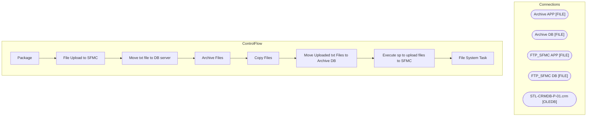

# SSIS Package: Package

**Project:** FileUploadSFMC  
**Folder:** CRM  

## Architecture Diagram

## Connection Managers

| Connection Name | Type |
|---|---|
| Archive APP | FILE |
| Archive DB | FILE |
| FTP_SFMC APP | FILE |
| FTP_SFMC DB | FILE |
| STL-CRMDB-P-01.crm | OLEDB |

## Control Flow Tasks

| Task Name | Type |
|---|---|
| Package | Microsoft.Package |
| File Upload to SFMC | STOCK:SEQUENCE |
| Move txt file to DB server | STOCK:FOREACHLOOP |
| Archive Files | Microsoft.FileSystemTask |
| Copy Files | Microsoft.FileSystemTask |
| Move Uploaded txt Files to Archive DB | STOCK:FOREACHLOOP |
| Execute sp to upload files to SFMC | Microsoft.ExecuteSQLTask |
| File System Task | Microsoft.FileSystemTask |

## Data Flow: Sources

_No OLE DB data flow sources detected._

## Data Flow: Destinations

_No OLE DB data flow destinations detected._

