# SSIS Package: PartyDailyBirthdayExclusions

**Project:** PartyDailyBirthdayExclusions  
**Folder:** CRM  

## Architecture Diagram

```mermaid
flowchart TD
    subgraph Connections
        BABWPartyPlanner_conn(["BABWPartyPlanner [OLEDB]"])
        dw_conn(["dw [OLEDB]"])
        DWStaging_conn(["DWStaging [OLEDB]"])
        PartyCustomers_csv_conn(["PartyCustomers.csv [FLATFILE]"])
        PartyRequest_conn(["PartyRequest [OLEDB]"])
        SMTP_EMAIL_conn(["SMTP_EMAIL [SMTP]"])
    end
    subgraph ControlFlow
        PartyDailyBirthdayExclusions_task["PartyDailyBirthdayExclusions"]
        Package_Sequence_task["Package Sequence"]
        PartyDailyBirthdayExclusions_task --> Package_Sequence_task
        6_weeks_DateKey_task["6 weeks DateKey"]
        Package_Sequence_task --> 6_weeks_DateKey_task
        daily_file_task[/"daily file"/]
        6_weeks_DateKey_task --> daily_file_task
        Get_Todays_DateKey_task["Get Todays DateKey"]
        daily_file_task --> Get_Todays_DateKey_task
        Stage_customerNumbers_task[/"Stage customerNumbers"/]
        Get_Todays_DateKey_task --> Stage_customerNumbers_task
        Stage_customerNumbers_1_task[/"Stage customerNumbers 1"/]
        Stage_customerNumbers_task --> Stage_customerNumbers_1_task
        Truncate_Staging_task["Truncate Staging"]
        Stage_customerNumbers_1_task --> Truncate_Staging_task
        upload_files_task["upload files"]
        Truncate_Staging_task --> upload_files_task
        Foreach_Loop___Move_to_Archive_task["Foreach Loop - Move to Archive"]
        upload_files_task --> Foreach_Loop___Move_to_Archive_task
        Archive_File_task["Archive File"]
        Foreach_Loop___Move_to_Archive_task --> Archive_File_task
        FTP_script_task["FTP script"]
        Archive_File_task --> FTP_script_task
        Send_Email_onError_task["Send Email onError"]
        FTP_script_task --> Send_Email_onError_task
    end
```

## Connection Managers

| Connection Name | Type |
|---|---|
| BABWPartyPlanner | OLEDB |
| dw | OLEDB |
| DWStaging | OLEDB |
| PartyCustomers.csv | FLATFILE |
| PartyRequest | OLEDB |
| SMTP_EMAIL | SMTP |

## Control Flow Tasks

| Task Name | Type |
|---|---|
| PartyDailyBirthdayExclusions | Microsoft.Package |
| Package Sequence | STOCK:SEQUENCE |
| 6 weeks DateKey | Microsoft.ExecuteSQLTask |
| daily file | Microsoft.Pipeline |
| Get Todays DateKey | Microsoft.ExecuteSQLTask |
| Stage customerNumbers | Microsoft.Pipeline |
| Stage customerNumbers 1 | Microsoft.Pipeline |
| Truncate Staging | Microsoft.ExecuteSQLTask |
| upload files | STOCK:SEQUENCE |
| Foreach Loop - Move to Archive | STOCK:FOREACHLOOP |
| Archive File | Microsoft.FileSystemTask |
| FTP script | Microsoft.ExecuteSQLTask |
| Send Email onError | Microsoft.SendMailTask |

## Data Flow: Sources

| Component | Tables Referenced | SQL Preview |
|---|---|---|
|  |  | SELECT [CustomerNumber], CONVERT(char(10), [partyDate], 101)  as partyDate FROM [dbo].[PartyDailyBirthdayExclusions] where [CustomerNumber] is not null |
|  |  | ; with  futurePartyCustID as ( select p.CustomerID, vp.ExecuteDateKey from Party p join vwDWPartyFacts vp on p.PartyID = vp.PartyID where p.PartyID in ( select PartyID from vwDWPartyFacts where ExecuteDateKey between ? and ? ) ), futurePartyEmailAddr as (select EmailAddress, CustomerID from [dbo].[Customer] where CUstomerID in  ( select CustomerID from futurePartyCustID) ) select e.EmailAddress, c |
|  |  | select ctf.CustomerNumber, cast(dd.actual_date as date) as 'partyDate' from papamart.dw.dbo.CRMTransactionFact ctf join papamart.dw.dbo.TransactionFact tf on ctf.TransactionID=tf.transaction_id join papamart.dw.dbo.party_Facts pf on tf.party_key=pf.party_key join papamart.dw.dbo.date_dim dd on pf.ExecuteDateKey = dd.date_key where pf.OccasionName='Birthday Party' and datediff(dd, ctf.TransactionDa |
|  |  | ; with  futurePartyCustID as ( select p.CustomerID, vp.ExecuteDateKey from Party p join vwDWPartyFacts vp on p.PartyID = vp.PartyID where p.PartyID in ( select PartyID from vwDWPartyFacts where ExecuteDateKey >= ? ) ), futurePartyEmailAddr as (select EmailAddress, CustomerID from [dbo].[Customer] where CUstomerID in  ( select CustomerID from futurePartyCustID) ) select e.EmailAddress, cast(d.actua |
|  |  | select ctf.CustomerNumber, cast(dd.actual_date as date) as 'partyDate' from papamart.dw.dbo.CRMTransactionFact ctf join papamart.dw.dbo.TransactionFact tf on ctf.TransactionID=tf.transaction_id join papamart.dw.dbo.party_Facts pf on tf.party_key=pf.party_key join papamart.dw.dbo.date_dim dd on pf.ExecuteDateKey = dd.date_key where pf.OccasionName='Birthday Party' and datediff(dd, ctf.TransactionDa |

## Data Flow: Destinations

| Component | Destination Table |
|---|---|
|  | [dbo].[PartyDailyBirthdayExclusions] |
|  | [dbo].[PartyDailyBirthdayExclusions] |

