# SSIS Package: ProcessCube

**Project:** ProcessCube  
**Folder:** Cube  

## Architecture Diagram

```mermaid
flowchart TD
    subgraph Connections
        biapp01_BAB_DW_conn(["biapp01.BAB DW [OLEDB]"])
        Cube_conn(["Cube [MSOLAP100]"])
        dw_conn(["dw [OLEDB]"])
        DWStaging_conn(["DWStaging [OLEDB]"])
        SMTP_conn(["SMTP [SMTP]"])
        SSISTemplates_conn(["SSISTemplates [OLEDB]"])
        SSRSJobServer_conn(["SSRSJobServer [OLEDB]"])
    end
    subgraph ControlFlow
        ProcessCube_task["ProcessCube"]
        CRM_Sequence_task["CRM Sequence"]
        ProcessCube_task --> CRM_Sequence_task
        Foreach_Loop_Container_task["Foreach Loop Container"]
        CRM_Sequence_task --> Foreach_Loop_Container_task
        Analysis_Services_Processing_Task_task["Analysis Services Processing Task"]
        Foreach_Loop_Container_task --> Analysis_Services_Processing_Task_task
        Select_Cube_Partitions_task["Select Cube Partitions"]
        Analysis_Services_Processing_Task_task --> Select_Cube_Partitions_task
        Labor_Measures_Sequence_task["Labor Measures Sequence"]
        Select_Cube_Partitions_task --> Labor_Measures_Sequence_task
        Foreach_Loop_Container_task["Foreach Loop Container"]
        Labor_Measures_Sequence_task --> Foreach_Loop_Container_task
        Analysis_Services_Processing_Task_task["Analysis Services Processing Task"]
        Foreach_Loop_Container_task --> Analysis_Services_Processing_Task_task
        Run_Cube_Validation_task["Run Cube Validation"]
        Analysis_Services_Processing_Task_task --> Run_Cube_Validation_task
        Select_Cube_Partitions_task["Select Cube Partitions"]
        Run_Cube_Validation_task --> Select_Cube_Partitions_task
        Measures_Sequence_task["Measures Sequence"]
        Select_Cube_Partitions_task --> Measures_Sequence_task
        Foreach_Loop_Container_task["Foreach Loop Container"]
        Measures_Sequence_task --> Foreach_Loop_Container_task
        Analysis_Services_Processing_Task_task["Analysis Services Processing Task"]
        Foreach_Loop_Container_task --> Analysis_Services_Processing_Task_task
        Run_Cube_Validation_task["Run Cube Validation"]
        Analysis_Services_Processing_Task_task --> Run_Cube_Validation_task
        Select_Cube_Partitions_task["Select Cube Partitions"]
        Run_Cube_Validation_task --> Select_Cube_Partitions_task
        SeqCont___Validate_task["SeqCont - Validate"]
        Select_Cube_Partitions_task --> SeqCont___Validate_task
        Capture_Imbalance_Count_task["Capture Imbalance Count"]
        SeqCont___Validate_task --> Capture_Imbalance_Count_task
        Capture_MDX_Date_task["Capture MDX Date"]
        Capture_Imbalance_Count_task --> Capture_MDX_Date_task
        Data_Flow_Task_task[/"Data Flow Task"/]
        Capture_MDX_Date_task --> Data_Flow_Task_task
        Raise_Error_task["Raise Error"]
        Data_Flow_Task_task --> Raise_Error_task
        Send_Mail_Task_task["Send Mail Task"]
        Raise_Error_task --> Send_Mail_Task_task
        Truncate_Stage_task["Truncate Stage"]
        Send_Mail_Task_task --> Truncate_Stage_task
        Process_Dimensions_task["Process Dimensions"]
        Truncate_Stage_task --> Process_Dimensions_task
        Process_Labor_Dimensions_task["Process Labor Dimensions"]
        Process_Dimensions_task --> Process_Labor_Dimensions_task
        StoreComps_Sequence_task["StoreComps Sequence"]
        Process_Labor_Dimensions_task --> StoreComps_Sequence_task
        Foreach_Loop_Container_task["Foreach Loop Container"]
        StoreComps_Sequence_task --> Foreach_Loop_Container_task
        Analysis_Services_Processing_Task_task["Analysis Services Processing Task"]
        Foreach_Loop_Container_task --> Analysis_Services_Processing_Task_task
        Select_Cube_Partitions_task["Select Cube Partitions"]
        Analysis_Services_Processing_Task_task --> Select_Cube_Partitions_task
        WhichWayDoWeGo_task["WhichWayDoWeGo"]
        Select_Cube_Partitions_task --> WhichWayDoWeGo_task
        Send_Mail_Task_task["Send Mail Task"]
        WhichWayDoWeGo_task --> Send_Mail_Task_task
    end
```

## Connection Managers

| Connection Name | Type |
|---|---|
| biapp01.BAB DW | OLEDB |
| Cube | MSOLAP100 |
| dw | OLEDB |
| DWStaging | OLEDB |
| SMTP | SMTP |
| SSISTemplates | OLEDB |
| SSRSJobServer | OLEDB |

## Control Flow Tasks

| Task Name | Type |
|---|---|
| ProcessCube | Microsoft.Package |
| CRM Sequence | STOCK:SEQUENCE |
| Foreach Loop Container | STOCK:FOREACHLOOP |
| Analysis Services Processing Task | Microsoft.DTSProcessingTask |
| Select Cube Partitions | Microsoft.ExecuteSQLTask |
| Labor Measures Sequence | STOCK:SEQUENCE |
| Foreach Loop Container | STOCK:FOREACHLOOP |
| Analysis Services Processing Task | Microsoft.DTSProcessingTask |
| Run Cube Validation | Microsoft.ExecuteSQLTask |
| Select Cube Partitions | Microsoft.ExecuteSQLTask |
| Measures Sequence | STOCK:SEQUENCE |
| Foreach Loop Container | STOCK:FOREACHLOOP |
| Analysis Services Processing Task | Microsoft.DTSProcessingTask |
| Run Cube Validation | Microsoft.ExecuteSQLTask |
| Select Cube Partitions | Microsoft.ExecuteSQLTask |
| SeqCont - Validate | STOCK:SEQUENCE |
| Capture Imbalance Count | Microsoft.ExecuteSQLTask |
| Capture MDX Date | Microsoft.ExecuteSQLTask |
| Data Flow Task | Microsoft.Pipeline |
| Raise Error | Microsoft.ExecuteSQLTask |
| Send Mail Task | Microsoft.SendMailTask |
| Truncate Stage | Microsoft.ExecuteSQLTask |
| Process Dimensions | Microsoft.DTSProcessingTask |
| Process Labor Dimensions | Microsoft.DTSProcessingTask |
| StoreComps Sequence | STOCK:SEQUENCE |
| Foreach Loop Container | STOCK:FOREACHLOOP |
| Analysis Services Processing Task | Microsoft.DTSProcessingTask |
| Select Cube Partitions | Microsoft.ExecuteSQLTask |
| WhichWayDoWeGo | Microsoft.ExecuteSQLTask |
| Send Mail Task | Microsoft.SendMailTask |

## Data Flow: Sources

| Component | Tables Referenced | SQL Preview |
|---|---|---|
|  |  | with set Corporate as [Store].[Corporate].[All].Children - [Store].[Corporate].[Company Level].&[Franchisees] member [Unit Gross Amountx] as      sum([Corporate],[Measures].[Native Unit Gross Amount]) member [Native GAAP] as      sum([Corporate],[Measures].[Native GAAP Sales])  SELECT 	{ [Unit Gross Amountx], [Native GAAP] } ON 0 FROM [Papa Mart] WHERE [Date].[Fiscal].[Date].&[9745] |
|  |  | --Papamart Data 	SELECT 	sum(tf.unit_gross_amount) unit_gross_amount, 	sum(tf.GAAP_sales_amount) Gaap_sales_amount FROM 	Transaction_Facts tf WITH (NOLOCK) 	INNER JOIN date_dim dd WITH (NOLOCK) 		ON tf.date_key = dd.date_key where dd.actual_date = CONVERT(DATETIME, CONVERT(CHAR(10), GETDATE() - 1, 101)) |

## Data Flow: Destinations

| Component | Destination Table |
|---|---|
|  | [dbo].[CubeDwBalanceCompareStage] |

