# SSIS Package: AuditworksToDWTriggerFile

**Project:** AuditworksToDWTriggerFile  
**Folder:** DW  

## Architecture Diagram

```mermaid
flowchart TD
    subgraph Connections
        IntegrationStaging_conn(["IntegrationStaging [OLEDB]"])
        SMTP_conn(["SMTP [SMTP]"])
    end
    subgraph ControlFlow
        AuditworksToDWTriggerFile_task["AuditworksToDWTriggerFile"]
        Sequence_Container___Delete_Trigger_File_task["Sequence Container - Delete Trigger File"]
        AuditworksToDWTriggerFile_task --> Sequence_Container___Delete_Trigger_File_task
        File_System_Task___Delete_Trigger_File_task["File System Task - Delete Trigger File"]
        Sequence_Container___Delete_Trigger_File_task --> File_System_Task___Delete_Trigger_File_task
        Sequence_Container___Watch_for_Trigger_File_task["Sequence Container - Watch for Trigger File"]
        File_System_Task___Delete_Trigger_File_task --> Sequence_Container___Watch_for_Trigger_File_task
        For_Loop_Container_task["For Loop Container"]
        Sequence_Container___Watch_for_Trigger_File_task --> For_Loop_Container_task
        Foreach_Loop_Container_task["Foreach Loop Container"]
        For_Loop_Container_task --> Foreach_Loop_Container_task
        Get_and_Set_Process_Status_task["Get and Set Process Status"]
        Foreach_Loop_Container_task --> Get_and_Set_Process_Status_task
        Send_Mail_Task_task["Send Mail Task"]
        Get_and_Set_Process_Status_task --> Send_Mail_Task_task
        Wait_For_X_Minutes_task["Wait For X Minutes"]
        Send_Mail_Task_task --> Wait_For_X_Minutes_task
        Watch_or_Delete_Trigger_File___task["Watch or Delete Trigger File ?"]
        Wait_For_X_Minutes_task --> Watch_or_Delete_Trigger_File___task
        Send_Mail_Task_task["Send Mail Task"]
        Watch_or_Delete_Trigger_File___task --> Send_Mail_Task_task
    end
```

## Connection Managers

| Connection Name | Type |
|---|---|
| IntegrationStaging | OLEDB |
| SMTP | SMTP |

## Control Flow Tasks

| Task Name | Type |
|---|---|
| AuditworksToDWTriggerFile | Microsoft.Package |
| Sequence Container - Delete Trigger File | STOCK:SEQUENCE |
| File System Task - Delete Trigger File | Microsoft.FileSystemTask |
| Sequence Container - Watch for Trigger File | STOCK:SEQUENCE |
| For Loop Container | STOCK:FORLOOP |
| Foreach Loop Container | STOCK:FOREACHLOOP |
| Get and Set Process Status | Microsoft.ExecuteSQLTask |
| Send Mail Task | Microsoft.SendMailTask |
| Wait For X Minutes | Microsoft.ExecuteSQLTask |
| Watch or Delete Trigger File ? | Microsoft.ExecuteSQLTask |
| Send Mail Task | Microsoft.SendMailTask |

## Data Flow: Sources

_No OLE DB data flow sources detected._

## Data Flow: Destinations

_No OLE DB data flow destinations detected._

