# SSIS Package: DW_FlashGaapSalesForAccounting

**Project:** DW_FlashGaapSalesForAccounting  
**Folder:** DW  

## Architecture Diagram

```mermaid
flowchart TD
    subgraph Connections
        auditworks_conn(["auditworks [OLEDB]"])
        AW_Cache_conn(["AW Cache [CACHE]"])
        DW_conn(["DW [OLEDB]"])
        DW_Cache_conn(["DW Cache [CACHE]"])
        DWStaging_conn(["DWStaging [OLEDB]"])
        kodiak_BABWMstrData_conn(["kodiak.BABWMstrData [OLEDB]"])
        SMTP_conn(["SMTP [SMTP]"])
        USICOAL1_conn(["USICOAL1 [OLEDB]"])
        USICOAL2_conn(["USICOAL2 [OLEDB]"])
        USICOAL3_conn(["USICOAL3 [OLEDB]"])
        USICOAL4_conn(["USICOAL4 [OLEDB]"])
        USICOAL5_conn(["USICOAL5 [OLEDB]"])
        WebOrderProcessing_conn(["WebOrderProcessing [OLEDB]"])
    end
    subgraph ControlFlow
        DW_FlashGaapSalesForAccounting_task["DW_FlashGaapSalesForAccounting"]
        DataFlow___Load_Web_Data_task[/"DataFlow - Load Web Data"/]
        DW_FlashGaapSalesForAccounting_task --> DataFlow___Load_Web_Data_task
        DataFlow___Load_Web_Data_1_task[/"DataFlow - Load Web Data 1"/]
        DataFlow___Load_Web_Data_task --> DataFlow___Load_Web_Data_1_task
        DataFlow___Load_Web_Data_2_task[/"DataFlow - Load Web Data 2"/]
        DataFlow___Load_Web_Data_1_task --> DataFlow___Load_Web_Data_2_task
        SEQ___Store_Sales_1_task["SEQ - Store Sales 1"]
        DataFlow___Load_Web_Data_2_task --> SEQ___Store_Sales_1_task
        JumpMind_task[/"JumpMind"/]
        SEQ___Store_Sales_1_task --> JumpMind_task
        Merge_Transaction_RawSummaryFromStoreServer_task["Merge Transaction_RawSummaryFromStoreServer"]
        JumpMind_task --> Merge_Transaction_RawSummaryFromStoreServer_task
        SEQ_Store_Groups_task["SEQ Store Groups"]
        Merge_Transaction_RawSummaryFromStoreServer_task --> SEQ_Store_Groups_task
        SEQ_Group_1_task["SEQ Group 1"]
        SEQ_Store_Groups_task --> SEQ_Group_1_task
        Foreach_Loop_Container_task["Foreach Loop Container"]
        SEQ_Group_1_task --> Foreach_Loop_Container_task
        Failure_To_Connect_task["Failure To Connect"]
        Foreach_Loop_Container_task --> Failure_To_Connect_task
        Sequence_Container_task["Sequence Container"]
        Failure_To_Connect_task --> Sequence_Container_task
        DataFlow___Load_Store_Data_task[/"DataFlow - Load Store Data"/]
        Sequence_Container_task --> DataFlow___Load_Store_Data_task
        Stage_Store_Data_task["Stage Store Data"]
        DataFlow___Load_Store_Data_task --> Stage_Store_Data_task
        Get_Store_Groups_task["Get Store Groups"]
        Stage_Store_Data_task --> Get_Store_Groups_task
        SEQ_Group_2_task["SEQ Group 2"]
        Get_Store_Groups_task --> SEQ_Group_2_task
        Foreach_Loop_Container_task["Foreach Loop Container"]
        SEQ_Group_2_task --> Foreach_Loop_Container_task
        Failure_To_Connect_task["Failure To Connect"]
        Foreach_Loop_Container_task --> Failure_To_Connect_task
        Sequence_Container_task["Sequence Container"]
        Failure_To_Connect_task --> Sequence_Container_task
        DataFlow___Load_Store_Data_task[/"DataFlow - Load Store Data"/]
        Sequence_Container_task --> DataFlow___Load_Store_Data_task
        Stage_Store_Data_task["Stage Store Data"]
        DataFlow___Load_Store_Data_task --> Stage_Store_Data_task
        Get_Store_Groups_task["Get Store Groups"]
        Stage_Store_Data_task --> Get_Store_Groups_task
        SEQ_Group_3_task["SEQ Group 3"]
        Get_Store_Groups_task --> SEQ_Group_3_task
        Foreach_Loop_Container_task["Foreach Loop Container"]
        SEQ_Group_3_task --> Foreach_Loop_Container_task
        Failure_To_Connect_task["Failure To Connect"]
        Foreach_Loop_Container_task --> Failure_To_Connect_task
        Sequence_Container_task["Sequence Container"]
        Failure_To_Connect_task --> Sequence_Container_task
        DataFlow___Load_Store_Data_task[/"DataFlow - Load Store Data"/]
        Sequence_Container_task --> DataFlow___Load_Store_Data_task
        Stage_Store_Data_task["Stage Store Data"]
        DataFlow___Load_Store_Data_task --> Stage_Store_Data_task
        Get_Store_Groups_task["Get Store Groups"]
        Stage_Store_Data_task --> Get_Store_Groups_task
        SEQ_Group_4_task["SEQ Group 4"]
        Get_Store_Groups_task --> SEQ_Group_4_task
        Foreach_Loop_Container_task["Foreach Loop Container"]
        SEQ_Group_4_task --> Foreach_Loop_Container_task
        Failure_To_Connect_task["Failure To Connect"]
        Foreach_Loop_Container_task --> Failure_To_Connect_task
        Sequence_Container_task["Sequence Container"]
        Failure_To_Connect_task --> Sequence_Container_task
        DataFlow___Load_Store_Data_task[/"DataFlow - Load Store Data"/]
        Sequence_Container_task --> DataFlow___Load_Store_Data_task
        Stage_Store_Data_task["Stage Store Data"]
        DataFlow___Load_Store_Data_task --> Stage_Store_Data_task
        Get_Store_Groups_task["Get Store Groups"]
        Stage_Store_Data_task --> Get_Store_Groups_task
        SEQ_Group_5_task["SEQ Group 5"]
        Get_Store_Groups_task --> SEQ_Group_5_task
        Foreach_Loop_Container_task["Foreach Loop Container"]
        SEQ_Group_5_task --> Foreach_Loop_Container_task
        Failure_To_Connect_task["Failure To Connect"]
        Foreach_Loop_Container_task --> Failure_To_Connect_task
        Sequence_Container_task["Sequence Container"]
        Failure_To_Connect_task --> Sequence_Container_task
        DataFlow___Load_Store_Data_task[/"DataFlow - Load Store Data"/]
        Sequence_Container_task --> DataFlow___Load_Store_Data_task
        Stage_Store_Data_task["Stage Store Data"]
        DataFlow___Load_Store_Data_task --> Stage_Store_Data_task
        Get_Store_Groups_task["Get Store Groups"]
        Stage_Store_Data_task --> Get_Store_Groups_task
        Stage_Store_List_task[/"Stage Store List"/]
        Get_Store_Groups_task --> Stage_Store_List_task
        TRUNCATE_STAGE_task["TRUNCATE STAGE"]
        Stage_Store_List_task --> TRUNCATE_STAGE_task
        SEQ___Web_Sales_task["SEQ - Web Sales"]
        TRUNCATE_STAGE_task --> SEQ___Web_Sales_task
        DataFlow___Load_Web_Data_task[/"DataFlow - Load Web Data"/]
        SEQ___Web_Sales_task --> DataFlow___Load_Web_Data_task
        DW_Lookup_task[/"DW Lookup"/]
        DataFlow___Load_Web_Data_task --> DW_Lookup_task
        Merge_Sales_GAAP_RawFromStoreServerFromWeb_task["Merge Sales_GAAP_RawFromStoreServerFromWeb"]
        DW_Lookup_task --> Merge_Sales_GAAP_RawFromStoreServerFromWeb_task
        SA_Lookup_Task_task[/"SA Lookup Task"/]
        Merge_Sales_GAAP_RawFromStoreServerFromWeb_task --> SA_Lookup_Task_task
        TRUNCATE_STAGE_task["TRUNCATE STAGE"]
        SA_Lookup_Task_task --> TRUNCATE_STAGE_task
    end
```

## Connection Managers

| Connection Name | Type |
|---|---|
| auditworks | OLEDB |
| AW Cache | CACHE |
| DW | OLEDB |
| DW Cache | CACHE |
| DWStaging | OLEDB |
| kodiak.BABWMstrData | OLEDB |
| SMTP | SMTP |
| USICOAL1 | OLEDB |
| USICOAL2 | OLEDB |
| USICOAL3 | OLEDB |
| USICOAL4 | OLEDB |
| USICOAL5 | OLEDB |
| WebOrderProcessing | OLEDB |

## Control Flow Tasks

| Task Name | Type |
|---|---|
| DW_FlashGaapSalesForAccounting | Microsoft.Package |
| DataFlow - Load Web Data | Microsoft.Pipeline |
| DataFlow - Load Web Data 1 | Microsoft.Pipeline |
| DataFlow - Load Web Data 2 | Microsoft.Pipeline |
| SEQ - Store Sales 1 | STOCK:SEQUENCE |
| JumpMind | Microsoft.Pipeline |
| Merge Transaction_RawSummaryFromStoreServer | Microsoft.ExecuteSQLTask |
| SEQ Store Groups | STOCK:SEQUENCE |
| SEQ Group 1 | STOCK:SEQUENCE |
| Foreach Loop Container | STOCK:FOREACHLOOP |
| Failure To Connect | Microsoft.ExecuteSQLTask |
| Sequence Container | STOCK:SEQUENCE |
| DataFlow - Load Store Data | Microsoft.Pipeline |
| Stage Store Data | Microsoft.ExecuteSQLTask |
| Get Store Groups | Microsoft.ExecuteSQLTask |
| SEQ Group 2 | STOCK:SEQUENCE |
| Foreach Loop Container | STOCK:FOREACHLOOP |
| Failure To Connect | Microsoft.ExecuteSQLTask |
| Sequence Container | STOCK:SEQUENCE |
| DataFlow - Load Store Data | Microsoft.Pipeline |
| Stage Store Data | Microsoft.ExecuteSQLTask |
| Get Store Groups | Microsoft.ExecuteSQLTask |
| SEQ Group 3 | STOCK:SEQUENCE |
| Foreach Loop Container | STOCK:FOREACHLOOP |
| Failure To Connect | Microsoft.ExecuteSQLTask |
| Sequence Container | STOCK:SEQUENCE |
| DataFlow - Load Store Data | Microsoft.Pipeline |
| Stage Store Data | Microsoft.ExecuteSQLTask |
| Get Store Groups | Microsoft.ExecuteSQLTask |
| SEQ Group 4 | STOCK:SEQUENCE |
| Foreach Loop Container | STOCK:FOREACHLOOP |
| Failure To Connect | Microsoft.ExecuteSQLTask |
| Sequence Container | STOCK:SEQUENCE |
| DataFlow - Load Store Data | Microsoft.Pipeline |
| Stage Store Data | Microsoft.ExecuteSQLTask |
| Get Store Groups | Microsoft.ExecuteSQLTask |
| SEQ Group 5 | STOCK:SEQUENCE |
| Foreach Loop Container | STOCK:FOREACHLOOP |
| Failure To Connect | Microsoft.ExecuteSQLTask |
| Sequence Container | STOCK:SEQUENCE |
| DataFlow - Load Store Data | Microsoft.Pipeline |
| Stage Store Data | Microsoft.ExecuteSQLTask |
| Get Store Groups | Microsoft.ExecuteSQLTask |
| Stage Store List | Microsoft.Pipeline |
| TRUNCATE STAGE | Microsoft.ExecuteSQLTask |
| SEQ - Web Sales | STOCK:SEQUENCE |
| DataFlow - Load Web Data | Microsoft.Pipeline |
| DW Lookup | Microsoft.Pipeline |
| Merge Sales_GAAP_RawFromStoreServerFromWeb | Microsoft.ExecuteSQLTask |
| SA Lookup Task | Microsoft.Pipeline |
| TRUNCATE STAGE | Microsoft.ExecuteSQLTask |

## Data Flow: Sources

| Component | Tables Referenced | SQL Preview |
|---|---|---|
|  |  | select  distinct 	cast(th.transaction_no as numeric(14,0)) as transaction_id, cast(left(substring (ln.line_note, 12,30),8) as varchar(12)) as OrderNumber, 	cast(substring (ln.line_note, 12,30) as varchar(12)) WMOrderNumber from transaction_header th with (nolock) join line_note ln with (nolock) on th.transaction_id = ln.transaction_id and th.store_no in ( '13', '2013')  and ln.line_note like 'Web  |
|  |  | select  distinct 	cast(th.transaction_no as numeric(14,0)) as transaction_id, cast(left(substring (ln.line_note, 12,30),8) as varchar(12)) as OrderNumber, 	cast(substring (ln.line_note, 12,30) as varchar(12)) WMOrderNumber from transaction_header th with (nolock) join line_note ln with (nolock) on th.transaction_id = ln.transaction_id and th.store_no in ( '13', '2013')  and ln.line_note like 'Web  |
|  |  | select 	transaction_id, 	gaap_sales_amount as GaapSalesDW from transaction_facts tf with (nolock) join dw.dbo.date_dim dd on tf.date_key=dd.date_key where datediff(dd, dd.actual_date, getdate()) <= 200 |
|  |  | with  MaxDate as 	( 		select  			OrderNumber, 			DeckSKU, 			max(OrderItemStatusChangeDateUTC) MaxDate 		from wm.OMSCustomOrderExport 		group by  			OrderNumber, 			DeckSKU 	) select distinct 	cast(x.OrderNumber as varchar(10)) as OrderNumber, 	cast(x.DeckSKU as varchar(6)) as DeckSKU, 1 as isReturn from wm.OMSCustomOrderExport x join MaxDate md  	on x.OrderNumber=md.OrderNumber 	and x.DeckSKU=md. |
|  |  | select  distinct 	cast(th.transaction_id as int) transaction_id,  	th.transaction_no,  	th.register_no, 	cast(left(substring (ln.line_note, 12,30),8) as varchar(12)) as OrderNumber, 	cast(substring (ln.line_note, 12,30) as varchar(12)) WMOrderNumber from transaction_header th with (nolock) join line_note ln with (nolock) on th.transaction_id = ln.transaction_id where ln.line_note like 'Web Order%' |
|  |  | select 	transaction_id, 	gaap_sales_amount as GaapSalesDW, gaap_transaction_flag isGaap from transaction_facts tf with (nolock) join dw.dbo.date_dim dd on tf.date_key=dd.date_key where datediff(dd, dd.actual_date, getdate()) <= 200 |
|  |  | select  distinct 	cast(th.transaction_id as int) transaction_id,  	th.transaction_no,  	th.register_no, 	cast(left(substring (ln.line_note, 12,30),8) as varchar(12)) as OrderNumber, 	cast(substring (ln.line_note, 12,30) as varchar(12)) WMOrderNumber, 	th.transaction_remark, case when th.register_no in (7,57) then 1 else 0 end as ReturnsRegister from transaction_header th with (nolock) join line_no |
|  |  | select * from vwDWFlashGaapWebV2 where cast(TransactionDate as date) between ? and ? |
|  |  | select * from vwPOSJumpMindSalesForAccounting where datediff(dd, TransactionDateTime, getdate())<=3 |
|  |  | select '1' as ColumnOne |
|  |  | select '1' as ColumnOne |
|  |  | select '1' as ColumnOne |
|  |  | select '1' as ColumnOne |
|  |  | select '1' as ColumnOne |
|  |  | select  	StoreID, 	('SW0' + right(('0000' + cast(StoreID as varchar)),4) + '00001') store_ip, 	StoreGroup from vwDW_StoreGroupIPs  --where StoreID in  (109) order by StoreID  /* with  OpenStores as 	( 		select  			cast(sd.str_num as int) as StoreID 		from  			str_dim sd  		join str_open_dim sod on sd.str_id = sod.str_key 		where cast(sod.open_dt as date) <= cast(getdate() as date) 		and (cast(sod. |
|  |  | select  distinct 	cast(th.transaction_id as int) transaction_id,  	th.transaction_no,  	th.register_no, 	cast(left(substring (ln.line_note, 12,30),8) as varchar(12)) as OrderNumber, 	cast(substring (ln.line_note, 12,30) as varchar(12)) WMOrderNumber, 	th.transaction_remark, case when th.register_no in (7,57) then 1 else 0 end as ReturnsRegister from transaction_header th with (nolock) join line_no |
|  |  | select * from vwDWFlashGaapWebV2 where cast(TransactionDate as date) between ? and ? |
|  |  | select 	transaction_id, 	gaap_sales_amount as GaapSalesDW, gaap_transaction_flag isGaap from transaction_facts tf with (nolock) join dw.dbo.date_dim dd on tf.date_key=dd.date_key where cast(dd.actual_date as date) between ? and ? |
|  |  | select  distinct 	cast(th.transaction_id as int) transaction_id,  	th.transaction_no,  	th.register_no, 	cast(left(substring (ln.line_note, 12,30),8) as varchar(12)) as OrderNumber, 	cast(substring (ln.line_note, 12,30) as varchar(12)) WMOrderNumber, 	th.transaction_remark, case when th.register_no in (7,57) then 1 else 0 end as ReturnsRegister from transaction_header th with (nolock) join line_no |

## Data Flow: Destinations

| Component | Destination Table |
|---|---|
|  | [dbo].[vwDWFlashGaapWeb] |
|  | [Accounting].[WebFlashGaapStage] |
|  | [dbo].[vwDWFlashGaapWeb] |
|  | [Accounting].[WebFlashGaapStage] |
|  | [dbo].[vwDWFlashGaapWeb] |
|  | [Accounting].[WebFlashGaapStage] |
|  | [Accounting].[Sales_GAAP_RawFromStoreServer_Staging] |
|  | [dbo].[vwPOSJumpMindSalesForAccounting] |
|  | [Accounting].[Sales_GAAP_RawFromStoreServer_Staging] |
|  | [dbo].[tmpGAAPStage] |
|  | [Accounting].[Sales_GAAP_RawFromStoreServer_Staging] |
|  | [dbo].[tmpGAAPStage] |
|  | [Accounting].[Sales_GAAP_RawFromStoreServer_Staging] |
|  | [dbo].[tmpGAAPStage] |
|  | [Accounting].[Sales_GAAP_RawFromStoreServer_Staging] |
|  | [dbo].[tmpGAAPStage] |
|  | [Accounting].[Sales_GAAP_RawFromStoreServer_Staging] |
|  | [dbo].[tmpGAAPStage] |
|  | [DWFlashGaapSales_StoreList] |
|  | [dbo].[vwDWFlashGaapWeb] |
|  | [Accounting].[WebFlashGaapStage] |

