# SSIS Package: DW_SalesDimExtracts_LineObjectDim

**Project:** DW_SalesDimExtracts_LineObjectDim  
**Folder:** DW  

## Architecture Diagram

```mermaid
flowchart TD
    subgraph Connections
        auditworks_conn(["auditworks [OLEDB]"])
        dw_conn(["dw [OLEDB]"])
        DWStaging_conn(["DWStaging [OLEDB]"])
        SMTP_conn(["SMTP [SMTP]"])
    end
    subgraph ControlFlow
        DW_SalesDimExtracts_LineObjectDim_task["DW_SalesDimExtracts_LineObjectDim"]
        Sequence_Container___Audit_Row_Count_task["Sequence Container - Audit Row Count"]
        DW_SalesDimExtracts_LineObjectDim_task --> Sequence_Container___Audit_Row_Count_task
        Execute_SQL_Task___Get_Audit_Dest_Count_task["Execute SQL Task - Get Audit Dest Count"]
        Sequence_Container___Audit_Row_Count_task --> Execute_SQL_Task___Get_Audit_Dest_Count_task
        Execute_SQL_Task___Get_Audit_Invalid_Count_task["Execute SQL Task - Get Audit Invalid Count"]
        Execute_SQL_Task___Get_Audit_Dest_Count_task --> Execute_SQL_Task___Get_Audit_Invalid_Count_task
        Execute_SQL_Task___Get_Audit_Source_Count_task["Execute SQL Task - Get Audit Source Count"]
        Execute_SQL_Task___Get_Audit_Invalid_Count_task --> Execute_SQL_Task___Get_Audit_Source_Count_task
        Send_Mail_Task_task["Send Mail Task"]
        Execute_SQL_Task___Get_Audit_Source_Count_task --> Send_Mail_Task_task
        Sequence_Container___Load_LineObjectDim_task["Sequence Container - Load LineObjectDim"]
        Send_Mail_Task_task --> Sequence_Container___Load_LineObjectDim_task
        Data_Flow_Task___Load_LineObjectStage_task[/"Data Flow Task - Load LineObjectStage"/]
        Sequence_Container___Load_LineObjectDim_task --> Data_Flow_Task___Load_LineObjectStage_task
        Execute_SQL_Task____spMergeLineObjectDim_task["Execute SQL Task  - spMergeLineObjectDim"]
        Data_Flow_Task___Load_LineObjectStage_task --> Execute_SQL_Task____spMergeLineObjectDim_task
        Execute_SQL_Task___Truncate_Stage_task["Execute SQL Task - Truncate Stage"]
        Execute_SQL_Task____spMergeLineObjectDim_task --> Execute_SQL_Task___Truncate_Stage_task
        Send_Mail_Task_task["Send Mail Task"]
        Execute_SQL_Task___Truncate_Stage_task --> Send_Mail_Task_task
    end
```

## Connection Managers

| Connection Name | Type |
|---|---|
| auditworks | OLEDB |
| dw | OLEDB |
| DWStaging | OLEDB |
| SMTP | SMTP |

## Control Flow Tasks

| Task Name | Type |
|---|---|
| DW_SalesDimExtracts_LineObjectDim | Microsoft.Package |
| Sequence Container - Audit Row Count | STOCK:SEQUENCE |
| Execute SQL Task - Get Audit Dest Count | Microsoft.ExecuteSQLTask |
| Execute SQL Task - Get Audit Invalid Count | Microsoft.ExecuteSQLTask |
| Execute SQL Task - Get Audit Source Count | Microsoft.ExecuteSQLTask |
| Send Mail Task | Microsoft.SendMailTask |
| Sequence Container - Load LineObjectDim | STOCK:SEQUENCE |
| Data Flow Task - Load LineObjectStage | Microsoft.Pipeline |
| Execute SQL Task  - spMergeLineObjectDim | Microsoft.ExecuteSQLTask |
| Execute SQL Task - Truncate Stage | Microsoft.ExecuteSQLTask |
| Send Mail Task | Microsoft.SendMailTask |

## Data Flow: Sources

| Component | Tables Referenced | SQL Preview |
|---|---|---|
|  |  | SELECT line_object       ,line_object_type       ,line_object_description FROM dbo.vwDW_Line_Object_Dim  with (nolock) ORDER BY line_object |

## Data Flow: Destinations

| Component | Destination Table |
|---|---|
|  | [dbo].[line_object_dim_stage] |

