# SSIS Package: DW_SalesDimExtracts_SyncCompanyStoreComps

**Project:** DW_SalesDimExtracts_SyncCompanyStoreComps  
**Folder:** DW  

## Architecture Diagram

```mermaid
flowchart TD
    subgraph Connections
        BABWMstrData_conn(["BABWMstrData [OLEDB]"])
        dw_conn(["dw [OLEDB]"])
        DWStaging_conn(["DWStaging [OLEDB]"])
        SMTP_conn(["SMTP [SMTP]"])
    end
    subgraph ControlFlow
        DW_SalesDimExtracts_SyncCompanyStoreComps_task["DW_SalesDimExtracts_SyncCompanyStoreComps"]
        Sequence_Container___Merge_Store_Comp_Detail_and_Validate_Min_Date_task["Sequence Container - Merge Store Comp Detail and Validate Min Date"]
        DW_SalesDimExtracts_SyncCompanyStoreComps_task --> Sequence_Container___Merge_Store_Comp_Detail_and_Validate_Min_Date_task
        Execute_SQL_Task___Capture_Min_Change_Comp_Actual_Date_task["Execute SQL Task - Capture Min Change Comp Actual Date"]
        Sequence_Container___Merge_Store_Comp_Detail_and_Validate_Min_Date_task --> Execute_SQL_Task___Capture_Min_Change_Comp_Actual_Date_task
        Execute_SQL_Task___Capture_Min_Change_Comp_Date_Key_task["Execute SQL Task - Capture Min Change Comp Date Key"]
        Execute_SQL_Task___Capture_Min_Change_Comp_Actual_Date_task --> Execute_SQL_Task___Capture_Min_Change_Comp_Date_Key_task
        Execute_SQL_Task___Make_Snapshot_of_Store_Comp_Details_task["Execute SQL Task - Make Snapshot of Store Comp Details"]
        Execute_SQL_Task___Capture_Min_Change_Comp_Date_Key_task --> Execute_SQL_Task___Make_Snapshot_of_Store_Comp_Details_task
        Execute_SQL_Task___spMergeStoreCompDetail_Dim_task["Execute SQL Task - spMergeStoreCompDetail_Dim"]
        Execute_SQL_Task___Make_Snapshot_of_Store_Comp_Details_task --> Execute_SQL_Task___spMergeStoreCompDetail_Dim_task
        Send_Mail_Task_task["Send Mail Task"]
        Execute_SQL_Task___spMergeStoreCompDetail_Dim_task --> Send_Mail_Task_task
        Sequence_Container___Process_Cube_StoreComps_task["Sequence Container - Process Cube StoreComps"]
        Send_Mail_Task_task --> Sequence_Container___Process_Cube_StoreComps_task
        Execute_SQL_Task___Identify_Comp_Modifications_Older_than_30_days_task["Execute SQL Task - Identify Comp Modifications Older than 30 days"]
        Sequence_Container___Process_Cube_StoreComps_task --> Execute_SQL_Task___Identify_Comp_Modifications_Older_than_30_days_task
        Execute_SQL_Task___Process_Cube_Measures_SQL_Agent_Job_task["Execute SQL Task - Process Cube Measures SQL Agent Job"]
        Execute_SQL_Task___Identify_Comp_Modifications_Older_than_30_days_task --> Execute_SQL_Task___Process_Cube_Measures_SQL_Agent_Job_task
        Sequence_Container___Stage_Data__from_BABWMstrDate_and_Merge_to_DW_task["Sequence Container - Stage Data  from BABWMstrDate and Merge to DW"]
        Execute_SQL_Task___Process_Cube_Measures_SQL_Agent_Job_task --> Sequence_Container___Stage_Data__from_BABWMstrDate_and_Merge_to_DW_task
        Data_Flow_Task___BABWMstrData_to_Stage_task[/"Data Flow Task - BABWMstrData to Stage"/]
        Sequence_Container___Stage_Data__from_BABWMstrDate_and_Merge_to_DW_task --> Data_Flow_Task___BABWMstrData_to_Stage_task
        Execute_SQL_Task___Truncate_Stage_task["Execute SQL Task - Truncate Stage"]
        Data_Flow_Task___BABWMstrData_to_Stage_task --> Execute_SQL_Task___Truncate_Stage_task
        Sequence_Container___Merges_task["Sequence Container - Merges"]
        Execute_SQL_Task___Truncate_Stage_task --> Sequence_Container___Merges_task
        Execute_SQL_Task____spMergeStoreOpenDim_task["Execute SQL Task  - spMergeStoreOpenDim"]
        Sequence_Container___Merges_task --> Execute_SQL_Task____spMergeStoreOpenDim_task
        Execute_SQL_Task___spMergeStoreCompDim_task["Execute SQL Task - spMergeStoreCompDim"]
        Execute_SQL_Task____spMergeStoreOpenDim_task --> Execute_SQL_Task___spMergeStoreCompDim_task
        Execute_SQL_Task___spMergeStoreShopperTrakCompDim_task["Execute SQL Task - spMergeStoreShopperTrakCompDim"]
        Execute_SQL_Task___spMergeStoreCompDim_task --> Execute_SQL_Task___spMergeStoreShopperTrakCompDim_task
        Execute_SQL_Task___spMergeStoreShoppertrakOpenDim_task["Execute SQL Task - spMergeStoreShoppertrakOpenDim"]
        Execute_SQL_Task___spMergeStoreShopperTrakCompDim_task --> Execute_SQL_Task___spMergeStoreShoppertrakOpenDim_task
        Execute_SQL_Task___spMergeStoreSOTFopenDim_task["Execute SQL Task - spMergeStoreSOTFopenDim"]
        Execute_SQL_Task___spMergeStoreShoppertrakOpenDim_task --> Execute_SQL_Task___spMergeStoreSOTFopenDim_task
        Sequence_Container___Testing_task["Sequence Container - Testing"]
        Execute_SQL_Task___spMergeStoreSOTFopenDim_task --> Sequence_Container___Testing_task
        Data_Flow_Task___BABWMstrData_to_Stage_task[/"Data Flow Task - BABWMstrData to Stage"/]
        Sequence_Container___Testing_task --> Data_Flow_Task___BABWMstrData_to_Stage_task
        Send_Mail_Task_task["Send Mail Task"]
        Data_Flow_Task___BABWMstrData_to_Stage_task --> Send_Mail_Task_task
    end
```

## Connection Managers

| Connection Name | Type |
|---|---|
| BABWMstrData | OLEDB |
| dw | OLEDB |
| DWStaging | OLEDB |
| SMTP | SMTP |

## Control Flow Tasks

| Task Name | Type |
|---|---|
| DW_SalesDimExtracts_SyncCompanyStoreComps | Microsoft.Package |
| Sequence Container - Merge Store Comp Detail and Validate Min Date | STOCK:SEQUENCE |
| Execute SQL Task - Capture Min Change Comp Actual Date | Microsoft.ExecuteSQLTask |
| Execute SQL Task - Capture Min Change Comp Date Key | Microsoft.ExecuteSQLTask |
| Execute SQL Task - Make Snapshot of Store Comp Details | Microsoft.ExecuteSQLTask |
| Execute SQL Task - spMergeStoreCompDetail_Dim | Microsoft.ExecuteSQLTask |
| Send Mail Task | Microsoft.SendMailTask |
| Sequence Container - Process Cube StoreComps | STOCK:SEQUENCE |
| Execute SQL Task - Identify Comp Modifications Older than 30 days | Microsoft.ExecuteSQLTask |
| Execute SQL Task - Process Cube Measures SQL Agent Job | Microsoft.ExecuteSQLTask |
| Sequence Container - Stage Data  from BABWMstrDate and Merge to DW | STOCK:SEQUENCE |
| Data Flow Task - BABWMstrData to Stage | Microsoft.Pipeline |
| Execute SQL Task - Truncate Stage | Microsoft.ExecuteSQLTask |
| Sequence Container - Merges | STOCK:SEQUENCE |
| Execute SQL Task  - spMergeStoreOpenDim | Microsoft.ExecuteSQLTask |
| Execute SQL Task - spMergeStoreCompDim | Microsoft.ExecuteSQLTask |
| Execute SQL Task - spMergeStoreShopperTrakCompDim | Microsoft.ExecuteSQLTask |
| Execute SQL Task - spMergeStoreShoppertrakOpenDim | Microsoft.ExecuteSQLTask |
| Execute SQL Task - spMergeStoreSOTFopenDim | Microsoft.ExecuteSQLTask |
| Sequence Container - Testing | STOCK:SEQUENCE |
| Data Flow Task - BABWMstrData to Stage | Microsoft.Pipeline |
| Send Mail Task | Microsoft.SendMailTask |

## Data Flow: Sources

| Component | Tables Referenced | SQL Preview |
|---|---|---|
|  |  | SELECT store_key 	 , start_Date_Key 	 , end_Date_Key from vwDW_Store_Comp_Dim ORDER BY 	store_key   , start_Date_key |
|  |  | SELECT VSD.store_key 	 , VDDO.date_key AS date_key_from 	 , isnull(VDDC.date_key, 999999) AS date_key_thru FROM 	dbo.STR_DIM SD 	INNER JOIN dbo.STR_SHPRTRK_COMP_DIM SOD 		ON SOD.STR_ID = SD.STR_ID 	INNER JOIN dbo.vw_STORE_DIM VSD 		ON VSD.store_id = SD.STR_NUM 	INNER JOIN dbo.vw_DATE_DIM VDDO 		ON VDDO.actual_date = cast(SOD.Start_Comp_Date AS DATETIME) 	LEFT OUTER JOIN dbo.vw_DATE_DIM VDDC 		ON V |
|  |  | SELECT VSD.store_key 	 , VDDO.date_key AS date_key_from 	 , isnull(VDDC.date_key, 999999) AS date_key_thru FROM 	dbo.STR_DIM SD 	INNER JOIN dbo.STR_SOTF_OPEN_DIM  SOD 		ON SOD.STR_KEY = SD.STR_ID 	INNER JOIN dbo.vw_STORE_DIM VSD 		ON VSD.store_id = SD.STR_NUM 	INNER JOIN dbo.vw_DATE_DIM VDDO 		ON VDDO.actual_date = cast(SOD.OPEN_DT AS DATETIME) 	LEFT OUTER JOIN dbo.vw_DATE_DIM VDDC 		ON VDDC.actua |
|  |  | SELECT VSD.store_key, VDDO.date_key AS date_key_from, ISNULL(VDDC.date_key, 999999) AS date_key_thru, STD.MDSE_WGHT  FROM dbo.STR_DIM SD 	INNER JOIN dbo.STR_OPEN_DIM SOD 		ON SOD.STR_KEY = SD.STR_ID 	INNER JOIN dbo.STR_TYP_DIM STD 		ON SOD.STR_TYPE_KEY = STD.STR_TYP_KEY 	INNER JOIN dbo.vw_STORE_DIM VSD 		ON VSD.store_id = SD.STR_NUM 	INNER JOIN dbo.vw_DATE_DIM VDDO 		ON VDDO.actual_date = CAST(SOD |
|  |  | SELECT VSD.store_key 	 , VDDO.date_key AS date_key_from 	 , isnull(VDDC.date_key, 999999) AS date_key_thru FROM 	dbo.STR_DIM SD 	INNER JOIN dbo.STR_SHPRTRK_OPEN_DIM SOD 		ON SOD.STR_KEY = SD.STR_ID 	INNER JOIN dbo.vw_STORE_DIM VSD 		ON VSD.store_id = SD.STR_NUM 	INNER JOIN dbo.vw_DATE_DIM VDDO 		ON VDDO.actual_date = cast(SOD.OPEN_DT AS DATETIME) 	LEFT OUTER JOIN dbo.vw_DATE_DIM VDDC 		ON VDDC.act |
|  |  | SELECT VSD.store_key 	 , VDDO.date_key AS date_key_from 	 , isnull(VDDC.date_key, 999999) AS date_key_thru FROM 	dbo.STR_DIM SD 	INNER JOIN dbo.STR_SHPRTRK_COMP_DIM SOD 		ON SOD.STR_ID = SD.STR_ID 	INNER JOIN dbo.vw_STORE_DIM VSD 		ON VSD.store_id = SD.STR_NUM 	INNER JOIN dbo.vw_DATE_DIM VDDO 		ON VDDO.actual_date = cast(SOD.Start_Comp_Date AS DATETIME) 	LEFT OUTER JOIN dbo.vw_DATE_DIM VDDC 		ON V |

## Data Flow: Destinations

| Component | Destination Table |
|---|---|
|  | [dbo].[StoreComp_Dim_Stage] |
|  | [dbo].[StoreOpen_Dim_Stage] |
|  | [dbo].[Store_Shoppertrak_Comp_Dim_Stage] |
|  | [dbo].[Store_Shoppertrak_Open_Dim_Stage] |
|  | [dbo].[Store_SOTF_Open_Dim_Stage] |
|  | [dbo].[Store_Shoppertrak_Comp_Dim_Stage] |

