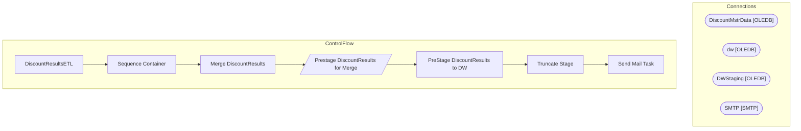

# SSIS Package: DiscountResultsETL

**Project:** DiscountResultsETL  
**Folder:** DW  

## Architecture Diagram

## Connection Managers

| Connection Name | Type |
|---|---|
| DiscountMstrData | OLEDB |
| dw | OLEDB |
| DWStaging | OLEDB |
| SMTP | SMTP |

## Control Flow Tasks

| Task Name | Type |
|---|---|
| DiscountResultsETL | Microsoft.Package |
| Sequence Container | STOCK:SEQUENCE |
| Merge DiscountResults | Microsoft.ExecuteSQLTask |
| Prestage DiscountResults for Merge | Microsoft.Pipeline |
| PreStage DiscountResults to DW | Microsoft.ExecuteSQLTask |
| Truncate Stage | Microsoft.ExecuteSQLTask |
| Send Mail Task | Microsoft.SendMailTask |

## Data Flow: Sources

| Component | Tables Referenced | SQL Preview |
|---|---|---|
|  |  | SELECT        countryID, Abbrv FROM            dbo.Country |

## Data Flow: Destinations

| Component | Destination Table |
|---|---|
|  | [dbo].[vwDM_Discount_Results] |
|  | [OutboundDiscountResultsStage] |

