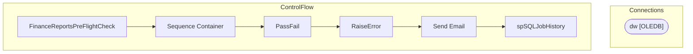

# SSIS Package: FinanceReportsPreFlightCheck

**Project:** FinanceReportsPreFlightCheck  
**Folder:** DW  

## Architecture Diagram

## Connection Managers

| Connection Name | Type |
|---|---|
| dw | OLEDB |

## Control Flow Tasks

| Task Name | Type |
|---|---|
| FinanceReportsPreFlightCheck | Microsoft.Package |
| Sequence Container | STOCK:SEQUENCE |
| PassFail | Microsoft.ExecuteSQLTask |
| RaiseError | Microsoft.ExecuteSQLTask |
| Send Email | Microsoft.ExecuteSQLTask |
| spSQLJobHistory | Microsoft.ExecuteSQLTask |

## Data Flow: Sources

_No OLE DB data flow sources detected._

## Data Flow: Destinations

_No OLE DB data flow destinations detected._

