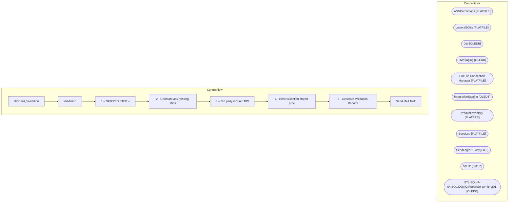

# SSIS Package: GiftCard_Validation

**Project:** GiftCard_Validation  
**Folder:** DW  

## Architecture Diagram

## Connection Managers

| Connection Name | Type |
|---|---|
| ASNCorrections | FLATFILE |
| currentGCfile | FLATFILE |
| DW | OLEDB |
| DWStaging | OLEDB |
| Flat File Connection Manager | FLATFILE |
| IntegrationStaging | OLEDB |
| ProductInventory | FLATFILE |
| SendLog | FLATFILE |
| SendLogPIPE.csv | FILE |
| SMTP | SMTP |
| STL-SQL-P-04\SQL2008R2.ReportServer_birpt01 | OLEDB |

## Control Flow Tasks

| Task Name | Type |
|---|---|
| GiftCard_Validation | Microsoft.Package |
| Validation | STOCK:SEQUENCE |
| 1 -- SKIPPED STEP -- | Microsoft.ExecuteSQLTask |
| 2 - Generate any missing Mids | Microsoft.ExecuteSQLTask |
| 3 -- 3rd party GC into DW | Microsoft.ExecuteSQLTask |
| 4 - Exec validation stored proc | Microsoft.ExecuteSQLTask |
| 5 - Generate Validation Reports | Microsoft.ExecuteSQLTask |
| Send Mail Task | Microsoft.SendMailTask |

## Data Flow: Sources

_No OLE DB data flow sources detected._

## Data Flow: Destinations

_No OLE DB data flow destinations detected._

