# SSIS Package: Package

**Project:** GiftCard_firstData_download  
**Folder:** DW  

## Architecture Diagram

```mermaid
flowchart TD
    subgraph Connections
        Archive_conn(["Archive [FILE]"])
        SMTP_conn(["SMTP [SMTP]"])
        STL_SSIS_P_01_IntegrationStaging_conn(["STL-SSIS-P-01.IntegrationStaging [OLEDB]"])
    end
    subgraph ControlFlow
        Package_task["Package"]
        Sequence_Container_task["Sequence Container"]
        Package_task --> Sequence_Container_task
        5_second_pause_task["5 second pause"]
        Sequence_Container_task --> 5_second_pause_task
        5_second_pause_2_task["5 second pause 2"]
        5_second_pause_task --> 5_second_pause_2_task
        file_conversion_task["file conversion"]
        5_second_pause_2_task --> file_conversion_task
        ps1_task["ps1"]
        file_conversion_task --> ps1_task
        ps2_task["ps2"]
        ps1_task --> ps2_task
        ps3_task["ps3"]
        ps2_task --> ps3_task
        Foreach_Loop___Move_to_Archive_task["Foreach Loop - Move to Archive"]
        ps3_task --> Foreach_Loop___Move_to_Archive_task
        Archive_File_task["Archive File"]
        Foreach_Loop___Move_to_Archive_task --> Archive_File_task
        FTP_retrieve_files_task["FTP retrieve files"]
        Archive_File_task --> FTP_retrieve_files_task
        move_files_to_stl_sql_p_04_task["move files to stl-sql-p-04"]
        FTP_retrieve_files_task --> move_files_to_stl_sql_p_04_task
        copy_DACT_file_task["copy DACT file"]
        move_files_to_stl_sql_p_04_task --> copy_DACT_file_task
        copy_HDSK_file_task["copy HDSK file"]
        copy_DACT_file_task --> copy_HDSK_file_task
        copy_UK_file_task["copy UK file"]
        copy_HDSK_file_task --> copy_UK_file_task
        copy_US_file_task["copy US file"]
        copy_UK_file_task --> copy_US_file_task
        empty_task_used_to_initiate__expression___constraint__task["empty task used to initiate 'expression & constraint'"]
        copy_US_file_task --> empty_task_used_to_initiate__expression___constraint__task
        Send_Mail_Task_task["Send Mail Task"]
        empty_task_used_to_initiate__expression___constraint__task --> Send_Mail_Task_task
    end
```

## Connection Managers

| Connection Name | Type |
|---|---|
| Archive | FILE |
| SMTP | SMTP |
| STL-SSIS-P-01.IntegrationStaging | OLEDB |

## Control Flow Tasks

| Task Name | Type |
|---|---|
| Package | Microsoft.Package |
| Sequence Container | STOCK:SEQUENCE |
| 5 second pause | STOCK:FORLOOP |
| 5 second pause 2 | STOCK:FORLOOP |
| file conversion | STOCK:SEQUENCE |
| ps1 | Microsoft.ExecuteProcess |
| ps2 | Microsoft.ExecuteProcess |
| ps3 | Microsoft.ExecuteProcess |
| Foreach Loop - Move to Archive | STOCK:FOREACHLOOP |
| Archive File | Microsoft.FileSystemTask |
| FTP retrieve files | Microsoft.ExecuteSQLTask |
| move files to stl-sql-p-04 | STOCK:FOREACHLOOP |
| copy DACT file | Microsoft.FileSystemTask |
| copy HDSK file | Microsoft.FileSystemTask |
| copy UK file | Microsoft.FileSystemTask |
| copy US file | Microsoft.FileSystemTask |
| empty task used to initiate 'expression & constraint' | Microsoft.ExecuteSQLTask |
| Send Mail Task | Microsoft.SendMailTask |

## Data Flow: Sources

_No OLE DB data flow sources detected._

## Data Flow: Destinations

_No OLE DB data flow destinations detected._

