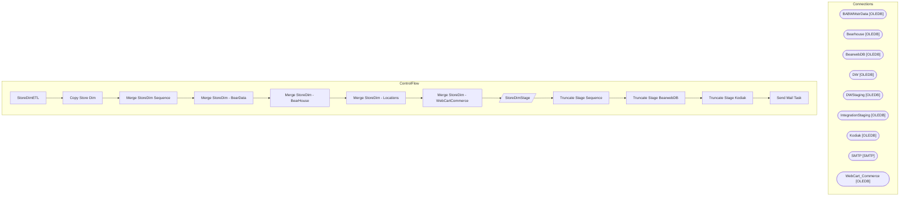

# SSIS Package: StoreDimETL

**Project:** StoreDimETL  
**Folder:** DW  

## Architecture Diagram

## Connection Managers

| Connection Name | Type |
|---|---|
| BABWMstrData | OLEDB |
| Bearhouse | OLEDB |
| BearwebDB | OLEDB |
| DW | OLEDB |
| DWStaging | OLEDB |
| IntegrationStaging | OLEDB |
| Kodiak | OLEDB |
| SMTP | SMTP |
| WebCart_Commerce | OLEDB |

## Control Flow Tasks

| Task Name | Type |
|---|---|
| StoreDimETL | Microsoft.Package |
| Copy Store Dim | STOCK:SEQUENCE |
| Merge StoreDim Sequence | STOCK:SEQUENCE |
| Merge StoreDim - BearData | Microsoft.ExecuteSQLTask |
| Merge StoreDim - BearHouse | Microsoft.ExecuteSQLTask |
| Merge StoreDim - Locations | Microsoft.ExecuteSQLTask |
| Merge StoreDim - WebCartCommerce | Microsoft.ExecuteSQLTask |
| StoreDimStage | Microsoft.Pipeline |
| Truncate Stage Sequence | STOCK:SEQUENCE |
| Truncate Stage BearwebDB | Microsoft.ExecuteSQLTask |
| Truncate Stage Kodiak | Microsoft.ExecuteSQLTask |
| Send Mail Task | Microsoft.SendMailTask |

## Data Flow: Sources

_No OLE DB data flow sources detected._

## Data Flow: Destinations

| Component | Destination Table |
|---|---|
|  | [dbo].[store_dim] |
|  | [dbo].[StoreDimStage] |
|  | [dbo].[StoreDimStage] |
|  | [dbo].[StoreDimStage] |

