# SSIS Package: ERP_AdyenETL

**Project:** ERP_AdyenETL  
**Folder:** ERP  

## Architecture Diagram

```mermaid
flowchart TD
    subgraph Connections
        adyen_csv_conn(["adyen.csv [FLATFILE]"])
        adyen_csv_1_conn(["adyen.csv 1 [FLATFILE]"])
        adyenFinal_conn(["adyenFinal [FLATFILE]"])
        AdyenFinal_conn(["AdyenFinal [FLATFILE]"])
        bankAdyen_csv_conn(["bankAdyen csv [FLATFILE]"])
        Excel_Connection_Manager_2_conn(["Excel Connection Manager 2 [EXCEL]"])
        IntegrationStaging_conn(["IntegrationStaging [OLEDB]"])
    end
    subgraph ControlFlow
        ERP_AdyenETL_task["ERP_AdyenETL"]
        merchant_loop_task["merchant loop"]
        ERP_AdyenETL_task --> merchant_loop_task
        batch___loop_task["batch # loop"]
        merchant_loop_task --> batch___loop_task
        cleanup_task["cleanup"]
        batch___loop_task --> cleanup_task
        delete_task["delete"]
        cleanup_task --> delete_task
        delete_staged_file_task["delete staged file"]
        delete_task --> delete_staged_file_task
        exist_task["exist"]
        delete_staged_file_task --> exist_task
        archive_task["archive"]
        exist_task --> archive_task
        babw_adyen_1_task[/"babw_adyen 1"/]
        archive_task --> babw_adyen_1_task
        copy_task["copy"]
        babw_adyen_1_task --> copy_task
        exist_task["exist"]
        copy_task --> exist_task
        GBRWEB_fix_task["GBRWEB fix"]
        exist_task --> GBRWEB_fix_task
        prepare_bank_statement_csv_task["prepare bank statement csv"]
        GBRWEB_fix_task --> prepare_bank_statement_csv_task
        bank_file_task["bank file"]
        prepare_bank_statement_csv_task --> bank_file_task
        export_bank_csv_task[/"export bank csv"/]
        bank_file_task --> export_bank_csv_task
        timestamped_copy_task["timestamped copy"]
        export_bank_csv_task --> timestamped_copy_task
        prepare_D365_files_task["prepare D365 files"]
        timestamped_copy_task --> prepare_D365_files_task
        1100_task["1100"]
        prepare_D365_files_task --> 1100_task
        1700_task["1700"]
        1100_task --> 1700_task
        2110_task["2110"]
        1700_task --> 2110_task
        archive_task["archive"]
        2110_task --> archive_task
        copy_dat_task["copy dat"]
        archive_task --> copy_dat_task
        Data_Flow_Task_task[/"Data Flow Task"/]
        copy_dat_task --> Data_Flow_Task_task
        wait2_task["wait2"]
        Data_Flow_Task_task --> wait2_task
        Sequence_Container_task["Sequence Container"]
        wait2_task --> Sequence_Container_task
        delete_dat_task["delete dat"]
        Sequence_Container_task --> delete_dat_task
        spAdyenFileControl_task["spAdyenFileControl"]
        delete_dat_task --> spAdyenFileControl_task
        truncate_task["truncate"]
        spAdyenFileControl_task --> truncate_task
        USAWEB_fix_task["USAWEB fix"]
        truncate_task --> USAWEB_fix_task
        wait_task["wait"]
        USAWEB_fix_task --> wait_task
        wait_1_task["wait 1"]
        wait_task --> wait_1_task
        file_already_loaded__task["file already loaded?"]
        wait_1_task --> file_already_loaded__task
        wait_1_1_task["wait 1 1"]
        file_already_loaded__task --> wait_1_1_task
        wait_1_2_task["wait 1 2"]
        wait_1_1_task --> wait_1_2_task
        wait2_2_task["wait2 2"]
        wait_1_2_task --> wait2_2_task
        wget_task["wget"]
        wait2_2_task --> wget_task
        batch_var_task["batch var"]
        wget_task --> batch_var_task
        marchant_var_task["marchant var"]
        batch_var_task --> marchant_var_task
        wait_task["wait"]
        marchant_var_task --> wait_task
        wait_1_task["wait 1"]
        wait_task --> wait_1_task
    end
```

## Connection Managers

| Connection Name | Type |
|---|---|
| adyen.csv | FLATFILE |
| adyen.csv 1 | FLATFILE |
| adyenFinal | FLATFILE |
| AdyenFinal | FLATFILE |
| bankAdyen csv | FLATFILE |
| Excel Connection Manager 2 | EXCEL |
| IntegrationStaging | OLEDB |

## Control Flow Tasks

| Task Name | Type |
|---|---|
| ERP_AdyenETL | Microsoft.Package |
| merchant loop | STOCK:FORLOOP |
| batch # loop | STOCK:FORLOOP |
| cleanup | Microsoft.ExecuteProcess |
| delete | Microsoft.FileSystemTask |
| delete staged file | Microsoft.FileSystemTask |
| exist | STOCK:FOREACHLOOP |
| archive | Microsoft.FileSystemTask |
| babw_adyen 1 | Microsoft.Pipeline |
| copy | Microsoft.FileSystemTask |
| exist | Microsoft.ExecuteSQLTask |
| GBRWEB fix | Microsoft.ExecuteSQLTask |
| prepare bank statement csv | STOCK:SEQUENCE |
| bank file | Microsoft.ExecuteSQLTask |
| export bank csv | Microsoft.Pipeline |
| timestamped copy | Microsoft.FileSystemTask |
| prepare D365 files | STOCK:SEQUENCE |
| 1100 | Microsoft.FileSystemTask |
| 1700 | Microsoft.FileSystemTask |
| 2110 | Microsoft.FileSystemTask |
| archive | Microsoft.FileSystemTask |
| copy dat | Microsoft.FileSystemTask |
| Data Flow Task | Microsoft.Pipeline |
| wait2 | Microsoft.ExecuteSQLTask |
| Sequence Container | STOCK:SEQUENCE |
| delete dat | Microsoft.FileSystemTask |
| spAdyenFileControl | Microsoft.ExecuteSQLTask |
| truncate | Microsoft.ExecuteSQLTask |
| USAWEB fix | Microsoft.ExecuteSQLTask |
| wait | Microsoft.ExecuteSQLTask |
| wait 1 | Microsoft.ExecuteSQLTask |
| file already loaded? | Microsoft.ExecuteSQLTask |
| wait 1 1 | Microsoft.ExecuteSQLTask |
| wait 1 2 | Microsoft.ExecuteSQLTask |
| wait2 2 | Microsoft.ExecuteSQLTask |
| wget | Microsoft.ExecuteProcess |
| batch var | Microsoft.ExecuteSQLTask |
| marchant var | Microsoft.ExecuteSQLTask |
| wait | Microsoft.ExecuteSQLTask |
| wait 1 | Microsoft.ExecuteSQLTask |

## Data Flow: Sources

| Component | Tables Referenced | SQL Preview |
|---|---|---|
|  |  | select (select distinct convert(varchar(10), cast(Creation_Date as date), 101)  from [dbo].[babw_adyen] where Type = 'MerchantPayout') as 'As Of' ,(select distinct [Gross_Currency] from [dbo].[babw_adyen] where [Gross_Currency] is not null) as 'Currency' , 'ABA' as 'BankID Type','123456789' as 'BankID',  'Account' = CASE WHEN Payment_Method in ('visa','mc') THEN '1100MCVCLEAR' WHEN  Payment_Method |
|  |  | declare @totalCredits decimal(18,2) declare @totalDebits decimal(18,2) declare @summaryLineNumber integer declare @merchantAccountCode varchar(50)  set @totalCredits = 0  set @totalDebits = 0   set @totalCredits = (select (sum(Gross_Credit_GC)) as 'total credits' from [dbo].[babw_adyen] where Type in ('Settled','Refunded','Fee'))   set  @totalDebits = ( select sum(debits) from ( select sum(isnull( |

## Data Flow: Destinations

| Component | Destination Table |
|---|---|
|  | [dbo].[babw_adyen] |

