# SSIS Package: Package

**Project:** ERP_AmExETL  
**Folder:** ERP  

## Architecture Diagram

```mermaid
flowchart TD
    subgraph Connections
        amexUS_conn(["amexUS [FLATFILE]"])
        amexUS_csv_conn(["amexUS.csv [FILE]"])
        amexUS1_csv_conn(["amexUS1.csv [FILE]"])
        amexUS2_csv_conn(["amexUS2.csv [FLATFILE]"])
        amexUS2_csv_1_conn(["amexUS2.csv 1 [FILE]"])
        amexUS3_csv_conn(["amexUS3.csv [FILE]"])
        amexUS4_csv_conn(["amexUS4.csv [FILE]"])
        amexUSfinal_csv_conn(["amexUSfinal.csv [FLATFILE]"])
        amexUSfinal_csv_1_conn(["amexUSfinal.csv 1 [FLATFILE]"])
        bankAmex_conn(["bankAmex [FLATFILE]"])
        bankChase_csv_conn(["bankChase csv [FLATFILE]"])
        stl_dynsnc_p_01_conn(["stl-dynsnc-p-01 [OLEDB]"])
        stl_ssis_p_01_conn(["stl-ssis-p-01 [OLEDB]"])
    end
    subgraph ControlFlow
        Package_task["Package"]
        Foreach_Loop_Container_task["Foreach Loop Container"]
        Package_task --> Foreach_Loop_Container_task
        bank_file_task["bank file"]
        Foreach_Loop_Container_task --> bank_file_task
        copy_dat_to_archive_task["copy dat to archive"]
        bank_file_task --> copy_dat_to_archive_task
        create_timestamped_copy_task["create timestamped copy"]
        copy_dat_to_archive_task --> create_timestamped_copy_task
        d0_task["d0"]
        create_timestamped_copy_task --> d0_task
        d1_task["d1"]
        d0_task --> d1_task
        d2_task["d2"]
        d1_task --> d2_task
        d3_task["d3"]
        d2_task --> d3_task
        d4_task["d4"]
        d3_task --> d4_task
        Data_Flow_Task_task[/"Data Flow Task"/]
        d4_task --> Data_Flow_Task_task
        delete_1st_bank_csv_task["delete 1st bank csv"]
        Data_Flow_Task_task --> delete_1st_bank_csv_task
        delete_dat_task["delete dat"]
        delete_1st_bank_csv_task --> delete_dat_task
        export_bank_csv_task[/"export bank csv"/]
        delete_dat_task --> export_bank_csv_task
        export_GJ_file_to_dat_task[/"export GJ file to dat"/]
        export_bank_csv_task --> export_GJ_file_to_dat_task
        get_file_date_task["get file date"]
        export_GJ_file_to_dat_task --> get_file_date_task
        GJ_rename_task["GJ rename"]
        get_file_date_task --> GJ_rename_task
        insert_task["insert"]
        GJ_rename_task --> insert_task
        prep_task["prep"]
        insert_task --> prep_task
        replace_NA_task["replace NA"]
        prep_task --> replace_NA_task
        sum_debit_task["sum debit"]
        replace_NA_task --> sum_debit_task
        truncate_amexUS_task["truncate amexUS"]
        sum_debit_task --> truncate_amexUS_task
        wait_task["wait"]
        truncate_amexUS_task --> wait_task
        Sequence_Container_task["Sequence Container"]
        wait_task --> Sequence_Container_task
        copy_dat_to_archive_task["copy dat to archive"]
        Sequence_Container_task --> copy_dat_to_archive_task
        create_timestamped_copy_task["create timestamped copy"]
        copy_dat_to_archive_task --> create_timestamped_copy_task
        d0_task["d0"]
        create_timestamped_copy_task --> d0_task
        d1_task["d1"]
        d0_task --> d1_task
        d2_task["d2"]
        d1_task --> d2_task
        d3_task["d3"]
        d2_task --> d3_task
        d4_task["d4"]
        d3_task --> d4_task
        delete_1st_bank_csv_task["delete 1st bank csv"]
        d4_task --> delete_1st_bank_csv_task
        delete_dat_task["delete dat"]
        delete_1st_bank_csv_task --> delete_dat_task
        export_bank_csv_task[/"export bank csv"/]
        delete_dat_task --> export_bank_csv_task
        export_GJ_file_to_dat_task[/"export GJ file to dat"/]
        export_bank_csv_task --> export_GJ_file_to_dat_task
        get_file_date_task["get file date"]
        export_GJ_file_to_dat_task --> get_file_date_task
        GJ_rename_task["GJ rename"]
        get_file_date_task --> GJ_rename_task
        insert_task["insert"]
        GJ_rename_task --> insert_task
        sum_debit_task["sum debit"]
        insert_task --> sum_debit_task
    end
```

## Connection Managers

| Connection Name | Type |
|---|---|
| amexUS | FLATFILE |
| amexUS.csv | FILE |
| amexUS1.csv | FILE |
| amexUS2.csv | FLATFILE |
| amexUS2.csv 1 | FILE |
| amexUS3.csv | FILE |
| amexUS4.csv | FILE |
| amexUSfinal.csv | FLATFILE |
| amexUSfinal.csv 1 | FLATFILE |
| bankAmex | FLATFILE |
| bankChase csv | FLATFILE |
| stl-dynsnc-p-01 | OLEDB |
| stl-ssis-p-01 | OLEDB |

## Control Flow Tasks

| Task Name | Type |
|---|---|
| Package | Microsoft.Package |
| Foreach Loop Container | STOCK:FOREACHLOOP |
| bank file | Microsoft.ExecuteSQLTask |
| copy dat to archive | Microsoft.FileSystemTask |
| create timestamped copy | Microsoft.FileSystemTask |
| d0 | Microsoft.FileSystemTask |
| d1 | Microsoft.FileSystemTask |
| d2 | Microsoft.FileSystemTask |
| d3 | Microsoft.FileSystemTask |
| d4 | Microsoft.FileSystemTask |
| Data Flow Task | Microsoft.Pipeline |
| delete 1st bank csv | Microsoft.FileSystemTask |
| delete dat | Microsoft.FileSystemTask |
| export bank csv | Microsoft.Pipeline |
| export GJ file to dat | Microsoft.Pipeline |
| get file date | Microsoft.ExecuteSQLTask |
| GJ rename | Microsoft.FileSystemTask |
| insert | Microsoft.ExecuteSQLTask |
| prep | Microsoft.ExecuteSQLTask |
| replace NA | Microsoft.ExecuteSQLTask |
| sum debit | Microsoft.ExecuteSQLTask |
| truncate amexUS | Microsoft.ExecuteSQLTask |
| wait | Microsoft.ExecuteSQLTask |
| Sequence Container | STOCK:SEQUENCE |
| copy dat to archive | Microsoft.FileSystemTask |
| create timestamped copy | Microsoft.FileSystemTask |
| d0 | Microsoft.FileSystemTask |
| d1 | Microsoft.FileSystemTask |
| d2 | Microsoft.FileSystemTask |
| d3 | Microsoft.FileSystemTask |
| d4 | Microsoft.FileSystemTask |
| delete 1st bank csv | Microsoft.FileSystemTask |
| delete dat | Microsoft.FileSystemTask |
| export bank csv | Microsoft.Pipeline |
| export GJ file to dat | Microsoft.Pipeline |
| get file date | Microsoft.ExecuteSQLTask |
| GJ rename | Microsoft.FileSystemTask |
| insert | Microsoft.ExecuteSQLTask |
| sum debit | Microsoft.ExecuteSQLTask |

## Data Flow: Sources

| Component | Tables Referenced | SQL Preview |
|---|---|---|
|  |  | select (select convert(varchar(10),dateadd(day, 1, cast(max(AmexDate) as date)), 101) from [dbo].[babw_amexUS]) as 'As Of', 'USD' as 'Currency', 'ABA' as 'BankID Type','123456789' as 'BankID', '1100AMEXCLEAR' as 'Account','Credits' as 'Data Type', '399' as 'BAI Code','Deposit' as 'Description',convert(float, REPLACE(REPLACE(REPLACE(REPLACE([SubmissionAmount],'$',''),',',''),'(',''),')',''), 10) as |
|  |  | SELECT [JOURNALBATCHNUMBER],ROW_NUMBER() OVER(ORDER BY [JOURNALBATCHNUMBER] ASC) AS LINENUMBER, [ACCOUNTDISPLAYVALUE],[ACCOUNTTYPE],[BANKTRANSTYPE],[CREDITAMOUNT],[CURRENCYCODE],[DEBITAMOUNT],[DEFAULTDIMENSIONDISPLAYVALUE],[DESCRIPTION],[ISPOSTED] ,[JOURNALNAME],[PAYMENTMETHOD],[PAYMENTREFERENCE],[POSTINGLAYER],[TEXT],[TRANSDATE],[VOUCHER] FROM [dbo].[babw_amexUSd365] |
|  |  | select (select convert(varchar(10),dateadd(day, 1, cast(max(AmexDate) as date)), 101) from [dbo].[babw_amexUS]) as 'As Of', 'USD' as 'Currency', 'ABA' as 'BankID Type','123456789' as 'BankID', '1100AMEXCLEAR' as 'Account','Credits' as 'Data Type', '399' as 'BAI Code','Deposit' as 'Description',convert(float, REPLACE(REPLACE(REPLACE(REPLACE([SubmissionAmount],'$',''),',',''),'(',''),')',''), 10) as |
|  |  | SELECT [JOURNALBATCHNUMBER],ROW_NUMBER() OVER(ORDER BY [JOURNALBATCHNUMBER] ASC) AS LINENUMBER, [ACCOUNTDISPLAYVALUE],[ACCOUNTTYPE],[BANKTRANSTYPE],[CREDITAMOUNT],[CURRENCYCODE],[DEBITAMOUNT],[DEFAULTDIMENSIONDISPLAYVALUE],[DESCRIPTION],[ISPOSTED] ,[JOURNALNAME],[PAYMENTMETHOD],[PAYMENTREFERENCE],[POSTINGLAYER],[TEXT],[TRANSDATE],[VOUCHER] FROM [dbo].[babw_amexUSd365] |

## Data Flow: Destinations

| Component | Destination Table |
|---|---|
|  | [dbo].[babw_amexUS] |
|  | [dbo].[babw_amexUS] |
|  | [dbo].[babw_amexUS] |

