# SSIS Package: Package

**Project:** ERP_DiscoverETL  
**Folder:** ERP  

## Architecture Diagram

```mermaid
flowchart TD
    subgraph Connections
        bankDiscover_csv_conn(["bankDiscover csv [FLATFILE]"])
        discover_csv_conn(["discover csv [FLATFILE]"])
        discover_csv_1_conn(["discover csv 1 [FLATFILE]"])
        discover_dat_conn(["discover.dat [FLATFILE]"])
        Discover_dat_conn(["Discover.dat [FILE]"])
        stl_dynsnc_p_01_conn(["stl-dynsnc-p-01 [OLEDB]"])
        STL_SSIS_P_01_conn(["STL-SSIS-P-01 [OLEDB]"])
    end
    subgraph ControlFlow
        Package_task["Package"]
        process_file_task["process file"]
        Package_task --> process_file_task
        file_archive_task["file archive"]
        process_file_task --> file_archive_task
        clean_task["clean"]
        file_archive_task --> clean_task
        create_timestamped_copy_task["create timestamped copy"]
        clean_task --> create_timestamped_copy_task
        delete_1st_bank_csv_task["delete 1st bank csv"]
        create_timestamped_copy_task --> delete_1st_bank_csv_task
        delete_GJ_dat_task["delete GJ dat"]
        delete_1st_bank_csv_task --> delete_GJ_dat_task
        file_exports_task["file exports"]
        delete_GJ_dat_task --> file_exports_task
        copy_dat_to_archive_task["copy dat to archive"]
        file_exports_task --> copy_dat_to_archive_task
        export_bank_csv_task[/"export bank csv"/]
        copy_dat_to_archive_task --> export_bank_csv_task
        export_GJ_file_to_dat_task[/"export GJ file to dat"/]
        export_bank_csv_task --> export_GJ_file_to_dat_task
        get_file_date_task["get file date"]
        export_GJ_file_to_dat_task --> get_file_date_task
        GJ_rename_task["GJ rename"]
        get_file_date_task --> GJ_rename_task
        prep_DAT_task["prep DAT"]
        GJ_rename_task --> prep_DAT_task
        prep_task["prep"]
        prep_DAT_task --> prep_task
        wait_task["wait"]
        prep_task --> wait_task
        Sequence_Container_task["Sequence Container"]
        wait_task --> Sequence_Container_task
        insert_CB_into_final_table_task["insert CB into final table"]
        Sequence_Container_task --> insert_CB_into_final_table_task
        insert_fees1_into_final_table_task["insert fees1 into final table"]
        insert_CB_into_final_table_task --> insert_fees1_into_final_table_task
        insert_fees2_into_final_table_task["insert fees2 into final table"]
        insert_fees1_into_final_table_task --> insert_fees2_into_final_table_task
        insert_into_chargeback_table_task["insert into chargeback table"]
        insert_fees2_into_final_table_task --> insert_into_chargeback_table_task
        insert_into_fees1_table_task["insert into fees1 table"]
        insert_into_chargeback_table_task --> insert_into_fees1_table_task
        insert_into_fees2_table_task["insert into fees2 table"]
        insert_into_fees1_table_task --> insert_into_fees2_table_task
        insert_into_sales_table_task["insert into sales table"]
        insert_into_fees2_table_task --> insert_into_sales_table_task
        insert_sales_into_final_table_task["insert sales into final table"]
        insert_into_sales_table_task --> insert_sales_into_final_table_task
        populate_discover_table_task[/"populate discover table"/]
        insert_sales_into_final_table_task --> populate_discover_table_task
        truncate_stage_task["truncate stage"]
        populate_discover_table_task --> truncate_stage_task
        truncate_stage_task["truncate stage"]
        truncate_stage_task --> truncate_stage_task
    end
```

## Connection Managers

| Connection Name | Type |
|---|---|
| bankDiscover csv | FLATFILE |
| discover csv | FLATFILE |
| discover csv 1 | FLATFILE |
| discover.dat | FLATFILE |
| Discover.dat | FILE |
| stl-dynsnc-p-01 | OLEDB |
| STL-SSIS-P-01 | OLEDB |

## Control Flow Tasks

| Task Name | Type |
|---|---|
| Package | Microsoft.Package |
| process file | STOCK:FOREACHLOOP |
| file archive | STOCK:SEQUENCE |
| clean | Microsoft.ExecuteSQLTask |
| create timestamped copy | Microsoft.FileSystemTask |
| delete 1st bank csv | Microsoft.FileSystemTask |
| delete GJ dat | Microsoft.FileSystemTask |
| file exports | STOCK:SEQUENCE |
| copy dat to archive | Microsoft.FileSystemTask |
| export bank csv | Microsoft.Pipeline |
| export GJ file to dat | Microsoft.Pipeline |
| get file date | Microsoft.ExecuteSQLTask |
| GJ rename | Microsoft.FileSystemTask |
| prep DAT | STOCK:SEQUENCE |
| prep | Microsoft.ExecuteSQLTask |
| wait | Microsoft.ExecuteSQLTask |
| Sequence Container | STOCK:SEQUENCE |
| insert CB into final table | Microsoft.ExecuteSQLTask |
| insert fees1 into final table | Microsoft.ExecuteSQLTask |
| insert fees2 into final table | Microsoft.ExecuteSQLTask |
| insert into chargeback table | Microsoft.ExecuteSQLTask |
| insert into fees1 table | Microsoft.ExecuteSQLTask |
| insert into fees2 table | Microsoft.ExecuteSQLTask |
| insert into sales table | Microsoft.ExecuteSQLTask |
| insert sales into final table | Microsoft.ExecuteSQLTask |
| populate discover table | Microsoft.Pipeline |
| truncate stage | STOCK:SEQUENCE |
| truncate stage | Microsoft.ExecuteSQLTask |

## Data Flow: Sources

| Component | Tables Referenced | SQL Preview |
|---|---|---|
|  |  | select (select convert(varchar(10),dateadd(day, 1, cast(max(date) as date)), 101) from [dbo].[babw_discoverFinal]) as 'As Of', 'USD' as 'Currency', 'ABA' as 'BankID Type','123456789' as 'BankID', '1100DISCVCLEAR' as 'Account','Credits' as 'Data Type', '399' as 'BAI Code','Deposit' as 'Description',sum(credit+(debit*-1)) as 'Amount','' as 'Balance/Value Date', [store] as 'Customer Reference','' as  |
|  |  | declare @totalCredits decimal(18,2) declare @totalDebits decimal(18,2) set @totalCredits = (select sum(credit) as 'total credits' from [dbo].[babw_discoverFinal]) set @totalDebits = (select sum(debit) as 'total debits' from [dbo].[babw_discoverFinal])  select 'GLNUM001' as JOURNALBATCHNUMBER, ROW_NUMBER() OVER(ORDER BY MID ASC) AS LINENUMBER, 'ACCOUNTDISPLAYVALUE' = CASE                            |

## Data Flow: Destinations

| Component | Destination Table |
|---|---|
|  | [dbo].[babw_discover] |

