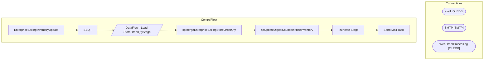

# SSIS Package: EnterpriseSellingInventoryUpdate

**Project:** EnterpriseSellingInventoryUpdate  
**Folder:** EnterpriseSelling  

## Architecture Diagram

## Connection Managers

| Connection Name | Type |
|---|---|
| esell | OLEDB |
| SMTP | SMTP |
| WebOrderProcessing | OLEDB |

## Control Flow Tasks

| Task Name | Type |
|---|---|
| EnterpriseSellingInventoryUpdate | Microsoft.Package |
| SEQ - | STOCK:SEQUENCE |
| DataFlow - Load StoreOrderQtyStage | Microsoft.Pipeline |
| spMergeEnterpriseSellingStoreOrderQty | Microsoft.ExecuteSQLTask |
| spUpdateDigitalSoundsInfiniteInventory | Microsoft.ExecuteSQLTask |
| Truncate Stage | Microsoft.ExecuteSQLTask |
| Send Mail Task | Microsoft.SendMailTask |

## Data Flow: Sources

| Component | Tables Referenced | SQL Preview |
|---|---|---|
|  |  | select  	o.PickUpStore, 	oi.sku ItemNumber, 	sum(oi.qty) ItemQty from wm.Orders o with (nolock) join wm.OrderStatus os with (nolock)  	on o.OrderID=os.OrderID 	and os.CurrentStatus=1 	and os.[Status] not in ('Cancelled', 'Complete', 'Shipped')  join wm.OrderItems oi with (nolock)  	on o.OrderID=oi.OrderID where 1=1 and isnull(o.PickUpStore,'') not in ('', '2013','0013') and len(oi.sku) = 6 group b |

## Data Flow: Destinations

| Component | Destination Table |
|---|---|
|  | [dbo].[StoreOrderQtyStage] |

