# SSIS Package: Package

**Project:** ERP_xRateDaily  
**Folder:** ExchangeRates  

## Architecture Diagram

```mermaid
flowchart TD
    subgraph Connections
        Dynamics_AX_Connection_Manager_conn(["Dynamics AX Connection Manager [DynamicsAX]"])
        IntegrationStaging_conn(["IntegrationStaging [OLEDB]"])
        papamart_dw_conn(["papamart.dw [OLEDB]"])
        papamarttest_dw_conn(["papamarttest.dw [OLEDB]"])
        SMTP_Connection_Manager_conn(["SMTP Connection Manager [SMTP]"])
    end
    subgraph ControlFlow
        Package_task["Package"]
        did_we_get_yesterday_s_rate__task["did we get yesterday's rate?"]
        Package_task --> did_we_get_yesterday_s_rate__task
        get_yesterdays_rates_task[/"get yesterdays rates"/]
        did_we_get_yesterday_s_rate__task --> get_yesterdays_rates_task
        rate_updated_last_night_task["rate updated last night"]
        get_yesterdays_rates_task --> rate_updated_last_night_task
        Sequence_Container_task["Sequence Container"]
        rate_updated_last_night_task --> Sequence_Container_task
        EMAIL_did_not_get_rates_via_API_task["EMAIL did not get rates via API"]
        Sequence_Container_task --> EMAIL_did_not_get_rates_via_API_task
        EMAIL_got_rates_via_API_task["EMAIL got rates via API"]
        EMAIL_did_not_get_rates_via_API_task --> EMAIL_got_rates_via_API_task
        get_yesterdays_rates_task[/"get yesterdays rates"/]
        EMAIL_got_rates_via_API_task --> get_yesterdays_rates_task
        insert_inverse_rates_task["insert inverse rates"]
        get_yesterdays_rates_task --> insert_inverse_rates_task
        insert_ZUR_rates_task["insert ZUR rates"]
        insert_inverse_rates_task --> insert_ZUR_rates_task
        replicate_yesterdays_rates_today_task["replicate yesterdays rates today"]
        insert_ZUR_rates_task --> replicate_yesterdays_rates_today_task
        truncate_table_task["truncate table"]
        replicate_yesterdays_rates_today_task --> truncate_table_task
        update_dw_xRates_facts_task[/"update dw xRates facts"/]
        truncate_table_task --> update_dw_xRates_facts_task
    end
```

## Connection Managers

| Connection Name | Type |
|---|---|
| Dynamics AX Connection Manager | DynamicsAX |
| IntegrationStaging | OLEDB |
| papamart.dw | OLEDB |
| papamarttest.dw | OLEDB |
| SMTP Connection Manager | SMTP |

## Control Flow Tasks

| Task Name | Type |
|---|---|
| Package | Microsoft.Package |
| did we get yesterday's rate? | Microsoft.ExecuteSQLTask |
| get yesterdays rates | Microsoft.Pipeline |
| rate updated last night | Microsoft.SendMailTask |
| Sequence Container | STOCK:SEQUENCE |
| EMAIL did not get rates via API | Microsoft.ExecuteSQLTask |
| EMAIL got rates via API | Microsoft.ExecuteSQLTask |
| get yesterdays rates | Microsoft.Pipeline |
| insert inverse rates | Microsoft.ExecuteSQLTask |
| insert ZUR rates | Microsoft.ExecuteSQLTask |
| replicate yesterdays rates today | Microsoft.ExecuteSQLTask |
| truncate table | Microsoft.ExecuteSQLTask |
| update dw xRates facts | Microsoft.Pipeline |

## Data Flow: Sources

| Component | Tables Referenced | SQL Preview |
|---|---|---|
|  |  | select fromCurrency, toCurrency,  dateadd(hour, -12, CONVERT(VARCHAR(24), CONVERT(DATETIME, startDate, 103), 121)) as startDate, endDate, Rate from [dbo].[babw_xRates_daily] |
|  |  | update [dbo].[exchange_rate_facts] set bbw_rate = ? where actual_date = ? and from_currency_code = ? and to_currency_code = ? |

## Data Flow: Destinations

| Component | Destination Table |
|---|---|
|  | [dbo].[babw_xRates_daily] |
|  | [dbo].[babw_xRates_daily] |

