# SSIS Package: LoadAdminReviewRecords

**Project:** RetrieveData  
**Folder:** ForgetMe  

## Architecture Diagram

```mermaid
flowchart TD
    subgraph Connections
        CRM_conn(["CRM [OLEDB]"])
        SMTP_conn(["SMTP [SMTP]"])
        WebOrderProcessing_conn(["WebOrderProcessing [OLEDB]"])
    end
    subgraph ControlFlow
        LoadAdminReviewRecords_task["LoadAdminReviewRecords"]
        Sequence_Container_task["Sequence Container"]
        LoadAdminReviewRecords_task --> Sequence_Container_task
        FLC___Loop_through_ActionStatus_records_task["FLC - Loop through ActionStatus records"]
        Sequence_Container_task --> FLC___Loop_through_ActionStatus_records_task
        DFT___Consolidate_CRM_and_WOP_records_task[/"DFT - Consolidate CRM and WOP records"/]
        FLC___Loop_through_ActionStatus_records_task --> DFT___Consolidate_CRM_and_WOP_records_task
        DFT___Find_CRM_Records_task[/"DFT - Find CRM Records"/]
        DFT___Consolidate_CRM_and_WOP_records_task --> DFT___Find_CRM_Records_task
        DFT___Find_WOP_Records_task[/"DFT - Find WOP Records"/]
        DFT___Find_CRM_Records_task --> DFT___Find_WOP_Records_task
        SQL___EXEC_spDropThenCreate_tmpActionStatusGuestData_task["SQL - EXEC spDropThenCreate_tmpActionStatusGuestData"]
        DFT___Find_WOP_Records_task --> SQL___EXEC_spDropThenCreate_tmpActionStatusGuestData_task
        SQL___Update_ForgetMeAdminRecordsFlaggedDate_task["SQL - Update ForgetMeAdminRecordsFlaggedDate"]
        SQL___EXEC_spDropThenCreate_tmpActionStatusGuestData_task --> SQL___Update_ForgetMeAdminRecordsFlaggedDate_task
        SQL___Get_ActionStatus_task["SQL - Get ActionStatus"]
        SQL___Update_ForgetMeAdminRecordsFlaggedDate_task --> SQL___Get_ActionStatus_task
        Send_Mail_Task_task["Send Mail Task"]
        SQL___Get_ActionStatus_task --> Send_Mail_Task_task
    end
```

## Connection Managers

| Connection Name | Type |
|---|---|
| CRM | OLEDB |
| SMTP | SMTP |
| WebOrderProcessing | OLEDB |

## Control Flow Tasks

| Task Name | Type |
|---|---|
| LoadAdminReviewRecords | Microsoft.Package |
| Sequence Container | STOCK:SEQUENCE |
| FLC - Loop through ActionStatus records | STOCK:FOREACHLOOP |
| DFT - Consolidate CRM and WOP records | Microsoft.Pipeline |
| DFT - Find CRM Records | Microsoft.Pipeline |
| DFT - Find WOP Records | Microsoft.Pipeline |
| SQL - EXEC spDropThenCreate_tmpActionStatusGuestData | Microsoft.ExecuteSQLTask |
| SQL - Update ForgetMeAdminRecordsFlaggedDate | Microsoft.ExecuteSQLTask |
| SQL - Get ActionStatus | Microsoft.ExecuteSQLTask |
| Send Mail Task | Microsoft.SendMailTask |

## Data Flow: Sources

| Component | Tables Referenced | SQL Preview |
|---|---|---|
|  |  | SELECT DISTINCT [RecordKey]       ,[GuestDataTypeID]       ,[FirstName]       ,[LastName]       ,[Address1]       ,[Address2]       ,[City]       ,[State]       ,[PostalCode]       ,[Country]       ,[Phone]   FROM [BABWForgetMe].[dbo].[tmpActionStatusGuestData] |
|  |  | SELECT cust.first_name       ,cust.last_name       ,[address_1]       ,[address_2] 	  ,[address_3] AS 'City' 	  ,[address_4] AS 'State' 	  ,[post_code]       ,addr.[country_code]       --,[address_match_key]       ,phone.telephone_no   FROM [crm].[dbo].[address] addr   INNER JOIN [crm].[dbo].[customer] cust ON addr.customer_id = cust.customer_id   INNER JOIN [crm].[dbo].[phone] ON phone.customer_i |
|  |  | SELECT cust.first_name       ,cust.last_name       ,[address_1]       ,[address_2] 	  ,[address_3] AS 'City' 	  ,[address_4] AS 'State' 	  ,[post_code]       ,addr.[country_code]       ,phone.telephone_no   FROM [crm].[dbo].[address] addr   INNER JOIN [crm].[dbo].[customer] cust ON addr.customer_id = cust.customer_id   INNER JOIN [crm].[dbo].[phone] ON phone.customer_id = cust.customer_id   INNER  |
|  |  | SELECT cust.first_name       ,cust.last_name       ,[address_1]       ,[address_2] 	  ,[address_3] AS 'City' 	  ,[address_4] AS 'State' 	  ,[post_code]       ,addr.[country_code]       --,[address_match_key]       ,phone.telephone_no   FROM [crm].[dbo].[address] addr   INNER JOIN [crm].[dbo].[customer] cust ON addr.customer_id = cust.customer_id   INNER JOIN [crm].[dbo].[phone] ON phone.customer_i |
|  |  | DECLARE @address VARCHAR(20), @postalCode VARCHAR(10) SET @address = ? SET @postalCode = ?  SELECT CAST([BillToFName] AS NVARCHAR(20)) AS 'first_name'       ,CAST([BillToLName] AS NVARCHAR(50)) AS 'last_name'       ,CAST([BillToAddress1] AS NVARCHAR(100)) AS 'address_1'       ,CAST([BillToAddress2] AS NVARCHAR(100)) AS 'address_2'       ,CAST([BillToCity] AS NVARCHAR(50)) AS 'city'       ,CAST([Bi |
|  |  | SELECT CAST([BillToFName] AS NVARCHAR(20)) AS 'first_name'       ,CAST([BillToLName] AS NVARCHAR(50)) AS 'last_name'       ,CAST([BillToAddress1] AS NVARCHAR(100)) AS 'address_1'       ,CAST([BillToAddress2] AS NVARCHAR(100)) AS 'address_2'       ,CAST([BillToCity] AS NVARCHAR(50)) AS 'city'       ,CAST([BillToState] AS NVARCHAR(50)) AS 'state'       ,CAST([BillToPostalCode] AS NVARCHAR(20)) AS 'p |
|  |  | SELECT CAST([BillToFName] AS NVARCHAR(20)) AS 'first_name'       ,CAST([BillToLName] AS NVARCHAR(50)) AS 'last_name'       ,CAST([BillToAddress1] AS NVARCHAR(100)) AS 'address_1'       ,CAST([BillToAddress2] AS NVARCHAR(100)) AS 'address_2'       ,CAST([BillToCity] AS NVARCHAR(50)) AS 'city'       ,CAST([BillToState] AS NVARCHAR(50)) AS 'state'       ,CAST([BillToPostalCode] AS NVARCHAR(20)) AS 'p |
|  |  | DECLARE @address VARCHAR(20), @postalCode VARCHAR(10) SET @address = ? SET @postalCode = ?  SELECT CAST([ShipToFName] AS NVARCHAR(20)) AS 'first_name'       ,CAST([ShipToLName] AS NVARCHAR(50)) AS 'last_name'       ,CAST([ShipToAddress1] AS NVARCHAR(100)) AS 'address_1'       ,CAST([ShipToAddress2] AS NVARCHAR(100)) AS 'address_2'       ,CAST([ShipToCity] AS NVARCHAR(50)) AS 'city'       ,CAST([Sh |
|  |  | SELECT CAST([ShipToFName] AS NVARCHAR(20)) AS 'first_name'       ,CAST([ShipToLName] AS NVARCHAR(50)) AS 'last_name'       ,CAST([ShipToAddress1] AS NVARCHAR(100)) AS 'address_1'       ,CAST([ShipToAddress2] AS NVARCHAR(100)) AS 'address_2'       ,CAST([ShipToCity] AS NVARCHAR(50)) AS 'city'       ,CAST([ShipToState] AS NVARCHAR(50)) AS 'state'       ,CAST([ShipToPostalCode] AS NVARCHAR(20)) AS 'p |
|  |  | SELECT CAST([ShipToFName] AS NVARCHAR(20)) AS 'first_name'       ,CAST([ShipToLName] AS NVARCHAR(50)) AS 'last_name'       ,CAST([ShipToAddress1] AS NVARCHAR(100)) AS 'address_1'       ,CAST([ShipToAddress2] AS NVARCHAR(100)) AS 'address_2'       ,CAST([ShipToCity] AS NVARCHAR(50)) AS 'city'       ,CAST([ShipToState] AS NVARCHAR(50)) AS 'state'       ,CAST([ShipToPostalCode] AS NVARCHAR(20)) AS 'p |

## Data Flow: Destinations

| Component | Destination Table |
|---|---|
|  | [dbo].[tmpActionStatusGuestData] |
|  | [dbo].[ActionStatusGuestData] |
|  | [dbo].[tmpActionStatusGuestData] |
|  | [dbo].[tmpActionStatusGuestData] |
|  | [dbo].[tmpActionStatusGuestData] |
|  | [dbo].[tmpActionStatusGuestData] |
|  | [dbo].[tmpActionStatusGuestData] |
|  | [dbo].[tmpActionStatusGuestData] |
|  | [dbo].[tmpActionStatusGuestData] |
|  | [dbo].[tmpActionStatusGuestData] |
|  | [dbo].[tmpActionStatusGuestData] |

