# SSIS Package: LoadPIIRecords

**Project:** RetrieveData  
**Folder:** ForgetMe  

## Architecture Diagram

```mermaid
flowchart TD
    subgraph Connections
        STL_SQL_T_02_WebOrderProcessing_conn(["STL-SQL-T-02.WebOrderProcessing [OLEDB]"])
    end
    subgraph ControlFlow
        LoadPIIRecords_task["LoadPIIRecords"]
        GetEmailList_task["GetEmailList"]
        LoadPIIRecords_task --> GetEmailList_task
        Loop_throug_emails_task["Loop throug emails"]
        GetEmailList_task --> Loop_throug_emails_task
        ListDatabases_task["ListDatabases"]
        Loop_throug_emails_task --> ListDatabases_task
        Loop_through_tables_task["Loop through tables"]
        ListDatabases_task --> Loop_through_tables_task
        ListQueries_task["ListQueries"]
        Loop_through_tables_task --> ListQueries_task
        loop_through_Queries_task["loop through Queries"]
        ListQueries_task --> loop_through_Queries_task
        Execute_SQL_Task_task["Execute SQL Task"]
        loop_through_Queries_task --> Execute_SQL_Task_task
        Load_Records_task[/"Load Records"/]
        Execute_SQL_Task_task --> Load_Records_task
        Set_Records_loaded_flag_task["Set Records loaded flag"]
        Load_Records_task --> Set_Records_loaded_flag_task
    end
```

## Connection Managers

| Connection Name | Type |
|---|---|
| STL-SQL-T-02.WebOrderProcessing | OLEDB |

## Control Flow Tasks

| Task Name | Type |
|---|---|
| LoadPIIRecords | Microsoft.Package |
| GetEmailList | Microsoft.ExecuteSQLTask |
| Loop throug emails | STOCK:FOREACHLOOP |
| ListDatabases | Microsoft.ExecuteSQLTask |
| Loop through tables | STOCK:FOREACHLOOP |
| ListQueries | Microsoft.ExecuteSQLTask |
| loop through Queries | STOCK:FOREACHLOOP |
| Execute SQL Task | Microsoft.ExecuteSQLTask |
| Load Records | Microsoft.Pipeline |
| Set Records loaded flag | Microsoft.ExecuteSQLTask |

## Data Flow: Sources

| Component | Tables Referenced | SQL Preview |
|---|---|---|
|  |  | SELECT        RecordKey, ActionTableKey, ATKeyValue, AQKey FROM            ActionLog |

## Data Flow: Destinations

| Component | Destination Table |
|---|---|
|  | [dbo].[ActionLog] |

