# SSIS Package: LoadRetrieveMe

**Project:** RetrieveData  
**Folder:** ForgetMe  

## Architecture Diagram

```mermaid
flowchart TD
    subgraph Connections
        STL_SQL_T_02_WebOrderProcessing_conn(["STL-SQL-T-02.WebOrderProcessing [OLEDB]"])
    end
    subgraph ControlFlow
        LoadRetrieveMe_task["LoadRetrieveMe"]
        GetEmailList_task["GetEmailList"]
        LoadRetrieveMe_task --> GetEmailList_task
        StepThroughEmails_task["StepThroughEmails"]
        GetEmailList_task --> StepThroughEmails_task
        ListDatabases_task["ListDatabases"]
        StepThroughEmails_task --> ListDatabases_task
        Step_Through_Databases_task["Step Through Databases"]
        ListDatabases_task --> Step_Through_Databases_task
        ListQueries_task["ListQueries"]
        Step_Through_Databases_task --> ListQueries_task
        StepThroughQueries_task["StepThroughQueries"]
        ListQueries_task --> StepThroughQueries_task
        ListRecords_task["ListRecords"]
        StepThroughQueries_task --> ListRecords_task
        Log_Request_Completion_task["Log Request Completion"]
        ListRecords_task --> Log_Request_Completion_task
        Step_Through_Reocrds_task["Step Through Reocrds"]
        Log_Request_Completion_task --> Step_Through_Reocrds_task
        Load_to_OutputData_task[/"Load to OutputData"/]
        Step_Through_Reocrds_task --> Load_to_OutputData_task
    end
```

## Connection Managers

| Connection Name | Type |
|---|---|
| STL-SQL-T-02.WebOrderProcessing | OLEDB |

## Control Flow Tasks

| Task Name | Type |
|---|---|
| LoadRetrieveMe | Microsoft.Package |
| GetEmailList | Microsoft.ExecuteSQLTask |
| StepThroughEmails | STOCK:FOREACHLOOP |
| ListDatabases | Microsoft.ExecuteSQLTask |
| Step Through Databases | STOCK:FOREACHLOOP |
| ListQueries | Microsoft.ExecuteSQLTask |
| StepThroughQueries | STOCK:FOREACHLOOP |
| ListRecords | Microsoft.ExecuteSQLTask |
| Log Request Completion | Microsoft.ExecuteSQLTask |
| Step Through Reocrds | STOCK:FOREACHLOOP |
| Load to OutputData | Microsoft.Pipeline |

## Data Flow: Sources

| Component | Tables Referenced | SQL Preview |
|---|---|---|
|  |  | SELECT        AQKey, LogKey FROM            OutputData WHERE        (NOT (LogKey IS NULL)) |

## Data Flow: Destinations

| Component | Destination Table |
|---|---|
|  | [dbo].[OutputData] |

