# SSIS Package: HR_ADEmployeeExtract

**Project:** HR_ADEmployeeExtract  
**Folder:** HR  

## Architecture Diagram

```mermaid
flowchart TD
    subgraph Connections
        DW_conn(["DW [OLEDB]"])
        DWStaging_conn(["DWStaging [OLEDB]"])
    end
    subgraph ControlFlow
        HR_ADEmployeeExtract_task["HR_ADEmployeeExtract"]
        SEQ___PackageSequence_task["SEQ - PackageSequence"]
        HR_ADEmployeeExtract_task --> SEQ___PackageSequence_task
        AD_Extract_Loop_task["AD Extract Loop"]
        SEQ___PackageSequence_task --> AD_Extract_Loop_task
        DataFlow___MemberOf_task[/"DataFlow - MemberOf"/]
        AD_Extract_Loop_task --> DataFlow___MemberOf_task
        Load_ADEmployeeStage_task["Load ADEmployeeStage"]
        DataFlow___MemberOf_task --> Load_ADEmployeeStage_task
        Script___ADExtract_task["Script - ADExtract"]
        Load_ADEmployeeStage_task --> Script___ADExtract_task
        Script___ADExtract_1_task["Script - ADExtract 1"]
        Script___ADExtract_task --> Script___ADExtract_1_task
        Delete_Disabled_from_ADEmployee_task["Delete Disabled from ADEmployee"]
        Script___ADExtract_1_task --> Delete_Disabled_from_ADEmployee_task
        Merge_ADEmployee_task["Merge ADEmployee"]
        Delete_Disabled_from_ADEmployee_task --> Merge_ADEmployee_task
        Stage_EmployeeID_task["Stage EmployeeID"]
        Merge_ADEmployee_task --> Stage_EmployeeID_task
        Truncate_Stage_task["Truncate Stage"]
        Stage_EmployeeID_task --> Truncate_Stage_task
    end
```

## Connection Managers

| Connection Name | Type |
|---|---|
| DW | OLEDB |
| DWStaging | OLEDB |

## Control Flow Tasks

| Task Name | Type |
|---|---|
| HR_ADEmployeeExtract | Microsoft.Package |
| SEQ - PackageSequence | STOCK:SEQUENCE |
| AD Extract Loop | STOCK:FOREACHLOOP |
| DataFlow - MemberOf | Microsoft.Pipeline |
| Load ADEmployeeStage | Microsoft.ExecuteSQLTask |
| Script - ADExtract | Microsoft.ScriptTask |
| Script - ADExtract 1 | Microsoft.ScriptTask |
| Delete Disabled from ADEmployee | Microsoft.ExecuteSQLTask |
| Merge ADEmployee | Microsoft.ExecuteSQLTask |
| Stage EmployeeID | Microsoft.ExecuteSQLTask |
| Truncate Stage | Microsoft.ExecuteSQLTask |

## Data Flow: Sources

| Component | Tables Referenced | SQL Preview |
|---|---|---|
|  |  | Update ADEmployeeStage  set memberOf = ?  where EmployeeID = ? |

## Data Flow: Destinations

_No OLE DB data flow destinations detected._

