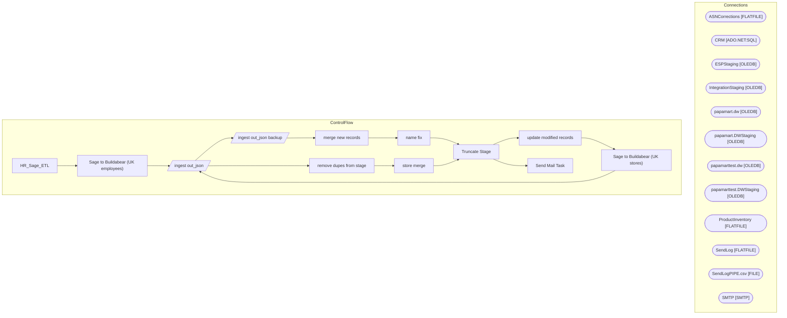

# SSIS Package: HR_Sage_ETL

**Project:** HR_Sage_ETL  
**Folder:** HR  

## Architecture Diagram

## Connection Managers

| Connection Name | Type |
|---|---|
| ASNCorrections | FLATFILE |
| CRM | ADO.NET:SQL |
| ESPStaging | OLEDB |
| IntegrationStaging | OLEDB |
| papamart.dw | OLEDB |
| papamart.DWStaging | OLEDB |
| papamarttest.dw | OLEDB |
| papamarttest.DWStaging | OLEDB |
| ProductInventory | FLATFILE |
| SendLog | FLATFILE |
| SendLogPIPE.csv | FILE |
| SMTP | SMTP |

## Control Flow Tasks

| Task Name | Type |
|---|---|
| HR_Sage_ETL | Microsoft.Package |
| Sage to Buildabear (UK employees) | STOCK:SEQUENCE |
| ingest out_json | Microsoft.Pipeline |
| ingest out_json backup | Microsoft.Pipeline |
| merge new records | Microsoft.ExecuteSQLTask |
| name fix | Microsoft.ExecuteSQLTask |
| Truncate Stage | Microsoft.ExecuteSQLTask |
| update modified records | Microsoft.ExecuteSQLTask |
| Sage to Buildabear (UK stores) | STOCK:SEQUENCE |
| ingest out_json | Microsoft.Pipeline |
| remove dupes from stage | Microsoft.ExecuteSQLTask |
| store merge | Microsoft.ExecuteSQLTask |
| Truncate Stage | Microsoft.ExecuteSQLTask |
| Send Mail Task | Microsoft.SendMailTask |

## Data Flow: Sources

_No OLE DB data flow sources detected._

## Data Flow: Destinations

| Component | Destination Table |
|---|---|
|  | [dbo].[SHCMEmpStage] |
|  | [dbo].[SHCMEmpStage] |
|  | [dbo].[SHCMStoreStage] |

