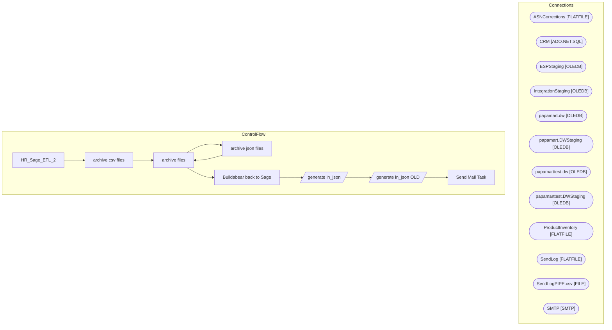

# SSIS Package: HR_Sage_ETL_2

**Project:** HR_Sage_ETL2  
**Folder:** HR  

## Architecture Diagram

## Connection Managers

| Connection Name | Type |
|---|---|
| ASNCorrections | FLATFILE |
| CRM | ADO.NET:SQL |
| ESPStaging | OLEDB |
| IntegrationStaging | OLEDB |
| papamart.dw | OLEDB |
| papamart.DWStaging | OLEDB |
| papamarttest.dw | OLEDB |
| papamarttest.DWStaging | OLEDB |
| ProductInventory | FLATFILE |
| SendLog | FLATFILE |
| SendLogPIPE.csv | FILE |
| SMTP | SMTP |

## Control Flow Tasks

| Task Name | Type |
|---|---|
| HR_Sage_ETL_2 | Microsoft.Package |
| archive csv files | STOCK:FOREACHLOOP |
| archive files | Microsoft.FileSystemTask |
| archive json files | STOCK:FOREACHLOOP |
| archive files | Microsoft.FileSystemTask |
| Buildabear back to Sage | STOCK:SEQUENCE |
| generate in_json | Microsoft.Pipeline |
| generate in_json OLD | Microsoft.Pipeline |
| Send Mail Task | Microsoft.SendMailTask |

## Data Flow: Sources

| Component | Tables Referenced | SQL Preview |
|---|---|---|
|  |  | SELECT u.EecLocation,u.EepEEID,u.JbcJobCode,u.JbcLongDesc,u.EecOrgLvl1Code,u.EecOrgLvl1Description,u.LocDesc,u.EecEmplStatus,u.EepNameFirst,u.EepNameLast,u.EepNameMiddle,u.EepAddressEMail,u.EepAddressEMail2 ,u.WorkPhoneNumber,u.efoPhoneExtension,u.EecSalaryOrHourly,u.EepNamePreferred,u.EecDateOfOriginalHire,u.EepCompanyCode,u.TerminationDate, --u.sAMAccountName isnull(a.SamAccountName,'') as sAMAc |
|  |  | SELECT u.EecLocation,u.EepEEID,u.JbcJobCode,u.JbcLongDesc,u.EecOrgLvl1Code,u.EecOrgLvl1Description,u.LocDesc,u.EecEmplStatus,u.EepNameFirst,u.EepNameLast,u.EepNameMiddle,u.EepAddressEMail ,u.WorkPhoneNumber,u.efoPhoneExtension,u.EecSalaryOrHourly,u.EepNamePreferred,u.EecDateOfOriginalHire,u.EepCompanyCode,u.TerminationDate, --u.sAMAccountName isnull(a.SamAccountName,'') as sAMAccountName --sAMAcco |

## Data Flow: Destinations

_No OLE DB data flow destinations detected._

