# SSIS Package: HR_Store_AD

**Project:** HR_Store_AD  
**Folder:** HR  

## Architecture Diagram

```mermaid
flowchart TD
    subgraph Connections
        Active_Directory_Connection_Manager_conn(["Active Directory Connection Manager [ActiveDirectory]"])
        Active_Directory_Connection_Manager_1_conn(["Active Directory Connection Manager 1 [ActiveDirectory]"])
        Active_Directory_Connection_Manager_2_conn(["Active Directory Connection Manager 2 [ActiveDirectory]"])
        Auditworks_conn(["Auditworks [OLEDB]"])
        Azure_Service_Bus_conn(["Azure Service Bus [Azure Service Bus (KingswaySoft)]"])
        coredb01_conn(["coredb01 [OLEDB]"])
        CRM_conn(["CRM [OLEDB]"])
        DW_conn(["DW [OLEDB]"])
        DWStaging_conn(["DWStaging [OLEDB]"])
        empIDs_conn(["empIDs [FLATFILE]"])
        empNoID_conn(["empNoID [FLATFILE]"])
        Flat_File_Connection_Manager_conn(["Flat File Connection Manager [FLATFILE]"])
        HTTP_Connection_Manager_conn(["HTTP Connection Manager [HTTP (KingswaySoft)]"])
        IntegrationStaging_conn(["IntegrationStaging [OLEDB]"])
        ME_01_conn(["ME_01 [OLEDB]"])
        namedAndNumbered_conn(["namedAndNumbered [FLATFILE]"])
        papamart_dw1_conn(["papamart.dw1 [OLEDB]"])
        SMTP_conn(["SMTP [SMTP]"])
        UltiProImportEmailCSV_conn(["UltiProImportEmailCSV [FLATFILE]"])
        UltiProImportSamAccountCSV_conn(["UltiProImportSamAccountCSV [FLATFILE]"])
    end
    subgraph ControlFlow
        HR_Store_AD_task["HR_Store_AD"]
        create_new_account_task["create new account"]
        HR_Store_AD_task --> create_new_account_task
        add_user_obj_to_group_obj_task["add user obj to group obj"]
        create_new_account_task --> add_user_obj_to_group_obj_task
        add_store_to_default_groups_task[/"add store to default groups"/]
        add_user_obj_to_group_obj_task --> add_store_to_default_groups_task
        add_store_to_default_groups_1_task[/"add store to default groups 1"/]
        add_store_to_default_groups_task --> add_store_to_default_groups_1_task
        add_store_to_district_task[/"add store to district"/]
        add_store_to_default_groups_1_task --> add_store_to_district_task
        add_store_to_DL_task[/"add store to DL"/]
        add_store_to_district_task --> add_store_to_DL_task
        wait_task["wait"]
        add_store_to_DL_task --> wait_task
        count_new_stores_task["count new stores"]
        wait_task --> count_new_stores_task
        group_object_create_task["group object create"]
        count_new_stores_task --> group_object_create_task
        Foreach_Loop_Container_task["Foreach Loop Container"]
        group_object_create_task --> Foreach_Loop_Container_task
        add_email_task["add email"]
        Foreach_Loop_Container_task --> add_email_task
        Send_Mail_Task_task["Send Mail Task"]
        add_email_task --> Send_Mail_Task_task
        move_to_store_OU_task[/"move to store OU"/]
        Send_Mail_Task_task --> move_to_store_OU_task
        stage_group_to_variable_task["stage group to variable"]
        move_to_store_OU_task --> stage_group_to_variable_task
        store_AD_group_object_task[/"store AD group object"/]
        stage_group_to_variable_task --> store_AD_group_object_task
        wait_task["wait"]
        store_AD_group_object_task --> wait_task
        wait_1_task["wait 1"]
        wait_task --> wait_1_task
        store_object_create_task["store object create"]
        wait_1_task --> store_object_create_task
        Foreach_Loop_Container_task["Foreach Loop Container"]
        store_object_create_task --> Foreach_Loop_Container_task
        account_enable_task["account enable"]
        Foreach_Loop_Container_task --> account_enable_task
        Send_Mail_Task_task["Send Mail Task"]
        account_enable_task --> Send_Mail_Task_task
        move_to_store_OU_task[/"move to store OU"/]
        Send_Mail_Task_task --> move_to_store_OU_task
        stage_identity_to_variable_task["stage identity to variable"]
        move_to_store_OU_task --> stage_identity_to_variable_task
        store_AD_user_object_task[/"store AD user object"/]
        stage_identity_to_variable_task --> store_AD_user_object_task
        wait_task["wait"]
        store_AD_user_object_task --> wait_task
        wait_1_task["wait 1"]
        wait_task --> wait_1_task
        repopulate_AD_attributes_task["repopulate AD attributes"]
        wait_1_task --> repopulate_AD_attributes_task
        merge_ADattributesMerged_task["merge ADattributesMerged"]
        repopulate_AD_attributes_task --> merge_ADattributesMerged_task
        populate_ADattributes_task[/"populate ADattributes"/]
        merge_ADattributesMerged_task --> populate_ADattributes_task
        populate_ADattributes_Group_task[/"populate ADattributes_Group"/]
        populate_ADattributes_task --> populate_ADattributes_Group_task
        truncate_ADattributes_task["truncate ADattributes"]
        populate_ADattributes_Group_task --> truncate_ADattributes_task
        update_EmployeeADGroup_task["update EmployeeADGroup"]
        truncate_ADattributes_task --> update_EmployeeADGroup_task
        Send_Mail_Task_task["Send Mail Task"]
        update_EmployeeADGroup_task --> Send_Mail_Task_task
    end
```

## Connection Managers

| Connection Name | Type |
|---|---|
| Active Directory Connection Manager | ActiveDirectory |
| Active Directory Connection Manager 1 | ActiveDirectory |
| Active Directory Connection Manager 2 | ActiveDirectory |
| Auditworks | OLEDB |
| Azure Service Bus | Azure Service Bus (KingswaySoft) |
| coredb01 | OLEDB |
| CRM | OLEDB |
| DW | OLEDB |
| DWStaging | OLEDB |
| empIDs | FLATFILE |
| empNoID | FLATFILE |
| Flat File Connection Manager | FLATFILE |
| HTTP Connection Manager | HTTP (KingswaySoft) |
| IntegrationStaging | OLEDB |
| ME_01 | OLEDB |
| namedAndNumbered | FLATFILE |
| papamart.dw1 | OLEDB |
| SMTP | SMTP |
| UltiProImportEmailCSV | FLATFILE |
| UltiProImportSamAccountCSV | FLATFILE |

## Control Flow Tasks

| Task Name | Type |
|---|---|
| HR_Store_AD | Microsoft.Package |
| create new account | STOCK:SEQUENCE |
| add user obj to group obj | STOCK:SEQUENCE |
| add store to default groups | Microsoft.Pipeline |
| add store to default groups 1 | Microsoft.Pipeline |
| add store to district | Microsoft.Pipeline |
| add store to DL | Microsoft.Pipeline |
| wait | Microsoft.ExecuteSQLTask |
| count new stores | Microsoft.ExecuteSQLTask |
| group object create | STOCK:SEQUENCE |
| Foreach Loop Container | STOCK:FOREACHLOOP |
| add email | Microsoft.ExecuteProcess |
| Send Mail Task | Microsoft.SendMailTask |
| move to store OU | Microsoft.Pipeline |
| stage group to variable | Microsoft.ExecuteSQLTask |
| store AD group object | Microsoft.Pipeline |
| wait | Microsoft.ExecuteSQLTask |
| wait 1 | Microsoft.ExecuteSQLTask |
| store object create | STOCK:SEQUENCE |
| Foreach Loop Container | STOCK:FOREACHLOOP |
| account enable | Microsoft.ExecuteProcess |
| Send Mail Task | Microsoft.SendMailTask |
| move to store OU | Microsoft.Pipeline |
| stage identity to variable | Microsoft.ExecuteSQLTask |
| store AD user object | Microsoft.Pipeline |
| wait | Microsoft.ExecuteSQLTask |
| wait 1 | Microsoft.ExecuteSQLTask |
| repopulate AD attributes | STOCK:SEQUENCE |
| merge ADattributesMerged | Microsoft.ExecuteSQLTask |
| populate ADattributes | Microsoft.Pipeline |
| populate ADattributes_Group | Microsoft.Pipeline |
| truncate ADattributes | Microsoft.ExecuteSQLTask |
| update EmployeeADGroup | Microsoft.ExecuteSQLTask |
| Send Mail Task | Microsoft.SendMailTask |

## Data Flow: Sources

| Component | Tables Referenced | SQL Preview |
|---|---|---|
|  |  | select * from [dbo].[vwStoreMDMtoAD] |
|  |  | select * from [dbo].[vwStoreMDMtoAD] |
|  |  | select * from [dbo].[vwStoreMDMtoAD] |
|  |  | select * from [dbo].[vwStoreMDMtoAD] |
|  |  | SELECT [storeNumber]       ,[StoreID]       ,[StoreNameFull]       ,[StoreNameAbbr]        ,[StoreNameAbbr_spacesRemoved]       ,[District]       ,[initialPassword]       ,[defaultAdsPath]       ,[newDisplayName]       ,[newFirstName]       ,[newLastName]       ,[newFullName]       ,[newDescription]       ,[newOffice]       ,[newEmail]       ,[newPager]       ,[newCompany]       ,[newAdsPath]      |
|  |  | SELECT [storeNumber]       ,[StoreID]       ,[StoreNameFull]       ,[StoreNameAbbr]       ,[StoreNameAbbr_spacesRemoved]       ,[District]       ,[initialPassword]       ,[defaultAdsPath]       ,[newDisplayName]       ,[newFirstName]       ,[newLastName]       ,[newFullName]       ,[newDescription]       ,[newOffice]       ,[newEmail]       ,[newPager]       ,[newCompany]       ,[newAdsPath]       |
|  |  | SELECT [storeNumber]       ,[StoreID]       ,[StoreNameFull]       ,[StoreNameAbbr]       ,[StoreNameAbbr_spacesRemoved]       ,[District]       ,[initialPassword]       ,[defaultAdsPath]       ,[newAdsPath]       ,[newUPN]       ,[AdsPath]       ,[LastName]       ,[Description]       ,[PhysicalDeliveryOfficeName]       ,[UserPrincipalName]       ,[SamAccountName]       ,[EmployeeADGroup]       ,[ |
|  |  | exec [dbo].[spEmailStoreToActiveDirectoryUpdate]  @storeID = ?,  					    @location = ?,				    @storeName = ?,   	    @district  = ?, @newADlogin = ?, @initialPassword = ? |
|  |  | SELECT [storeNumber]       ,[StoreID]       ,[StoreNameFull]       ,[StoreNameAbbr]       ,[StoreNameAbbr_spacesRemoved]       ,[District]       ,[initialPassword]       ,[defaultAdsPath]       ,[newDisplayName]       ,[newFirstName]       ,[newLastName]       ,[newFullName]       ,[newDescription]       ,[newOffice]       ,[newEmail]       ,[newPager]       ,[newCompany]       ,[newAdsPath]       |

## Data Flow: Destinations

| Component | Destination Table |
|---|---|
|  | [dbo].[ADmoveRejects] |
|  | [dbo].[ADmoveRejects] |
|  | [dbo].[ADmoveRejects] |
|  | [dbo].[ADmoveRejects] |
|  | [dbo].[ADmoveRejects] |
|  | [dbo].[ADmoveRejects] |
|  | [dbo].[ADmoveRejects] |
|  | [dbo].[ADmoveRejects] |
|  | [dbo].[ADmoveRejects] |
|  | [dbo].[ADmoveRejects] |
|  | [dbo].[ADmoveRejects] |
|  | [dbo].[ADmoveRejects] |
|  | [dbo].[ADmoveRejects] |
|  | [dbo].[ADmoveRejects] |
|  | [dbo].[ADmoveRejects] |
|  | [dbo].[ADmoveRejects] |
|  | [dbo].[ADcreateeRejects] |
|  | [dbo].[ADmoveRejects] |
|  | [dbo].[ADcreateeRejects] |
|  | [dbo].[ADattributes] |
|  | [dbo].[ADattributesGroup] |

