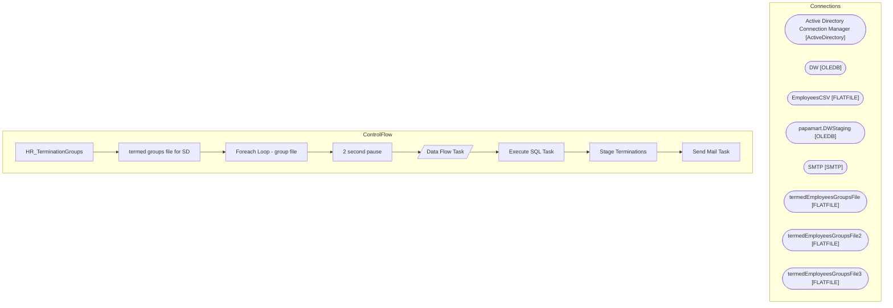

# SSIS Package: HR_TerminationGroups

**Project:** HR_TerminationGroups  
**Folder:** HR  

## Architecture Diagram

## Connection Managers

| Connection Name | Type |
|---|---|
| Active Directory Connection Manager | ActiveDirectory |
| DW | OLEDB |
| EmployeesCSV | FLATFILE |
| papamart.DWStaging | OLEDB |
| SMTP | SMTP |
| termedEmployeesGroupsFile | FLATFILE |
| termedEmployeesGroupsFile2 | FLATFILE |
| termedEmployeesGroupsFile3 | FLATFILE |

## Control Flow Tasks

| Task Name | Type |
|---|---|
| HR_TerminationGroups | Microsoft.Package |
| termed groups file for SD | STOCK:SEQUENCE |
| Foreach Loop - group file | STOCK:FOREACHLOOP |
| 2 second pause | STOCK:FORLOOP |
| Data Flow Task | Microsoft.Pipeline |
| Execute SQL Task | Microsoft.ExecuteSQLTask |
| Stage Terminations | Microsoft.ExecuteSQLTask |
| Send Mail Task | Microsoft.SendMailTask |

## Data Flow: Sources

| Component | Tables Referenced | SQL Preview |
|---|---|---|
|  |  | DECLARE @s NVARCHAR(MAX)  set @s = (select MemberOf from [dbo].[ADattributes] where EmployeeID = ?);   select left(replace(Item,'CN=',''),charindex(',',replace(Item,'CN=',''),1)-1)  as groupsNames FROM dbo.SplitStrings_CTE     (@s, N';'); |

## Data Flow: Destinations

_No OLE DB data flow destinations detected._

