# SSIS Package: HR_UltiProActivations

**Project:** HR_UltiProActivations  
**Folder:** HR  

## Architecture Diagram

```mermaid
flowchart TD
    subgraph Connections
        Activations_conn(["Activations [FLATFILE]"])
        DW_conn(["DW [OLEDB]"])
        DWStaging_conn(["DWStaging [OLEDB]"])
        HRFile_conn(["HRFile [FLATFILE]"])
        IntegrationStaging_conn(["IntegrationStaging [OLEDB]"])
        SMTP_conn(["SMTP [SMTP]"])
    end
    subgraph ControlFlow
        HR_UltiProActivations_task["HR_UltiProActivations"]
        Package_Sequence_task["Package Sequence"]
        HR_UltiProActivations_task --> Package_Sequence_task
        Employee_Stage_task[/"Employee Stage"/]
        Package_Sequence_task --> Employee_Stage_task
        Foreach_Loop___SSO_Activations_task["Foreach Loop - SSO Activations"]
        Employee_Stage_task --> Foreach_Loop___SSO_Activations_task
        Script___SSO_Activations_API_task["Script - SSO Activations API"]
        Foreach_Loop___SSO_Activations_task --> Script___SSO_Activations_API_task
        Send_Mail_Task_task["Send Mail Task"]
        Script___SSO_Activations_API_task --> Send_Mail_Task_task
        UltiPro_Response_task["UltiPro Response"]
        Send_Mail_Task_task --> UltiPro_Response_task
        UltiPro_Response_from_Fail_task["UltiPro Response from Fail"]
        UltiPro_Response_task --> UltiPro_Response_from_Fail_task
        Load_Employee_task["Load Employee"]
        UltiPro_Response_from_Fail_task --> Load_Employee_task
        Merge_UltiProSSOEmployeesActivated_task["Merge UltiProSSOEmployeesActivated"]
        Load_Employee_task --> Merge_UltiProSSOEmployeesActivated_task
        Truncate_Stage_task["Truncate Stage"]
        Merge_UltiProSSOEmployeesActivated_task --> Truncate_Stage_task
    end
```

## Connection Managers

| Connection Name | Type |
|---|---|
| Activations | FLATFILE |
| DW | OLEDB |
| DWStaging | OLEDB |
| HRFile | FLATFILE |
| IntegrationStaging | OLEDB |
| SMTP | SMTP |

## Control Flow Tasks

| Task Name | Type |
|---|---|
| HR_UltiProActivations | Microsoft.Package |
| Package Sequence | STOCK:SEQUENCE |
| Employee Stage | Microsoft.Pipeline |
| Foreach Loop - SSO Activations | STOCK:FOREACHLOOP |
| Script - SSO Activations API | Microsoft.ScriptTask |
| Send Mail Task | Microsoft.SendMailTask |
| UltiPro Response | Microsoft.ExecuteSQLTask |
| UltiPro Response from Fail | Microsoft.ExecuteSQLTask |
| Load Employee | Microsoft.ExecuteSQLTask |
| Merge UltiProSSOEmployeesActivated | Microsoft.ExecuteSQLTask |
| Truncate Stage | Microsoft.ExecuteSQLTask |

## Data Flow: Sources

| Component | Tables Referenced | SQL Preview |
|---|---|---|
|  |  | with  NamedSam as 	( 		select --named samaccounts to be excluded 			EepEEID 		from UHCMEmp 		where samaccountname<>EepEEID 		and samaccountname is not null  	) select 	EmployeeID as EmployeeIdentifier, 	concat(EmployeeID, '@buildabear.com') as ClientUserName, 	getdate() as InsertDate from vwUltiProValidationVsADStageVsAD with (nolock) where UltiProSamAccountName is not null --HAS A SAMACCOUNT and  |

## Data Flow: Destinations

| Component | Destination Table |
|---|---|
|  | [HR].[UltiProEmployeeActivationStage] |

