# SSIS Package: HR_UltiProToADtoUltiPro

**Project:** HR_UltiProToADtoUltiPro  
**Folder:** HR  

## Architecture Diagram

```mermaid
flowchart TD
    subgraph Connections
        Active_Directory_Connection_Manager_conn(["Active Directory Connection Manager [ActiveDirectory]"])
        AdImportCsv_conn(["AdImportCsv [FLATFILE]"])
        Coredb01_conn(["Coredb01 [OLEDB]"])
        DW_conn(["DW [OLEDB]"])
        DW2_conn(["DW2 [OLEDB]"])
        DWStaging_conn(["DWStaging [OLEDB]"])
        IntegrationStaging_conn(["IntegrationStaging [OLEDB]"])
        Ldap1_buildabear_com_conn(["Ldap1.buildabear.com [OLEDB]"])
        Ldap1_buildabear_com_1_conn(["Ldap1.buildabear.com 1 [ADO.NET:System.Data.OleDb.OleDbConnection, System.Data, Version=4.0.0.0, Culture=neutral, PublicKeyToken=b77a5c561934e089]"])
        SMTP_conn(["SMTP [SMTP]"])
        stl_dc_p_01_buildabear_com_conn(["stl-dc-p-01.buildabear.com [ADO.NET:System.Data.OleDb.OleDbConnection, System.Data, Version=4.0.0.0, Culture=neutral, PublicKeyToken=b77a5c561934e089]"])
        UltiProImportEmailCSV_conn(["UltiProImportEmailCSV [FLATFILE]"])
        UltiProImportSamAccountCSV_conn(["UltiProImportSamAccountCSV [FLATFILE]"])
    end
    subgraph ControlFlow
        HR_UltiproToADtoUltipro_task["HR_UltiproToADtoUltipro"]
        SEQ___AD_to_UltiPro___SamAccountName___Email_task["SEQ - AD to UltiPro - SamAccountName - Email"]
        HR_UltiproToADtoUltipro_task --> SEQ___AD_to_UltiPro___SamAccountName___Email_task
        Data_Flow___reset_send_flag_task[/"Data Flow - reset send flag"/]
        SEQ___AD_to_UltiPro___SamAccountName___Email_task --> Data_Flow___reset_send_flag_task
        SEQ___Generate_AD_File_task["SEQ - Generate AD File"]
        Data_Flow___reset_send_flag_task --> SEQ___Generate_AD_File_task
        correct_hyphen_char_task["correct hyphen char"]
        SEQ___Generate_AD_File_task --> correct_hyphen_char_task
        Count_Rows_to_Send_task["Count Rows to Send"]
        correct_hyphen_char_task --> Count_Rows_to_Send_task
        Data_Flow___Stage_C_for_AD_task[/"Data Flow - Stage C for AD"/]
        Count_Rows_to_Send_task --> Data_Flow___Stage_C_for_AD_task
        Data_Flow___Stage_for_AD_task[/"Data Flow - Stage for AD"/]
        Data_Flow___Stage_C_for_AD_task --> Data_Flow___Stage_for_AD_task
        Scrub_Phone_From_AD_Stage_task["Scrub Phone From AD Stage"]
        Data_Flow___Stage_for_AD_task --> Scrub_Phone_From_AD_Stage_task
        Scrub_Phone_from_DW_task["Scrub Phone from DW"]
        Scrub_Phone_From_AD_Stage_task --> Scrub_Phone_from_DW_task
        update_TermEmailSentFlag_task["update TermEmailSentFlag"]
        Scrub_Phone_from_DW_task --> update_TermEmailSentFlag_task
        SEQ___Generate_SamAccountName_and_Email_CSV_Files_task["SEQ - Generate SamAccountName and Email CSV Files"]
        update_TermEmailSentFlag_task --> SEQ___Generate_SamAccountName_and_Email_CSV_Files_task
        Foreach_Loop____CSV_task["Foreach Loop -  CSV"]
        SEQ___Generate_SamAccountName_and_Email_CSV_Files_task --> Foreach_Loop____CSV_task
        Archive_File_task["Archive File"]
        Foreach_Loop____CSV_task --> Archive_File_task
        SEQ___EmailCSV_task["SEQ - EmailCSV"]
        Archive_File_task --> SEQ___EmailCSV_task
        Count_Rows_for_Email_CSV_task["Count Rows for Email CSV"]
        SEQ___EmailCSV_task --> Count_Rows_for_Email_CSV_task
        Generate_UltiPro_Import_Email_CSV_task[/"Generate UltiPro Import Email CSV"/]
        Count_Rows_for_Email_CSV_task --> Generate_UltiPro_Import_Email_CSV_task
        SEQ___SamAccountCSV_task["SEQ - SamAccountCSV"]
        Generate_UltiPro_Import_Email_CSV_task --> SEQ___SamAccountCSV_task
        Count_Rows_for_SamAccountName_CSV_task["Count Rows for SamAccountName CSV"]
        SEQ___SamAccountCSV_task --> Count_Rows_for_SamAccountName_CSV_task
        Generate_UltiPro_Import_SamAccountName_CSV_task[/"Generate UltiPro Import SamAccountName CSV"/]
        Count_Rows_for_SamAccountName_CSV_task --> Generate_UltiPro_Import_SamAccountName_CSV_task
        sFTP_Upload_task["sFTP Upload"]
        Generate_UltiPro_Import_SamAccountName_CSV_task --> sFTP_Upload_task
        SEQ___send_C_event_for_promotion_task["SEQ - send C event for promotion"]
        sFTP_Upload_task --> SEQ___send_C_event_for_promotion_task
        Count_Rows_to_Send_task["Count Rows to Send"]
        SEQ___send_C_event_for_promotion_task --> Count_Rows_to_Send_task
        Data_Flow___stage_C_records_task[/"Data Flow - stage C records"/]
        Count_Rows_to_Send_task --> Data_Flow___stage_C_records_task
        SEQ___Generate_SamAccountName_and_Email_CSV_Files_task["SEQ - Generate SamAccountName and Email CSV Files"]
        Data_Flow___stage_C_records_task --> SEQ___Generate_SamAccountName_and_Email_CSV_Files_task
        Foreach_Loop____CSV_task["Foreach Loop -  CSV"]
        SEQ___Generate_SamAccountName_and_Email_CSV_Files_task --> Foreach_Loop____CSV_task
        Archive_File_task["Archive File"]
        Foreach_Loop____CSV_task --> Archive_File_task
        SEQ___EmailCSV_task["SEQ - EmailCSV"]
        Archive_File_task --> SEQ___EmailCSV_task
        Generate_Email_CSV_task[/"Generate Email CSV"/]
        SEQ___EmailCSV_task --> Generate_Email_CSV_task
        SEQ___SamAccountCSV_task["SEQ - SamAccountCSV"]
        Generate_Email_CSV_task --> SEQ___SamAccountCSV_task
        Generate_SamAccountName_CSV_task[/"Generate SamAccountName CSV"/]
        SEQ___SamAccountCSV_task --> Generate_SamAccountName_CSV_task
        sFTP_Upload_task["sFTP Upload"]
        Generate_SamAccountName_CSV_task --> sFTP_Upload_task
        UK_HR_named_account_change_task["UK HR named account change"]
        sFTP_Upload_task --> UK_HR_named_account_change_task
        Count_Rows_to_Send_task["Count Rows to Send"]
        UK_HR_named_account_change_task --> Count_Rows_to_Send_task
        UK_C_record_notification_task[/"UK C record notification"/]
        Count_Rows_to_Send_task --> UK_C_record_notification_task
        UK_welcome_email__numeric__task["UK welcome email (numeric)"]
        UK_C_record_notification_task --> UK_welcome_email__numeric__task
        BB_welcome_email_task[/"BB welcome email"/]
        UK_welcome_email__numeric__task --> BB_welcome_email_task
        Count_Rows_to_Send_task["Count Rows to Send"]
        BB_welcome_email_task --> Count_Rows_to_Send_task
        Send_Mail_Task_task["Send Mail Task"]
        Count_Rows_to_Send_task --> Send_Mail_Task_task
    end
```

## Connection Managers

| Connection Name | Type |
|---|---|
| Active Directory Connection Manager | ActiveDirectory |
| AdImportCsv | FLATFILE |
| Coredb01 | OLEDB |
| DW | OLEDB |
| DW2 | OLEDB |
| DWStaging | OLEDB |
| IntegrationStaging | OLEDB |
| Ldap1.buildabear.com | OLEDB |
| Ldap1.buildabear.com 1 | ADO.NET:System.Data.OleDb.OleDbConnection, System.Data, Version=4.0.0.0, Culture=neutral, PublicKeyToken=b77a5c561934e089 |
| SMTP | SMTP |
| stl-dc-p-01.buildabear.com | ADO.NET:System.Data.OleDb.OleDbConnection, System.Data, Version=4.0.0.0, Culture=neutral, PublicKeyToken=b77a5c561934e089 |
| UltiProImportEmailCSV | FLATFILE |
| UltiProImportSamAccountCSV | FLATFILE |

## Control Flow Tasks

| Task Name | Type |
|---|---|
| HR_UltiproToADtoUltipro | Microsoft.Package |
| SEQ - AD to UltiPro - SamAccountName - Email | STOCK:SEQUENCE |
| Data Flow - reset send flag | Microsoft.Pipeline |
| SEQ - Generate AD File | STOCK:SEQUENCE |
| correct hyphen char | Microsoft.ExecuteSQLTask |
| Count Rows to Send | Microsoft.ExecuteSQLTask |
| Data Flow - Stage C for AD | Microsoft.Pipeline |
| Data Flow - Stage for AD | Microsoft.Pipeline |
| Scrub Phone From AD Stage | Microsoft.ExecuteSQLTask |
| Scrub Phone from DW | Microsoft.ExecuteSQLTask |
| update TermEmailSentFlag | Microsoft.ExecuteSQLTask |
| SEQ - Generate SamAccountName and Email CSV Files | STOCK:SEQUENCE |
| Foreach Loop -  CSV | STOCK:FOREACHLOOP |
| Archive File | Microsoft.FileSystemTask |
| SEQ - EmailCSV | STOCK:SEQUENCE |
| Count Rows for Email CSV | Microsoft.ExecuteSQLTask |
| Generate UltiPro Import Email CSV | Microsoft.Pipeline |
| SEQ - SamAccountCSV | STOCK:SEQUENCE |
| Count Rows for SamAccountName CSV | Microsoft.ExecuteSQLTask |
| Generate UltiPro Import SamAccountName CSV | Microsoft.Pipeline |
| sFTP Upload | Microsoft.ExecuteSQLTask |
| SEQ - send C event for promotion | STOCK:SEQUENCE |
| Count Rows to Send | Microsoft.ExecuteSQLTask |
| Data Flow - stage C records | Microsoft.Pipeline |
| SEQ - Generate SamAccountName and Email CSV Files | STOCK:SEQUENCE |
| Foreach Loop -  CSV | STOCK:FOREACHLOOP |
| Archive File | Microsoft.FileSystemTask |
| SEQ - EmailCSV | STOCK:SEQUENCE |
| Generate Email CSV | Microsoft.Pipeline |
| SEQ - SamAccountCSV | STOCK:SEQUENCE |
| Generate SamAccountName CSV | Microsoft.Pipeline |
| sFTP Upload | Microsoft.ExecuteSQLTask |
| UK HR named account change | STOCK:SEQUENCE |
| Count Rows to Send | Microsoft.ExecuteSQLTask |
| UK C record notification | Microsoft.Pipeline |
| UK welcome email (numeric) | STOCK:SEQUENCE |
| BB welcome email | Microsoft.Pipeline |
| Count Rows to Send | Microsoft.ExecuteSQLTask |
| Send Mail Task | Microsoft.SendMailTask |

## Data Flow: Sources

| Component | Tables Referenced | SQL Preview |
|---|---|---|
|  |  | Update UHCMEMP Set SendUpdateFlag = 0 Where EepEEID = Cast(? as Nvarchar) |
|  |  | select * from vwUHCMUltiproToAD2 with (nolock) |
|  |  | SELECT [UpdatedTimeStamp],[StartDate],[EndDate],'C' as ProvisioningEvent,[ProvisioningValue(s)],[UserProvisioningRole],[FirstName],[MiddleName],[LastName],[ContainerOU],[AccountExpiration],[Title],[Department],[Office],[Street],[City],[State] ,[Zip/PostalCode],[Country],[Business],[Fax],[Mobile],[Pager],[Home],[EmployeeID],[EmployeeNumber],[AccountingCode],[ManagerEmployeeID],[ManagerEmployeeNumbe |
|  |  | exec spEmailUltiProToActiveDirectoryUpdatesStaged  	@ProvisioningEvent = ?, 	@EmployeeID = ?, 	@DisplayName = ?, 	@Department = ?, 	@Role = ?, 	@managerID = ? |
|  |  | Update UHCMEMP Set HireSentFlag = 1 Where EepEEID = Cast(? as nvarchar)  AND Cast( ? as Nvarchar)  = 'H' AND (HireSentFlag <> 1 or HireSentFlag is null)  |
|  |  | Update UHCMEMP Set SendUpdateFlag = 0 Where EepEEID = Cast(? as Nvarchar) |
|  |  | Update UHCMEMP Set TermEmailSentFlag = 1 Where EepEEID = Cast(? as Nvarchar) AND Cast(? as Nvarchar) = 'T' AND (TermEmailSentFlag <> 1 or TermEmailSentFlag is null) |
|  |  | select * from vwUHCMUltiproToAD with (nolock) |
|  |  | select * from vwUltiProNeedsEmail where CompanyCode <> 'BABUK' |
|  |  | select * from vwUltiProNeedsSamAccount where CompanyCode <> 'BABUK' |
|  |  | exec  [dbo].[spEmailUltiProToActiveDirectoryPromoteStaged2]  @EmployeeID = ?,  @EecLocation = ?, @EepNameFirst  = ?, @EepNameLast  = ?, @JbcJobCode  = ?, @EecOrgLvl1Code  = ?, @samaccountname  = ?, @managerEmail = ?  |
|  |  | select cast (EepEEID as nvarchar) as EepEEID, EecLocation,EepNameFirst,EepNameLast,JbcJobCode,EecOrgLvl1Code,samaccountname  from [dbo].[UHCMEmp] |
|  |  | select EmployeeId, Mail from [ADattributes] |
|  |  | select * from vwUHCMUltiproToAD2 with (nolock) where Status = 'Active' and ISNUMERIC([User Logon Name (Pre-Windows 2000)]) = 0 and [User Logon Name (Pre-Windows 2000)] is not null and isnull(UserProvisioningRole,'null') <> 'US Bear Builder' and EmployeeID not like '2%' and EmployeeID not in  ( select EmployeeID from [coredb01].[AIMSConfig].[dbo].[DataLoaderStaging] where (ProvisioningEvent = 'H' a |
|  |  | select  	u.eepCompanyCode as CompanyCode, 	convert(varchar, getdate(), 101) as EffectiveDate, 	u.EepEEID, 	cast(u.samaccountname as nvarchar) + '@buildabear.com' as PrimaryEmail from UHCMEmp u  where EepEEID in (select EmployeeID from vwUHCMUltiproToAD2 with (nolock) where ISNUMERIC([User Logon Name (Pre-Windows 2000)]) = 0 and EmployeeID not like '2%' ) |
|  |  | select  	u.eepCompanyCode as CompanyCode, 	convert(varchar, getdate(), 101) as EffectiveDate, 	u.EepEEID, 	cast(u.samaccountname as nvarchar) as samAccount from UHCMEmp u  where EepEEID in (select EmployeeID from vwUHCMUltiproToAD2 with (nolock) where ISNUMERIC([User Logon Name (Pre-Windows 2000)]) = 0 and EmployeeID not like '2%' ) |
|  |  | exec  [dbo].[spEmailSageActiveDirectoryNamedAccountAssigned]  @EmployeeID = ?,  @EecLocation = ?, @EepNameFirst  = ?, @EepNameLast  = ?, @JbcJobCode  = ?, @EecOrgLvl1Code  = ?, @samaccountname  = ?, @managerEmail = ?  |
|  |  | select cast (EepEEID as nvarchar) as EepEEID, EecLocation,EepNameFirst,EepNameLast,JbcJobCode,EecOrgLvl1Code,samaccountname  from [dbo].[UHCMEmp] |
|  |  | select EmployeeId, Mail from [ADattributes] |
|  |  | select * from vwUHCMUltiproToAD2 with (nolock) where Status  in ('Active','PreJoiner')  and ISNUMERIC([User Logon Name (Pre-Windows 2000)]) = 0 and [User Logon Name (Pre-Windows 2000)] is not null and UserProvisioningRole <> 'UK Bear Builder' and EmployeeID like '2%' |
|  |  | select v.FirstName, v.LastName, v.EmployeeID, u.EecLocation , u.EepAddressEMail2 as 'personalEmail' , u2.EepAddressEMail as 'supervisorEmail' ,u.JbcJobCode as 'jobCode',  u.EecOrgLvl1Code as 'orgCode' ,v.EmployeeID as 'futureSamaccountname' from vwUHCMUltiproToAD v with (nolock) join UHCMEmp u on v.EmployeeID = u.EepEEID join UHCMEmp u2 on u.SupervisorID = u2.EepEEID where v.ProvisioningEvent = 'H |
|  |  | exec spEmailSageNewHireNotificationNumeric  @EmployeeID = ?, @EecLocation = ?, @EepNameFirst  = ?, @EepNameLast  = ?, @JbcJobCode  = ?, @EecOrgLvl1Code  = ?, @samaccountname  = ?, @managerEmail = ?, @personalEmail = ? |

## Data Flow: Destinations

| Component | Destination Table |
|---|---|
|  | [dbo].[DataLoaderStaging] |
|  | [dbo].[DataLoaderStaging] |
|  | [dbo].[vwUltiProNeedsEmail] |
|  | [dbo].[vwUltiProNeedsSamAccount] |
|  | [dbo].[DataLoaderStaging] |
|  | [dbo].[vwUltiProNeedsEmail] |
|  | [dbo].[vwUltiProNeedsSamAccount] |

