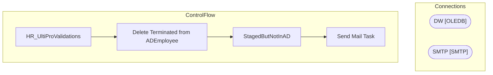

# SSIS Package: HR_UltiProValidations

**Project:** HR_UltiProValidations  
**Folder:** HR  

## Architecture Diagram

## Connection Managers

| Connection Name | Type |
|---|---|
| DW | OLEDB |
| SMTP | SMTP |

## Control Flow Tasks

| Task Name | Type |
|---|---|
| HR_UltiProValidations | Microsoft.Package |
| Delete Terminated from ADEmployee | Microsoft.ExecuteSQLTask |
| StagedButNotInAD | Microsoft.ExecuteSQLTask |
| Send Mail Task | Microsoft.SendMailTask |

## Data Flow: Sources

_No OLE DB data flow sources detected._

## Data Flow: Destinations

_No OLE DB data flow destinations detected._

