# SSIS Package: Package

**Project:** HR_UltiproTermSamaccount  
**Folder:** HR  

## Architecture Diagram

```mermaid
flowchart TD
    subgraph Connections
        Active_Directory_Connection_Manager_1_conn(["Active Directory Connection Manager 1 [ActiveDirectory]"])
        Active_Directory_Connection_Manager_2_conn(["Active Directory Connection Manager 2 [ActiveDirectory]"])
        Auditworks_conn(["Auditworks [OLEDB]"])
        Azure_Service_Bus_conn(["Azure Service Bus [Azure Service Bus (KingswaySoft)]"])
        CRM_conn(["CRM [OLEDB]"])
        DW_conn(["DW [OLEDB]"])
        DWStaging_conn(["DWStaging [OLEDB]"])
        empIDs_conn(["empIDs [FLATFILE]"])
        empNoID_conn(["empNoID [FLATFILE]"])
        HTTP_Connection_Manager_conn(["HTTP Connection Manager [HTTP (KingswaySoft)]"])
        IntegrationStaging_conn(["IntegrationStaging [OLEDB]"])
        ME_01_conn(["ME_01 [OLEDB]"])
        namedAndNumbered_conn(["namedAndNumbered [FLATFILE]"])
        papamart_dw1_conn(["papamart.dw1 [OLEDB]"])
        SMTP_conn(["SMTP [SMTP]"])
        UltiProImportEmailCSV_conn(["UltiProImportEmailCSV [FLATFILE]"])
        UltiProImportSamAccountCSV_conn(["UltiProImportSamAccountCSV [FLATFILE]"])
    end
    subgraph ControlFlow
        Package_task["Package"]
        create_file_to_erase_samaccount_in_Ultipro_for_terms_task["create file to erase samaccount in Ultipro for terms"]
        Package_task --> create_file_to_erase_samaccount_in_Ultipro_for_terms_task
        count_samaccounts_to_erase_task["count samaccounts to erase"]
        create_file_to_erase_samaccount_in_Ultipro_for_terms_task --> count_samaccounts_to_erase_task
        SEQ___Generate_SamAccountName_and_Email_CSV_Files__to_erase_account_and_email__task["SEQ - Generate SamAccountName and Email CSV Files (to erase account and email)"]
        count_samaccounts_to_erase_task --> SEQ___Generate_SamAccountName_and_Email_CSV_Files__to_erase_account_and_email__task
        Foreach_Loop____CSV_task["Foreach Loop -  CSV"]
        SEQ___Generate_SamAccountName_and_Email_CSV_Files__to_erase_account_and_email__task --> Foreach_Loop____CSV_task
        Archive_File_task["Archive File"]
        Foreach_Loop____CSV_task --> Archive_File_task
        SEQ___EmailCSV_task["SEQ - EmailCSV"]
        Archive_File_task --> SEQ___EmailCSV_task
        Generate_UltiPro_Import_Email_CSV_task[/"Generate UltiPro Import Email CSV"/]
        SEQ___EmailCSV_task --> Generate_UltiPro_Import_Email_CSV_task
        SEQ___SamAccountCSV_task["SEQ - SamAccountCSV"]
        Generate_UltiPro_Import_Email_CSV_task --> SEQ___SamAccountCSV_task
        Generate_UltiPro_Import_SamAccountName_CSV_task[/"Generate UltiPro Import SamAccountName CSV"/]
        SEQ___SamAccountCSV_task --> Generate_UltiPro_Import_SamAccountName_CSV_task
        sFTP_Upload_task["sFTP Upload"]
        Generate_UltiPro_Import_SamAccountName_CSV_task --> sFTP_Upload_task
        Sequence_Container_task["Sequence Container"]
        sFTP_Upload_task --> Sequence_Container_task
        AD_extract_Loop_task["AD extract Loop"]
        Sequence_Container_task --> AD_extract_Loop_task
        Data_Flow___memberOf_task[/"Data Flow - memberOf"/]
        AD_extract_Loop_task --> Data_Flow___memberOf_task
        load_ADemployeeStage_task["load ADemployeeStage"]
        Data_Flow___memberOf_task --> load_ADemployeeStage_task
        Script___ADextract_task["Script - ADextract"]
        load_ADemployeeStage_task --> Script___ADextract_task
        Merge_ADEmployee_task["Merge ADEmployee"]
        Script___ADextract_task --> Merge_ADEmployee_task
        stage_employee_ID_task["stage employee ID"]
        Merge_ADEmployee_task --> stage_employee_ID_task
        truncate_stage_task["truncate stage"]
        stage_employee_ID_task --> truncate_stage_task
        wait_task["wait"]
        truncate_stage_task --> wait_task
        update_ActiveDirectoryDataStage_table_task["update ActiveDirectoryDataStage table"]
        wait_task --> update_ActiveDirectoryDataStage_table_task
        SEQ___refresh_ActiveDirectoryDataStage_table_task["SEQ - refresh ActiveDirectoryDataStage table"]
        update_ActiveDirectoryDataStage_table_task --> SEQ___refresh_ActiveDirectoryDataStage_table_task
        DataFlow___ActiveDirectoryDataStage_task[/"DataFlow - ActiveDirectoryDataStage"/]
        SEQ___refresh_ActiveDirectoryDataStage_table_task --> DataFlow___ActiveDirectoryDataStage_task
        Truncate_ActiveDirectoryDataStage_task["Truncate ActiveDirectoryDataStage"]
        DataFlow___ActiveDirectoryDataStage_task --> Truncate_ActiveDirectoryDataStage_task
        Send_Mail_Task_task["Send Mail Task"]
        Truncate_ActiveDirectoryDataStage_task --> Send_Mail_Task_task
    end
```

## Connection Managers

| Connection Name | Type |
|---|---|
| Active Directory Connection Manager 1 | ActiveDirectory |
| Active Directory Connection Manager 2 | ActiveDirectory |
| Auditworks | OLEDB |
| Azure Service Bus | Azure Service Bus (KingswaySoft) |
| CRM | OLEDB |
| DW | OLEDB |
| DWStaging | OLEDB |
| empIDs | FLATFILE |
| empNoID | FLATFILE |
| HTTP Connection Manager | HTTP (KingswaySoft) |
| IntegrationStaging | OLEDB |
| ME_01 | OLEDB |
| namedAndNumbered | FLATFILE |
| papamart.dw1 | OLEDB |
| SMTP | SMTP |
| UltiProImportEmailCSV | FLATFILE |
| UltiProImportSamAccountCSV | FLATFILE |

## Control Flow Tasks

| Task Name | Type |
|---|---|
| Package | Microsoft.Package |
| create file to erase samaccount in Ultipro for terms | STOCK:SEQUENCE |
| count samaccounts to erase | Microsoft.ExecuteSQLTask |
| SEQ - Generate SamAccountName and Email CSV Files (to erase account and email) | STOCK:SEQUENCE |
| Foreach Loop -  CSV | STOCK:FOREACHLOOP |
| Archive File | Microsoft.FileSystemTask |
| SEQ - EmailCSV | STOCK:SEQUENCE |
| Generate UltiPro Import Email CSV | Microsoft.Pipeline |
| SEQ - SamAccountCSV | STOCK:SEQUENCE |
| Generate UltiPro Import SamAccountName CSV | Microsoft.Pipeline |
| sFTP Upload | Microsoft.ExecuteSQLTask |
| Sequence Container | STOCK:SEQUENCE |
| AD extract Loop | STOCK:FOREACHLOOP |
| Data Flow - memberOf | Microsoft.Pipeline |
| load ADemployeeStage | Microsoft.ExecuteSQLTask |
| Script - ADextract | Microsoft.ScriptTask |
| Merge ADEmployee | Microsoft.ExecuteSQLTask |
| stage employee ID | Microsoft.ExecuteSQLTask |
| truncate stage | Microsoft.ExecuteSQLTask |
| wait | Microsoft.ExecuteSQLTask |
| update ActiveDirectoryDataStage table | STOCK:SEQUENCE |
| SEQ - refresh ActiveDirectoryDataStage table | STOCK:SEQUENCE |
| DataFlow - ActiveDirectoryDataStage | Microsoft.Pipeline |
| Truncate ActiveDirectoryDataStage | Microsoft.ExecuteSQLTask |
| Send Mail Task | Microsoft.SendMailTask |

## Data Flow: Sources

| Component | Tables Referenced | SQL Preview |
|---|---|---|
|  |  | with  adsPaths as ( select distinct(AdsPAth), Name, DisplayName, samaccountname, EmployeeID, UserPrincipalName from [dbo].[ActiveDirectoryDataStage]  ), uhcmEmpsTermed as ( select e.eepCompanyCode as CompanyCode, e.EecLocation, e.EepEEID as EmployeeID , e.EepNameFirst, e.EepNamePreferred, e.EepNameLast,e.JbcJobCode, e.EecOrgLvl1Code, e.samaccountname,  e.TerminatedEffectiveDate,  convert(varchar,e |
|  |  | with  adsPaths as ( select distinct(AdsPAth), Name, DisplayName, samaccountname, EmployeeID, UserPrincipalName from [dbo].[ActiveDirectoryDataStage]  ), uhcmEmpsTermed as ( select e.eepCompanyCode as CompanyCode, e.EecLocation, e.EepEEID as EmployeeID , e.EepNameFirst, e.EepNamePreferred, e.EepNameLast,e.JbcJobCode, e.EecOrgLvl1Code, e.samaccountname,  e.TerminatedEffectiveDate,  convert(varchar,e |
|  |  | Update ADEmployeeStage  set memberOf = ?  where EmployeeID = ? |

## Data Flow: Destinations

| Component | Destination Table |
|---|---|
|  | [dbo].[vwUltiProNeedsEmail] |
|  | [dbo].[vwUltiProNeedsSamAccount] |
|  | [ActiveDirectoryDataStage] |

