# SSIS Package: HR_UltiproToD365

**Project:** HR_UltiproToD365  
**Folder:** HR  

## Architecture Diagram

```mermaid
flowchart TD
    subgraph Connections
        ArchiveFolder_conn(["ArchiveFolder [FILE]"])
        GetBlobUrl_conn(["GetBlobUrl [HTTP (KingswaySoft)]"])
        GetStatus_conn(["GetStatus [HTTP (KingswaySoft)]"])
        IntegrationStaging_conn(["IntegrationStaging [OLEDB]"])
        IntegrationStaging_1_conn(["IntegrationStaging 1 [OLEDB]"])
        ME_01_conn(["ME_01 [OLEDB]"])
        MultipleLocationFile_conn(["MultipleLocationFile [FLATFILE]"])
        papamart_dw_conn(["papamart.dw [OLEDB]"])
        PostTriggerImport_conn(["PostTriggerImport [HTTP (KingswaySoft)]"])
        setWorkUserPassword_conn(["setWorkUserPassword [HTTP (KingswaySoft)]"])
        SMTP_EMAIL_conn(["SMTP_EMAIL [SMTP]"])
        SQL_LOG_conn(["SQL_LOG [OLEDB]"])
        UserCreateCSV_conn(["UserCreateCSV [FLATFILE]"])
        UserDeactivateCSV_conn(["UserDeactivateCSV [FLATFILE]"])
        UserWHSCreateCSV_conn(["UserWHSCreateCSV [FLATFILE]"])
        XML_FILES_conn(["XML FILES [FILE]"])
    end
    subgraph ControlFlow
        WMS_UserCreate_task["WMS_UserCreate"]
        password_update_seq_task["password update seq"]
        WMS_UserCreate_task --> password_update_seq_task
        Foreach_Loop_Container_1_task["Foreach Loop Container 1"]
        password_update_seq_task --> Foreach_Loop_Container_1_task
        prep_1_row_task["prep 1 row"]
        Foreach_Loop_Container_1_task --> prep_1_row_task
        Truncate_Stage_task["Truncate Stage"]
        prep_1_row_task --> Truncate_Stage_task
        UserCreate_File_Generation_and_Move_NEW_JSON_task["UserCreate File Generation and Move NEW JSON"]
        Truncate_Stage_task --> UserCreate_File_Generation_and_Move_NEW_JSON_task
        password_reset_URL_task[/"password reset URL"/]
        UserCreate_File_Generation_and_Move_NEW_JSON_task --> password_reset_URL_task
        Send_Mail_Task_task["Send Mail Task"]
        password_reset_URL_task --> Send_Mail_Task_task
        Wait_task["Wait"]
        Send_Mail_Task_task --> Wait_task
        Truncate_Stage_task["Truncate Stage"]
        Wait_task --> Truncate_Stage_task
        User_Create_Stage_task["User Create Stage"]
        Truncate_Stage_task --> User_Create_Stage_task
        Stage_User_Data_task[/"Stage User Data"/]
        User_Create_Stage_task --> Stage_User_Data_task
        Truncate_Stage_task["Truncate Stage"]
        Stage_User_Data_task --> Truncate_Stage_task
        varPasswordObject_task["varPasswordObject"]
        Truncate_Stage_task --> varPasswordObject_task
        process_multiple_locations_task["process multiple locations"]
        varPasswordObject_task --> process_multiple_locations_task
        Foreach_Loop_Container_task["Foreach Loop Container"]
        process_multiple_locations_task --> Foreach_Loop_Container_task
        archive_task["archive"]
        Foreach_Loop_Container_task --> archive_task
        Data_Flow_Task_task[/"Data Flow Task"/]
        archive_task --> Data_Flow_Task_task
        delete_task["delete"]
        Data_Flow_Task_task --> delete_task
        merge_task["merge"]
        delete_task --> merge_task
        truncate_task["truncate"]
        merge_task --> truncate_task
        user_create_seq_task["user create seq"]
        truncate_task --> user_create_seq_task
        set_exported_flag_task["set exported flag"]
        user_create_seq_task --> set_exported_flag_task
        set_isExported_task["set isExported"]
        set_exported_flag_task --> set_isExported_task
        User_Create_Stage_task["User Create Stage"]
        set_isExported_task --> User_Create_Stage_task
        Stage_User_Data_task[/"Stage User Data"/]
        User_Create_Stage_task --> Stage_User_Data_task
        Stage_User_WHse_Data_task[/"Stage User_WHse Data"/]
        Stage_User_Data_task --> Stage_User_WHse_Data_task
        Truncate_Stage_task["Truncate Stage"]
        Stage_User_WHse_Data_task --> Truncate_Stage_task
        User_Deactivate_Stage_1_1_task["User Deactivate Stage 1 1"]
        Truncate_Stage_task --> User_Deactivate_Stage_1_1_task
        Stage_User_Data_task[/"Stage User Data"/]
        User_Deactivate_Stage_1_1_task --> Stage_User_Data_task
        Truncate_Stage_task["Truncate Stage"]
        Stage_User_Data_task --> Truncate_Stage_task
        UserCreate_File_Generation_and_Move_task["UserCreate File Generation and Move"]
        Truncate_Stage_task --> UserCreate_File_Generation_and_Move_task
        Foreach_Loop___Per_Entity_task["Foreach Loop - Per Entity"]
        UserCreate_File_Generation_and_Move_task --> Foreach_Loop___Per_Entity_task
        DataFlow_CSV_Files_task[/"DataFlow CSV Files"/]
        Foreach_Loop___Per_Entity_task --> DataFlow_CSV_Files_task
        Foreach_BlobUploadLoop_task["Foreach BlobUploadLoop"]
        DataFlow_CSV_Files_task --> Foreach_BlobUploadLoop_task
        datestamp_archive_task["datestamp archive"]
        Foreach_BlobUploadLoop_task --> datestamp_archive_task
        Foreach_Loop_Container_task["Foreach Loop Container"]
        datestamp_archive_task --> Foreach_Loop_Container_task
        Archive_Files_task["Archive Files"]
        Foreach_Loop_Container_task --> Archive_Files_task
        azCopy_to_Blob_task["azCopy to Blob"]
        Archive_Files_task --> azCopy_to_Blob_task
        ProcessStatus_For_Loop_task["ProcessStatus For Loop"]
        azCopy_to_Blob_task --> ProcessStatus_For_Loop_task
        Get_Summary_Status_task[/"Get Summary Status"/]
        ProcessStatus_For_Loop_task --> Get_Summary_Status_task
        Set_ProcessStatus_task["Set ProcessStatus"]
        Get_Summary_Status_task --> Set_ProcessStatus_task
        Wait_task["Wait"]
        Set_ProcessStatus_task --> Wait_task
        Set_BatchID___LoopCount_task["Set BatchID - LoopCount"]
        Wait_task --> Set_BatchID___LoopCount_task
        Set_RowsCount_task["Set RowsCount"]
        Set_BatchID___LoopCount_task --> Set_RowsCount_task
        Stage_Blob_URL_task[/"Stage Blob URL"/]
        Set_RowsCount_task --> Stage_Blob_URL_task
        Trigger_Import_task[/"Trigger Import"/]
        Stage_Blob_URL_task --> Trigger_Import_task
        Foreach_Loop___Copy_Manifest_and_Header_Files_task["Foreach Loop - Copy Manifest and Header Files"]
        Trigger_Import_task --> Foreach_Loop___Copy_Manifest_and_Header_Files_task
        Copy_Manifest___Header_task["Copy Manifest & Header"]
        Foreach_Loop___Copy_Manifest_and_Header_Files_task --> Copy_Manifest___Header_task
        Zip_File_task["Zip File"]
        Copy_Manifest___Header_task --> Zip_File_task
        Stage_Company_Entities_task["Stage Company Entities"]
        Zip_File_task --> Stage_Company_Entities_task
        UserDeactivate_File_Generation_and_Move_task["UserDeactivate File Generation and Move"]
        Stage_Company_Entities_task --> UserDeactivate_File_Generation_and_Move_task
        Foreach_Loop___Per_Entity_task["Foreach Loop - Per Entity"]
        UserDeactivate_File_Generation_and_Move_task --> Foreach_Loop___Per_Entity_task
        DataFlow_CSV_File_task[/"DataFlow CSV File"/]
        Foreach_Loop___Per_Entity_task --> DataFlow_CSV_File_task
        Foreach_BlobUploadLoop_task["Foreach BlobUploadLoop"]
        DataFlow_CSV_File_task --> Foreach_BlobUploadLoop_task
        datestamp_archive_task["datestamp archive"]
        Foreach_BlobUploadLoop_task --> datestamp_archive_task
        Foreach_Loop_Container_task["Foreach Loop Container"]
        datestamp_archive_task --> Foreach_Loop_Container_task
        Archive_Files_task["Archive Files"]
        Foreach_Loop_Container_task --> Archive_Files_task
        azCopy_to_Blob_task["azCopy to Blob"]
        Archive_Files_task --> azCopy_to_Blob_task
        ProcessStatus_For_Loop_task["ProcessStatus For Loop"]
        azCopy_to_Blob_task --> ProcessStatus_For_Loop_task
        Get_Summary_Status_task[/"Get Summary Status"/]
        ProcessStatus_For_Loop_task --> Get_Summary_Status_task
        Set_ProcessStatus_task["Set ProcessStatus"]
        Get_Summary_Status_task --> Set_ProcessStatus_task
        Wait_task["Wait"]
        Set_ProcessStatus_task --> Wait_task
        Set_BatchID___LoopCount_task["Set BatchID - LoopCount"]
        Wait_task --> Set_BatchID___LoopCount_task
        Set_RowsCount_task["Set RowsCount"]
        Set_BatchID___LoopCount_task --> Set_RowsCount_task
        Stage_Blob_URL_task[/"Stage Blob URL"/]
        Set_RowsCount_task --> Stage_Blob_URL_task
        Trigger_Import_task[/"Trigger Import"/]
        Stage_Blob_URL_task --> Trigger_Import_task
        Foreach_Loop___Copy_Manifest_and_Header_Files_task["Foreach Loop - Copy Manifest and Header Files"]
        Trigger_Import_task --> Foreach_Loop___Copy_Manifest_and_Header_Files_task
        Copy_Manifest___Header_task["Copy Manifest & Header"]
        Foreach_Loop___Copy_Manifest_and_Header_Files_task --> Copy_Manifest___Header_task
        Zip_File_task["Zip File"]
        Copy_Manifest___Header_task --> Zip_File_task
        Stage_Company_Entities_task["Stage Company Entities"]
        Zip_File_task --> Stage_Company_Entities_task
        Wait_task["Wait"]
        Stage_Company_Entities_task --> Wait_task
        Send_Email_onError_task["Send Email onError"]
        Wait_task --> Send_Email_onError_task
    end
```

## Connection Managers

| Connection Name | Type |
|---|---|
| ArchiveFolder | FILE |
| GetBlobUrl | HTTP (KingswaySoft) |
| GetStatus | HTTP (KingswaySoft) |
| IntegrationStaging | OLEDB |
| IntegrationStaging 1 | OLEDB |
| ME_01 | OLEDB |
| MultipleLocationFile | FLATFILE |
| papamart.dw | OLEDB |
| PostTriggerImport | HTTP (KingswaySoft) |
| setWorkUserPassword | HTTP (KingswaySoft) |
| SMTP_EMAIL | SMTP |
| SQL_LOG | OLEDB |
| UserCreateCSV | FLATFILE |
| UserDeactivateCSV | FLATFILE |
| UserWHSCreateCSV | FLATFILE |
| XML FILES | FILE |

## Control Flow Tasks

| Task Name | Type |
|---|---|
| WMS_UserCreate | Microsoft.Package |
| password update seq | STOCK:SEQUENCE |
| Foreach Loop Container 1 | STOCK:FOREACHLOOP |
| prep 1 row | Microsoft.ExecuteSQLTask |
| Truncate Stage | Microsoft.ExecuteSQLTask |
| UserCreate File Generation and Move NEW JSON | STOCK:SEQUENCE |
| password reset URL | Microsoft.Pipeline |
| Send Mail Task | Microsoft.SendMailTask |
| Wait | Microsoft.ExecuteSQLTask |
| Truncate Stage | Microsoft.ExecuteSQLTask |
| User Create Stage | STOCK:SEQUENCE |
| Stage User Data | Microsoft.Pipeline |
| Truncate Stage | Microsoft.ExecuteSQLTask |
| varPasswordObject | Microsoft.ExecuteSQLTask |
| process multiple locations | STOCK:SEQUENCE |
| Foreach Loop Container | STOCK:FOREACHLOOP |
| archive | Microsoft.FileSystemTask |
| Data Flow Task | Microsoft.Pipeline |
| delete | Microsoft.FileSystemTask |
| merge | Microsoft.ExecuteSQLTask |
| truncate | Microsoft.ExecuteSQLTask |
| user create seq | STOCK:SEQUENCE |
| set exported flag | STOCK:SEQUENCE |
| set isExported | Microsoft.ExecuteSQLTask |
| User Create Stage | STOCK:SEQUENCE |
| Stage User Data | Microsoft.Pipeline |
| Stage User_WHse Data | Microsoft.Pipeline |
| Truncate Stage | Microsoft.ExecuteSQLTask |
| User Deactivate Stage 1 1 | STOCK:SEQUENCE |
| Stage User Data | Microsoft.Pipeline |
| Truncate Stage | Microsoft.ExecuteSQLTask |
| UserCreate File Generation and Move | STOCK:SEQUENCE |
| Foreach Loop - Per Entity | STOCK:FOREACHLOOP |
| DataFlow CSV Files | Microsoft.Pipeline |
| Foreach BlobUploadLoop | STOCK:FOREACHLOOP |
| datestamp archive | Microsoft.FileSystemTask |
| Foreach Loop Container | STOCK:FOREACHLOOP |
| Archive Files | Microsoft.FileSystemTask |
| azCopy to Blob | Microsoft.ExecuteProcess |
| ProcessStatus For Loop | STOCK:FORLOOP |
| Get Summary Status | Microsoft.Pipeline |
| Set ProcessStatus | Microsoft.ExecuteSQLTask |
| Wait | Microsoft.ExecuteSQLTask |
| Set BatchID - LoopCount | Microsoft.ExecuteSQLTask |
| Set RowsCount | Microsoft.ExecuteSQLTask |
| Stage Blob URL | Microsoft.Pipeline |
| Trigger Import | Microsoft.Pipeline |
| Foreach Loop - Copy Manifest and Header Files | STOCK:FOREACHLOOP |
| Copy Manifest & Header | Microsoft.FileSystemTask |
| Zip File | Microsoft.ExecuteProcess |
| Stage Company Entities | Microsoft.ExecuteSQLTask |
| UserDeactivate File Generation and Move | STOCK:SEQUENCE |
| Foreach Loop - Per Entity | STOCK:FOREACHLOOP |
| DataFlow CSV File | Microsoft.Pipeline |
| Foreach BlobUploadLoop | STOCK:FOREACHLOOP |
| datestamp archive | Microsoft.FileSystemTask |
| Foreach Loop Container | STOCK:FOREACHLOOP |
| Archive Files | Microsoft.FileSystemTask |
| azCopy to Blob | Microsoft.ExecuteProcess |
| ProcessStatus For Loop | STOCK:FORLOOP |
| Get Summary Status | Microsoft.Pipeline |
| Set ProcessStatus | Microsoft.ExecuteSQLTask |
| Wait | Microsoft.ExecuteSQLTask |
| Set BatchID - LoopCount | Microsoft.ExecuteSQLTask |
| Set RowsCount | Microsoft.ExecuteSQLTask |
| Stage Blob URL | Microsoft.Pipeline |
| Trigger Import | Microsoft.Pipeline |
| Foreach Loop - Copy Manifest and Header Files | STOCK:FOREACHLOOP |
| Copy Manifest & Header | Microsoft.FileSystemTask |
| Zip File | Microsoft.ExecuteProcess |
| Stage Company Entities | Microsoft.ExecuteSQLTask |
| Wait | Microsoft.ExecuteSQLTask |
| Send Email onError | Microsoft.SendMailTask |

## Data Flow: Sources

| Component | Tables Referenced | SQL Preview |
|---|---|---|
|  |  | select workerName, userID, userPassword, Company from [ERP].[UserLoadtoD365pwReset] |
|  |  | select distinct USERID as 'userID', 'Retail Stores' as 'workerName' , USERID as 'pass',ENTITY as 'Company' from [ERP].[UserLoadtoD365] where USERID not in (select distinct WAREHOUSEMOBILEDEVICEUSERID from  [ERP].[UserLoadtoD365multipleLocations]) |
|  |  | with wmsEntity as ( select cast(OperationalSiteID as varchar) as OperationalSiteID, Entity from [stl-ssis-p-01].IntegrationStaging.ERP.WarehouseMaster  where WarehouseID not like '%[^0-9]%' and WarehouseID not in ('8010','10') and WarehouseID not like '9%' union  select '1068A'  as OperationalSiteID, '1100' as Entity  ) select distinct  	d.EmployeeID as [USERID]					 	,0 as [ADJUSTMENTQUANTITYLIMI |
|  |  | with wmsEntity as ( select cast(OperationalSiteID as varchar) as OperationalSiteID, Entity from [stl-ssis-p-01].IntegrationStaging.ERP.WarehouseMaster  where WarehouseID not like '%[^0-9]%' and WarehouseID not in ('8010','10') and WarehouseID not like '9%'  union  select '1068A'  as OperationalSiteID, '1100' as Entity ) select distinct  	d.EmployeeID as [WAREHOUSEMOBILEDEVICEUSERID]					 	,e.EecLo |
|  |  | with wmsEntity as ( select OperationalSiteID, Entity from [stl-ssis-p-01].IntegrationStaging.ERP.WarehouseMaster  where WarehouseID not like '%[^0-9]%' and WarehouseID not in ('8010','10') and WarehouseID not like '9%'  ) select distinct  	d.EmployeeID as [USERID]	                  ,'PSNNUM000003668' as [WAREHOUSEWORKERPERSONNELNUMBER]	                  ,'Yes' as [ISINACTIVE]			                  , |
|  |  | SELECT [WAREHOUSEID]       ,[WAREHOUSEMOBILEDEVICEUSERID]   FROM [ERP].[UserWHSELoadtoD365] WHERE [ENTITY] = ? |
|  |  | SELECT [USERID]       ,[ADJUSTMENTQUANTITYLIMIT]       ,[COUNTINGAPPROVALPERCENTAGELIMIT]       ,[COUNTINGAPPROVALQUANTITYLIMIT]       ,[COUNTINGAPPROVALVALUELIMIT]       ,[DEFAULTMOBILEDEVICEMENUITEMNAME]       ,[DEFAULTWAREHOUSEID]       ,[ISAUTOMATEDWAREHOUSEWORKUSER]       ,[ISCOUNTINGSUPERVISOR]       ,[ISINACTIVE]       ,[ISINVENTORYMOVEMENTWITHASSOCIATEDWORKALLOWED]       ,[ISMANUALITEMREAL |
|  |  | update l set  	l.StatusDate=getdate(),  	l.StatusResponse=?, 	l.Duration=convert(varchar, (getdate()-l.TriggerDate), 108) from wms.DynamicsPackageAPILog l where l.BatchID=? |
|  |  | select 'do nothing' as DoNothing |
|  |  | update wms.DynamicsPackageAPILog  set TriggerDate=getdate(), TriggerResponse=? where BatchID=? |
|  |  | SELECT [USERID]       ,[WAREHOUSEWORKERPERSONNELNUMBER]       ,[ISINACTIVE]       ,[ENTITY]   FROM [ERP].[UserDeactivateD365] WHERE [ENTITY] = ? |
|  |  | update l set  	l.StatusDate=getdate(),  	l.StatusResponse=?, 	l.Duration=convert(varchar, (getdate()-l.TriggerDate), 108) from wms.DynamicsPackageAPILog l where l.BatchID=? |
|  |  | select 'do nothing' as DoNothing |
|  |  | update wms.DynamicsPackageAPILog  set TriggerDate=getdate(), TriggerResponse=? where BatchID=? |

## Data Flow: Destinations

| Component | Destination Table |
|---|---|
|  | [WMS].[DynamicsAPILog] |
|  | [ERP].[UserLoadtoD365pwReset] |
|  | [ERP].[UserLoadtoD365multipleLocationsStage] |
|  | [ERP].[UserLoadtoD365] |
|  | [ERP].[UserWHSELoadtoD365] |
|  | [ERP].[UserDeactivateD365] |
|  | [WMS].[DynamicsPackageAPILog] |
|  | [WMS].[DynamicsPackageAPILog] |

